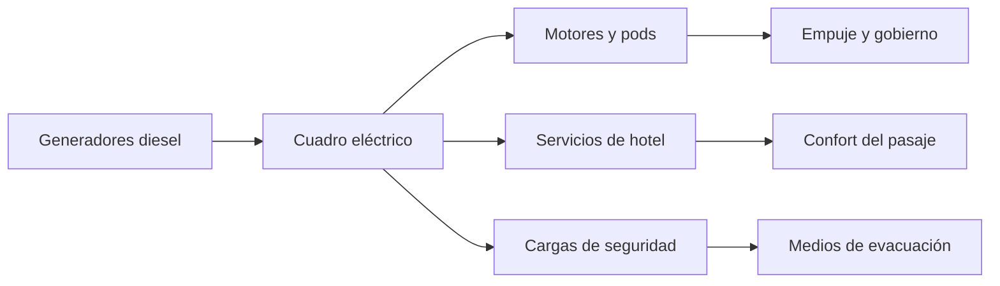

# 🧰 Recursos del crucero

[🏠 Inicio](../../../README.md) · [⛴️ Curso: Cruceros](../README.md) · 🧰 Recursos

Glosario náutico específico, enlaces y diagramas de apoyo del curso de cruceros.
Amplia el [glosario general](../../../docs/05-glosario-general.md).

---

## 📖 Glosario específico

| Término | Definición |
| --- | --- |
| Obra muerta | Parte del casco sobre la línea de flotación; muy alta en cruceros. |
| Pod azimutal | Unidad de propulsión bajo el casco que gira 360 grados y gobierna. |
| Diesel-electrica | Planta en que motores diesel generan electricidad para propulsar. |
| Estabilizador | Aleta lateral retráctil que reduce el balance del buque. |
| Compartimentado | División del casco en secciones estancas por mamparos. |
| Muster | Ejercicio de reunión e instrucción de seguridad del pasaje. |
| Punto de reunión | Lugar asignado donde el pasaje se concentra en una emergencia. |
| Francobordo | Altura del casco desde la flotación hasta la cubierta. |
| Escora | Inclinación transversal del buque. |
| Nudo | Unidad de velocidad: una milla náutica por hora. |
| Babor / estribor | Costado izquierdo / derecho mirando a proa. |

---

## 🗺️ Diagrama de la cadena de energía

---

## 🔗 Enlaces y fuentes

- Marco legal: [⚖️ docs/07-marco-legal-chile.md](../../../docs/07-marco-legal-chile.md)
- Registro de fuentes: [📚 manuales/fuentes.md](../../../manuales/fuentes.md)
- Convenios OMI (SOLAS, STCW, MARPOL, COLREG) y DIRECTEMAR: ver el registro de fuentes.

Registrar cada recurso nuevo con su origen y licencia, siguiendo
[`recursos/README.md`](../../../recursos/README.md).

---

[🎓 Portada del curso](../README.md) · [⬅️ Anterior: Diseño de simulación](../simulacion/diseno-simulador-crucero.md)
