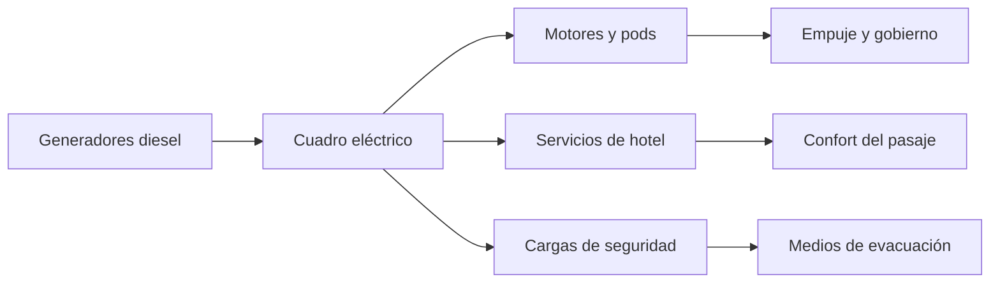

# 🧰 Recursos del crucero

[🏠 Inicio](../../../README.md) · [⛴️ Curso: Cruceros](../README.md) · 🧰 Recursos

Glosario náutico específico, enlaces y diagramas de apoyo del curso de cruceros.
Amplia el [glosario general](../../../docs/05-glosario-general.md).

---

## 📖 Glosario específico

| Término | Definición |
| --- | --- |
| Obra muerta | Parte del casco sobre la línea de flotación; muy alta en cruceros. |
| Pod azimutal | Unidad de propulsión bajo el casco que gira 360 grados y gobierna. |
| Diesel-eléctrica | Planta en que motores diesel generan electricidad para propulsar. |
| Estabilizador | Aleta lateral retráctil que reduce el balance del buque. |
| Compartimentado | División del casco en secciones estancas por mamparos. |
| Muster | Ejercicio de reunión e instrucción de seguridad del pasaje. |
| Punto de reunión | Lugar asignado donde el pasaje se concentra en una emergencia. |
| Francobordo | Altura del casco desde la flotación hasta la cubierta. |
| Escora | Inclinación transversal del buque. |
| Nudo | Unidad de velocidad: una milla náutica por hora. |
| Babor / estribor | Costado izquierdo / derecho mirando a proa. |

---

## 🗺️ Diagrama de la cadena de energía

```mermaid
flowchart LR
    Diesel[Generadores diesel] --> Cuadro[Cuadro eléctrico]
    Cuadro --> Propulsion[Motores y pods]
    Cuadro --> Hotel[Servicios de hotel]
    Cuadro --> Seguridad[Cargas de seguridad]
    Propulsion --> Empuje[Empuje y gobierno]
    Hotel --> Pasaje[Confort del pasaje]
    Seguridad --> Evacuacion[Medios de evacuación]
```

---

## 🔗 Enlaces y fuentes

- Marco legal: [⚖️ docs/07-marco-legal-chile.md](../../../docs/07-marco-legal-chile.md)
- Registro de fuentes: [📚 manuales/fuentes.md](../../../manuales/fuentes.md)
- Convenios OMI (SOLAS, STCW, MARPOL, COLREG) y DIRECTEMAR: ver el registro de fuentes.

Registrar cada recurso nuevo con su origen y licencia, siguiendo
[`recursos/README.md`](../../../recursos/README.md).

## 🎓 Cierre de clase

- **Actividad:** Selecciona términos de glosario, esquemas y trazabilidad de fuentes, explícalos en contexto de Cruceros y verifica la procedencia de las fuentes utilizadas.
- **Evidencia:** Glosario aplicado y ficha breve de trazabilidad.
- **Criterio de aprobación:** Los términos permiten interpretar el curso y las fuentes se distinguen por autoridad, alcance y vigencia.
- **Transferencia:** explica qué cambiaría al pasar a otra variante de esta máquina.

### Fuentes de esta clase

- [IMO-NAV](https://www.imo.org/en/ourwork/safety/pages/navigationdefault.aspx): Safety of Navigation, International Maritime Organization. Uso: navegación, SOLAS, COLREG y STCW.
- [IMO-COLREG](https://www.imo.org/en/about/conventions/pages/colreg.aspx): Collision Regulations, International Maritime Organization. Uso: prevención de abordajes.
- [CL-DIRECTEMAR](https://www.directemar.cl/directemar/marco-normativo): Marco normativo, DIRECTEMAR. Uso: marco marítimo chileno.

> Las fuentes sostienen el marco conceptual y normativo; esta clase no reemplaza el manual
> del fabricante, la formación certificada ni la habilitación exigida para operar equipos reales.

---

[🎓 Portada del curso](../README.md) · [⬅️ Anterior: Diseño de simulación](../simulacion/diseno-simulador-crucero.md) · [➡️ Siguiente: Ejercicios](../ejercicios/ejercicios-crucero.md)
