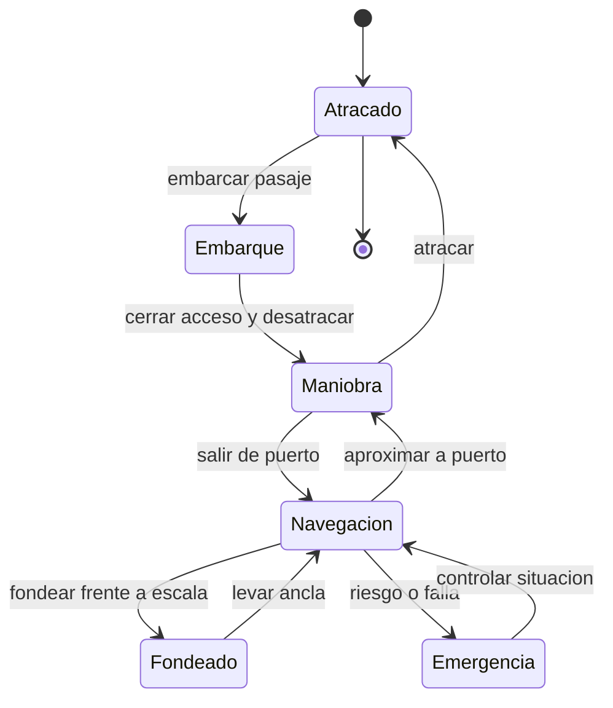
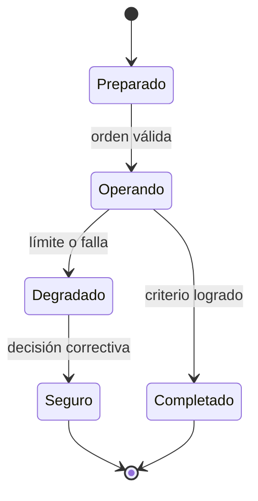

<!-- clase-meta
tipo_documento: clase
clase: 9
codigo: CRUCEROS-09
curso: cruceros
titulo: "Diseño de simulación del crucero"
modalidad: "laboratorio de diseño"
duracion_minutos: 90
nivel: introductorio
prerrequisito: CRUCEROS-08
competencia: "modelado_de_simulacion"
resultados_aprendizaje:
  - "Explicar objetivo, variables, estados, ciclo y escenarios de simulación con vocabulario propio de Cruceros."
  - "Aplicar esos conceptos a una decisión segura o a un escenario de simulación de Cruceros."
evidencia: "Ficha de escenario y diagrama de estados."
criterio_aprobacion: "El modelo es específico de la máquina, medible, seguro y trazable a clases anteriores."
fuentes: manuales/fuentes.md
ultima_revision: 2026-09-10
-->

# 🎮 Diseño de simulación del crucero

[🏠 Inicio](../../../README.md) · [⛴️ Curso: Cruceros](../README.md) · 🎮 Simulación

```mermaid
stateDiagram-v2
    [*] --> Atracado
    Atracado --> Embarque: embarcar pasaje
    Embarque --> Maniobra: cerrar acceso y desatracar
    Maniobra --> Navegacion: salir de puerto
    Navegacion --> Maniobra: aproximar a puerto
    Navegacion --> Fondeado: fondear frente a escala
    Fondeado --> Navegacion: levar ancla
    Maniobra --> Atracado: atracar
    Navegacion --> Emergencia: riesgo o falla
    Emergencia --> Navegacion: controlar situacion
    Atracado --> [*]
```

## Objetivo de la simulación

Que el usuario aprenda a gobernar un crucero respetando la inercia, manejar la
propulsión por pods y el gobierno, aplicar reglas básicas de navegación (COLREG),
gestionar la seguridad del pasaje (muster y evacuación) y realizar maniobras de
puerto de forma segura y progresiva.

## Nivel de realismo

- Nivel elegido: se ofrece del 1 al 3 (ver `docs/03-niveles-de-realismo.md`).
- Justificación: el crucero suma a la navegación de gran buque la gestión de miles
  de pasajeros y la evacuación, por lo que es un curso avanzado respecto del
  carguero.

## Variables principales

| Variable | Tipo | Rango | Afecta a | Comentarios |
| --- | --- | --- | --- | --- |
| Velocidad | numérica | 0-24 nudos | Avance y gobierno | Los pods mantienen autoridad a baja velocidad. |
| Rumbo | numérica | 0-359 grados | Dirección | Cambia con retardo por la inercia. |
| Empuje de pods | numérica | -100..100 % | Avance y maniobra | Combina propulsión y gobierno. |
| Ángulo de pods | numérica | -180..180 grados | Vector de empuje | Permite maniobra lateral. |
| Estabilizadores | discreta | retraído / desplegado | Balance y confort | Reduce el mareo del pasaje. |
| Pasajeros a bordo | numérica | 0-maximo | Seguridad y muster | Debe contarse en evacuación. |
| Estabilidad (GM) | numérica | positiva | Escora y seguridad | Depende de la estiba y el lastre. |
| Viento y corriente | vectorial | variable | Deriva | Muy sensible por la obra muerta. |
| Combustible | numérica | 0-100% | Autonomía | Consumo por propulsión y hotel. |

## Ciclo básico

1. Leer entrada del usuario (pods, timón, thruster, estabilizadores, piloto automático).
2. Actualizar estado de la planta eléctrica, la propulsión y el gobierno.
3. Calcular fuerzas: empuje, resistencia del agua, viento y corriente.
4. Aplicar la inercia de la masa del buque al cambio de velocidad y rumbo.
5. Actualizar posición, rumbo, escora y estado del pasaje.
6. Refrescar instrumentos (radar, GPS, ECDIS), estabilizadores y paneles de seguridad.

## Modos de juego futuros

- Tutorial guiado del puente y las palancas de pod.
- Práctica libre de maniobra de puerto con pods y thrusters.
- Travesía costera entre escalas respetando COLREG.
- Ejercicio de muster y evacuación ordenada del pasaje.
- Situaciones de baja visibilidad con radar, sin contenido sensible.

## Elementos fuera de alcance

- Maniobras temerarias presentadas como recomendables.
- Reproducción de accidentes o victimas de forma sensacionalista.
- Datos que permitan alterar sistemas reales de un buque.

## Pendientes

- [ ] Definir valores por defecto de cada variable por tipo de crucero.
- [ ] Prototipar el modelo de propulsión por pods y maniobra lateral.
- [ ] Modelar el procedimiento de muster y el conteo del pasaje.
- [ ] Agregar fuentes técnicas públicas a [`manuales/fuentes.md`](../../../manuales/fuentes.md).

## 🧭 Guía de estudio aplicada

### Pregunta guía

¿Cómo ayuda **Objetivo de la simulación, Nivel de realismo, Variables principales y Ciclo básico** a **modelar atraque con viento sobre una superestructura de gran superficie como estados, variables y decisiones observables**?

### Explicación razonada

Una simulación de Cruceros es educativa si representa decisiones y consecuencias. Como mínimo debe modelar el estado de generación eléctrica, la respuesta de propulsión, la transición en hélices o pods y el resultado en casco y gobierno. El escenario «atraque con viento sobre una superestructura de gran superficie» es valioso porque obliga a observar, formular una hipótesis, actuar y comprobar.

```mermaid
stateDiagram-v2
    [*] --> Preparado
    Preparado --> Operando: orden válida
    Operando --> Degradado: límite o falla
    Degradado --> Seguro: decisión correctiva
    Operando --> Completado: criterio logrado
    Seguro --> [*]
    Completado --> [*]
```

Esta clase se conecta con el resto del curso mediante **maniobrabilidad de gran masa combinada con viento lateral y efecto de aguas restringidas**. El hilo de
seguridad consiste en reconocer a tiempo **contacto con muelle o pérdida de separación por subestimar abatimiento** y poder justificar la decisión
**coordinar propulsión, remolcadores y límites de viento antes de aproximar**; en clases posteriores cambiará el ángulo de análisis, no esa relación causal.
La lectura funcional común sigue **generación eléctrica → propulsión → hélices o pods → casco y gobierno**, de modo que cada concepto pueda
ubicarse dentro del funcionamiento completo y no quede como un dato aislado.

**Apoyo documental:** [Safety of Navigation](https://www.imo.org/en/ourwork/safety/pages/navigationdefault.aspx) aporta navegación, SOLAS, COLREG y STCW;
[Collision Regulations](https://www.imo.org/en/about/conventions/pages/colreg.aspx) se usa para prevención de abordajes. Estas fuentes
se contrastan con el alcance de la clase y no sustituyen un manual de equipo concreto.

### Caso resuelto: de la observación a la decisión

1. **Estado inicial:** representa atraque con viento sobre una superestructura de gran superficie con valores observables para **generación eléctrica**, **propulsión**, **hélices o pods** y **casco y gobierno**.
2. **Decisión del estudiante:** ofrece una elección que cambie el estado, no una animación automática.
3. **Consecuencia:** modela la tendencia hacia **contacto con muelle o pérdida de separación por subestimar abatimiento** y una señal previa que permita corregir.
4. **Cierre:** evalúa la explicación de la decisión, además de si el estudiante “ganó” el escenario.

### Comprueba tu comprensión

1. ¿Qué cuatro estados mínimos necesita el escenario «atraque con viento sobre una superestructura de gran superficie»?
2. ¿Qué variable anticipa **contacto con muelle o pérdida de separación por subestimar abatimiento** antes de llegar al estado de falla?
3. ¿Cómo evaluarías la explicación del estudiante y no solo el resultado final?

Orientación para revisar tus respuestas

- La primera respuesta debe relacionar el eslabón elegido con un efecto posterior, no solo nombrarlo.
- La segunda debe proponer una señal medible u observable y explicar qué tendencia sería preocupante.
- La tercera debe cambiar al menos una variable de capacidad, mando, entorno o margen de seguridad.

## 🎓 Cierre de clase

- **Actividad:** Diseña un escenario educativo de Cruceros basado en objetivo, variables, estados, ciclo y escenarios de simulación, con entradas, estados, variables y criterio de cierre.
- **Evidencia:** Ficha de escenario y diagrama de estados.
- **Criterio de aprobación:** El modelo es específico de la máquina, medible, seguro y trazable a clases anteriores.
- **Transferencia:** explica qué cambiaría al pasar a otra variante de esta máquina.

### Fuentes de esta clase

- [IMO-NAV](https://www.imo.org/en/ourwork/safety/pages/navigationdefault.aspx): Safety of Navigation, International Maritime Organization. Uso: navegación, SOLAS, COLREG y STCW.
- [IMO-COLREG](https://www.imo.org/en/about/conventions/pages/colreg.aspx): Collision Regulations, International Maritime Organization. Uso: prevención de abordajes.
- [CL-DIRECTEMAR](https://www.directemar.cl/directemar/marco-normativo): Marco normativo, DIRECTEMAR. Uso: marco marítimo chileno.

> Las fuentes sostienen el marco conceptual y normativo; esta clase no reemplaza el manual
> del fabricante, la formación certificada ni la habilitación exigida para operar equipos reales.

---

[⬅️ Anterior: Reglamentos](../reglamentos/reglamentos-crucero.md) · [➡️ Siguiente: Recursos](../recursos/recursos-crucero.md)
