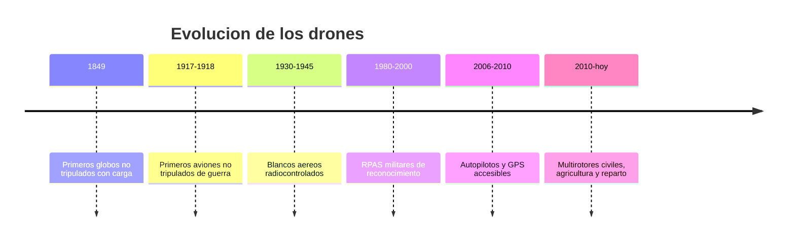

# 📜 Historia del dron

[🏠 Inicio](../../../README.md) · [🕹️ Curso: Drones](../README.md) · 📜 Historia

## Origen

La idea de una aeronave sin piloto a bordo es antigua: comenzó con globos y
blancos aéreos controlados a distancia. El salto hacia el dron moderno llegó
cuando los sensores, los motores brushless y las baterías de litio se hicieron
pequeños y económicos, permitiendo que una controladora estabilizara el vuelo de
forma automática.

## Línea de tiempo

| Periodo | Hito | Importancia |
| --- | --- | --- |
| 1849 | Globos no tripulados con carga | Primer uso de aeronave sin piloto. |
| 1917-1918 | Aviones no tripulados de guerra | Prueba del concepto autónomo. |
| 1930-1945 | Blancos aéreos radiocontrolados | Impulsa el control por radio. |
| 1980-2000 | RPAS militares de reconocimiento | Vuelo prolongado y cámaras. |
| 2006-2010 | Autopilotos y GPS accesibles | Estabilización automática barata. |
| 2010-presente | Multirotores civiles | Uso masivo civil y profesional. |

## Evolución tecnológica

- **Estructura**: de fuselajes de avión a marcos multirotor ligeros de fibra.
- **Propulsión**: de motores de explosión a motores brushless y hélices de paso fijo.
- **Energía**: de combustible a baterías LiPo de alta densidad.
- **Control**: de radio manual a controladoras con IMU, GPS y estabilización.
- **Sensores**: cámaras estabilizadas por gimbal, barómetros y sensores de obstáculos.
- **Automatización**: waypoints, retorno automático y planes de vuelo programados.

## Tipos representativos

| Tipo | Uso típico | Característica destacada |
| --- | --- | --- |
| Multirotor de consumo | Fotografía y ocio | Fácil de volar, estabilización automática. |
| Multirotor profesional | Inspección y cine | Cámara estabilizada y mayor autonomía. |
| Ala fija | Mapeo y agricultura | Gran alcance y eficiencia de vuelo. |
| VTOL híbrido | Mapeo de largo alcance | Despega en vertical y vuela como ala fija. |
| Agrícola | Fumigación y siembra | Depósito de carga y vuelo por franjas. |

## Impacto social y económico

El dron abarató tareas que antes exigian aviones o helicópteros tripulados:
fotografía aérea, inspección de infraestructura, mapeo, agricultura de precisión
y, cada vez más, reparto y apoyo en rescate. Su expansión obligo a crear marcos
legales específicos para la seguridad aérea y la privacidad.

## Fuentes

- Registrar aquí las fuentes públicas consultadas.
- Enlazar cada fuente también en [`manuales/fuentes.md`](../../../manuales/fuentes.md).

---

[🎓 Portada del curso](../README.md) · [➡️ Siguiente: Características](../operacion/caracteristicas-dron.md)
