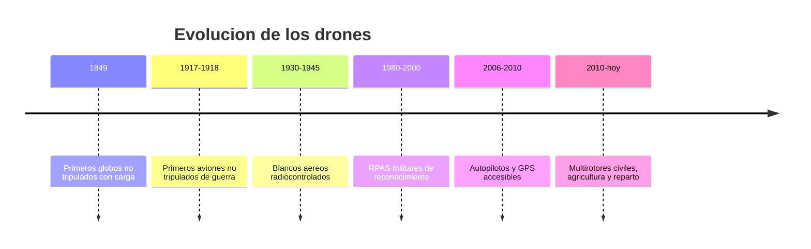

<!-- clase-meta
tipo_documento: clase
clase: 1
codigo: DRONES-01
curso: drones
titulo: "Historia del dron"
modalidad: "teórica dialogada"
duracion_minutos: 45
nivel: introductorio
prerrequisito: ninguno
competencia: "contexto_historico"
resultados_aprendizaje:
  - "Explicar origen, evolución tecnológica, variantes representativas e impacto con vocabulario propio de Drones."
  - "Aplicar esos conceptos a una decisión segura o a un escenario de simulación de Drones."
evidencia: "Línea de tiempo comentada con cuatro hitos o más."
criterio_aprobacion: "Los hitos están ordenados, son pertinentes y dos relaciones de causa y efecto quedan justificadas."
fuentes: manuales/fuentes.md
ultima_revision: 2026-09-10
-->

# 📜 Historia del dron

[🏠 Inicio](../../../README.md) · [🕹️ Curso: Drones](../README.md) · 📜 Historia

```mermaid
timeline
    title Evolucion de los drones
    1849 : Primeros globos no tripulados con carga
    1917-1918 : Primeros aviones no tripulados de guerra
    1930-1945 : Blancos aereos radiocontrolados
    1980-2000 : RPAS militares de reconocimiento
    2006-2010 : Autopilotos y GPS accesibles
    2010-hoy : Multirotores civiles, agricultura y reparto
```

## Origen

La idea de una aeronave sin piloto a bordo es antigua: comenzó con globos y
blancos aéreos controlados a distancia. El salto hacia el dron moderno llegó
cuando los sensores, los motores brushless y las baterías de litio se hicieron
pequeños y económicos, permitiendo que una controladora estabilizara el vuelo de
forma automática.

## Línea de tiempo

| Periodo | Hito | Importancia |
| --- | --- | --- |
| 1849 | Globos no tripulados con carga | Primer uso de aeronave sin piloto. |
| 1917-1918 | Aviones no tripulados de guerra | Prueba del concepto autónomo. |
| 1930-1945 | Blancos aéreos radiocontrolados | Impulsa el control por radio. |
| 1980-2000 | RPAS militares de reconocimiento | Vuelo prolongado y cámaras. |
| 2006-2010 | Autopilotos y GPS accesibles | Estabilización automática barata. |
| 2010-presente | Multirotores civiles | Uso masivo civil y profesional. |

## Evolución tecnológica

- **Estructura**: de fuselajes de avión a marcos multirotor ligeros de fibra.
- **Propulsión**: de motores de explosión a motores brushless y hélices de paso fijo.
- **Energía**: de combustible a baterías LiPo de alta densidad.
- **Control**: de radio manual a controladoras con IMU, GPS y estabilización.
- **Sensores**: cámaras estabilizadas por gimbal, barómetros y sensores de obstáculos.
- **Automatización**: waypoints, retorno automático y planes de vuelo programados.

## Tipos representativos

| Tipo | Uso típico | Característica destacada |
| --- | --- | --- |
| Multirotor de consumo | Fotografía y ocio | Fácil de volar, estabilización automática. |
| Multirotor profesional | Inspección y cine | Cámara estabilizada y mayor autonomía. |
| Ala fija | Mapeo y agricultura | Gran alcance y eficiencia de vuelo. |
| VTOL híbrido | Mapeo de largo alcance | Despega en vertical y vuela como ala fija. |
| Agrícola | Fumigación y siembra | Depósito de carga y vuelo por franjas. |

## Impacto social y económico

El dron abarató tareas que antes exigian aviones o helicópteros tripulados:
fotografía aérea, inspección de infraestructura, mapeo, agricultura de precisión
y, cada vez más, reparto y apoyo en rescate. Su expansión obligo a crear marcos
legales específicos para la seguridad aérea y la privacidad.

## 🧭 Guía de estudio aplicada

### Pregunta guía

¿Cómo ayuda **Origen, Línea de tiempo, Evolución tecnológica y Tipos representativos** a **explicar cómo la evolución hizo posibles alternativas como multirrotor frente a ala fija**?

### Explicación razonada

La evolución de Drones se comprende mejor como una sucesión de respuestas a problemas, no como una lista de fechas. Los cambios en batería, controladores, motores y hélices y actitud y trayectoria alteraron qué podía hacer la máquina, quién podía usarla y qué riesgos debían controlarse. El contraste «multirrotor frente a ala fija» permite observar qué decisiones de diseño permanecieron y cuáles cambiaron con la tecnología y el propósito.

Esta clase se conecta con el resto del curso mediante **el controlador estabiliza actitud, pero autonomía, enlace y entorno limitan la misión**. El hilo de
seguridad consiste en reconocer a tiempo **pérdida de enlace, deriva, impacto o invasión de espacio no autorizado** y poder justificar la decisión
**definir límites de viento, batería, enlace, geocerca y retorno antes de despegar**; en clases posteriores cambiará el ángulo de análisis, no esa relación causal.
La lectura funcional común sigue **batería → controladores → motores y hélices → actitud y trayectoria**, de modo que cada concepto pueda
ubicarse dentro del funcionamiento completo y no quede como un dato aislado.

**Apoyo documental:** [Unmanned Aircraft Systems](https://www.faa.gov/uas) aporta operación y normativa RPAS;
[Normativa aeronáutica](https://www.dgac.gob.cl/normativa/) se usa para marco aeronáutico chileno. Estas fuentes
se contrastan con el alcance de la clase y no sustituyen un manual de equipo concreto.

### Caso resuelto: de la observación a la decisión

1. **Situar:** ordena los hitos que explican cómo se llegó a **multirrotor frente a ala fija** y describe la necesidad que impulsó cada cambio.
2. **Relacionar:** explica qué se modificó en **batería**, **controladores**, **motores y hélices** o **actitud y trayectoria**; una fecha sin mecanismo no basta.
3. **Interpretar:** vincula el cambio con una capacidad nueva y también con el riesgo **pérdida de enlace, deriva, impacto o invasión de espacio no autorizado**.
4. **Transferir:** usa la evolución para justificar por qué hoy conviene **definir límites de viento, batería, enlace, geocerca y retorno antes de despegar**.

### Comprueba tu comprensión

1. ¿Qué necesidad histórica impulsó un cambio en **batería** o **controladores**?
2. ¿Qué hito modificó la relación entre capacidad y **pérdida de enlace, deriva, impacto o invasión de espacio no autorizado**?
3. ¿Por qué **multirrotor frente a ala fija** no puede explicarse como una simple diferencia estética?

Orientación para revisar tus respuestas

- La primera respuesta debe relacionar el eslabón elegido con un efecto posterior, no solo nombrarlo.
- La segunda debe proponer una señal medible u observable y explicar qué tendencia sería preocupante.
- La tercera debe cambiar al menos una variable de capacidad, mando, entorno o margen de seguridad.

## 🎓 Cierre de clase

- **Actividad:** Construye una línea de tiempo de Drones y explica cómo dos cambios históricos transformaron su función o su puesto de mando.
- **Evidencia:** Línea de tiempo comentada con cuatro hitos o más.
- **Criterio de aprobación:** Los hitos están ordenados, son pertinentes y dos relaciones de causa y efecto quedan justificadas.
- **Transferencia:** explica qué cambiaría al pasar a otra variante de esta máquina.

### Fuentes de esta clase

- [US-FAA-UAS](https://www.faa.gov/uas): Unmanned Aircraft Systems, FAA. Uso: operación y normativa RPAS.
- [CL-DGAC](https://www.dgac.gob.cl/normativa/): Normativa aeronáutica, DGAC Chile. Uso: marco aeronáutico chileno.

> Las fuentes sostienen el marco conceptual y normativo; esta clase no reemplaza el manual
> del fabricante, la formación certificada ni la habilitación exigida para operar equipos reales.

---

[🎓 Portada del curso](../README.md) · [➡️ Siguiente: Características](../operacion/caracteristicas-dron.md)
