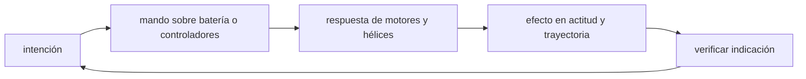

<!-- clase-meta
tipo_documento: clase
clase: 5
codigo: DRONES-05
curso: drones
titulo: "Mandos e instrumentos del dron"
modalidad: "taller de simulación"
duracion_minutos: 60
nivel: introductorio
prerrequisito: DRONES-04
competencia: "lectura_y_mando"
resultados_aprendizaje:
  - "Explicar controles, instrumentos, entradas y estados del sistema con vocabulario propio de Drones."
  - "Aplicar esos conceptos a una decisión segura o a un escenario de simulación de Drones."
evidencia: "Mapa de mandos y resolución de dos estados del tablero."
criterio_aprobacion: "Reconoce los controles críticos y responde a los estados sin introducir acciones inseguras."
fuentes: manuales/fuentes.md
ultima_revision: 2026-09-10
-->

# 🎛️ Mandos e instrumentos del dron

[🏠 Inicio](../../../README.md) · [🕹️ Curso: Drones](../README.md) · 🎛️ Mandos

## Vista general

El piloto de dron no va a bordo: opera desde tierra con un **radiocontrol** de dos
sticks y una **estación de tierra** que muestra la telemetría y la imagen de la
cámara. Los dos sticks combinan cuatro mandos básicos: gas o throttle, guiñada,
cabeceo y alabeo. La estación complementa con la vista de la cámara, el estado de
la batería, el modo de vuelo y la posición en un mapa.

## Mapa de controles

| Zona | Control | Tipo | Función | Prioridad | Comentarios |
| --- | --- | --- | --- | --- | --- |
| Stick izquierdo vertical | Throttle / gas | Stick | Subir o bajar el empuje total | Alta | En modo común controla la altura. |
| Stick izquierdo horizontal | Guiñada / yaw | Stick | Girar la nariz izquierda o derecha | Alta | Rota el dron sobre su eje vertical. |
| Stick derecho vertical | Cabeceo / pitch | Stick | Avanzar o retroceder | Alta | Inclina el dron adelante o atrás. |
| Stick derecho horizontal | Alabeo / roll | Stick | Desplazar a los lados | Alta | Inclina el dron a izquierda o derecha. |
| Interruptor superior | Modo de vuelo | Palanca | Cambiar entre modos | Alta | GPS, estabilizado o manual. |
| Interruptor lateral | Return to home | Botón | Activar el retorno a casa | Alta | Vuelve al punto de despegue. |
| Rueda lateral | Gimbal / cámara | Rueda | Inclinar la cámara | Media | Ajusta el ángulo de la toma. |
| Botón dedicado | Disparo de cámara | Botón | Foto o inicio de video | Media | Según la misión. |
| Estación de tierra | Pantalla | Pantalla | Video y telemetría | Alta | Ver sección de instrumentos. |

## Instrumentos principales

| Instrumento | Mide o muestra | Unidad | Importancia | Notas |
| --- | --- | --- | --- | --- |
| Nivel de batería | Carga restante | % o voltaje | Alta | Dispara avisos y retorno automático. |
| Altura | Altura sobre el despegue | metros | Alta | Del barómetro y del GPS. |
| Distancia | Separación al piloto | metros | Alta | Clave para no perder el enlace. |
| Número de satélites | Calidad del GPS | conteo | Alta | Pocos satélites, menos precisión. |
| Velocidad | Velocidad sobre el terreno | m/s o km/h | Media | Del GPS. |
| Modo de vuelo | Modo activo | texto | Alta | GPS, estabilizado o manual. |
| Intensidad de señal | Calidad del enlace | barras | Alta | Baja señal anticipa fail-safe. |
| Vista de cámara | Imagen en vivo | video | Media | Base del vuelo FPV. |

## Modos de vuelo

| Modo | Que hace | Cuando usarlo |
| --- | --- | --- |
| GPS / posición | Mantiene el punto y la altura solo. | Vuelo estable y para aprender. |
| Estabilizado | Nivela la actitud, sin fijar la posición. | Con poca señal de GPS. |
| Manual / acro | El piloto controla la actitud sin ayudas. | Vuelo deportivo y avanzado. |
| Retorno a casa | Vuelve y aterriza en el despegue. | Emergencia o fin de misión. |

## Entradas de simulación

| Acción | Teclado | Controlador | Radiocontrol | Comentarios |
| --- | --- | --- | --- | --- |
| Throttle arriba/abajo | Teclas W / S | Stick izq eje Y | Stick izq vertical | Sube o baja el empuje. |
| Guiñada izq/der | Teclas A / D | Stick izq eje X | Stick izq horizontal | Gira la nariz. |
| Cabeceo adelante/atrás | Flechas arriba/abajo | Stick der eje Y | Stick der vertical | Avanza o retrocede. |
| Alabeo izq/der | Flechas izq/der | Stick der eje X | Stick der horizontal | Desplaza de lado. |
| Cambiar modo | Tecla M | Botón | Interruptor superior | Rota entre modos. |
| Return to home | Tecla H | Botón | Interruptor lateral | Inicia el retorno. |
| Inclinar cámara | Teclas R / F | Cruceta | Rueda lateral | Mueve el gimbal. |

## Estados del sistema

| Estado | Descripción | Indicadores | Acciones disponibles |
| --- | --- | --- | --- |
| En tierra apagado | Motores detenidos | Estación sin telemetría | Encender, chequeo previo. |
| Armado | Motores listos para girar | Aviso de armado | Despegar, cancelar armado. |
| En vuelo | Volando bajo control | Altura y batería activas | Trasladar, ascender, girar, filmar. |
| Estacionario | Sostenido sobre un punto | Velocidad cerca de cero | Ajustar cámara, planear ruta. |
| Retorno | Volviendo a casa | Aviso de RTH | Retomar control o dejar aterrizar. |
| Emergencia | Falla o poca batería | Testigos de alerta | Aterrizar, activar retorno. |

## Observaciones ergonomicas

- El nivel de batería y la distancia deben verse siempre; limitan el vuelo.
- Los dos sticks se coordinan de forma continua: la interfaz debe mostrar como
  cada uno afecta el movimiento del dron.
- El botón de retorno a casa debe ser accesible y reconocible.
- Conviene distinguir con claridad el modo de vuelo activo, porque cambia como
  responden los sticks.
- La interfaz de simulación debería avisar antes de que el enlace o la batería
  lleguen al límite.

## 🧭 Guía de estudio aplicada

### Pregunta guía

¿Cómo ayuda **Vista general, Mapa de controles, Instrumentos principales y Modos de vuelo** a **interpretar mandos e indicaciones durante inspección próxima a una estructura con viento y señal GNSS degradada**?

### Explicación razonada

Un mando no se aprende memorizando su nombre, sino recorriendo el ciclo intención → acción → indicación → verificación. En Drones, el operador actúa sobre batería o controladores, observa la respuesta en motores y hélices y confirma el efecto en actitud y trayectoria. Una indicación inesperada exige detener la secuencia mental, identificar el modo activo y evitar una segunda orden que agrave el estado.

Esta clase se conecta con el resto del curso mediante **el controlador estabiliza actitud, pero autonomía, enlace y entorno limitan la misión**. El hilo de
seguridad consiste en reconocer a tiempo **pérdida de enlace, deriva, impacto o invasión de espacio no autorizado** y poder justificar la decisión
**definir límites de viento, batería, enlace, geocerca y retorno antes de despegar**; en clases posteriores cambiará el ángulo de análisis, no esa relación causal.
La lectura funcional común sigue **batería → controladores → motores y hélices → actitud y trayectoria**, de modo que cada concepto pueda
ubicarse dentro del funcionamiento completo y no quede como un dato aislado.

**Apoyo documental:** [Unmanned Aircraft Systems](https://www.faa.gov/uas) aporta operación y normativa RPAS;
[Normativa aeronáutica](https://www.dgac.gob.cl/normativa/) se usa para marco aeronáutico chileno. Estas fuentes
se contrastan con el alcance de la clase y no sustituyen un manual de equipo concreto.

### Caso resuelto: de la observación a la decisión

1. **Intención:** formula qué cambio se necesita durante **inspección próxima a una estructura con viento y señal GNSS degradada**.
2. **Mando:** identifica el control que actúa sobre **batería** o **controladores** y el modo que debe estar activo.
3. **Lectura:** localiza la indicación que confirma la respuesta de **motores y hélices** y el efecto en **actitud y trayectoria**.
4. **Verificación:** si la lectura no coincide, no acumules órdenes; estabiliza e investiga el estado.

### Comprueba tu comprensión

1. ¿Qué mando inicia la respuesta y qué instrumento confirma que el modo correcto está activo?
2. ¿Qué indicación temprana advertiría **pérdida de enlace, deriva, impacto o invasión de espacio no autorizado**?
3. ¿Qué secuencia usarías si la respuesta de **actitud y trayectoria** no coincide con la orden?

Orientación para revisar tus respuestas

- La primera respuesta debe relacionar el eslabón elegido con un efecto posterior, no solo nombrarlo.
- La segunda debe proponer una señal medible u observable y explicar qué tendencia sería preocupante.
- La tercera debe cambiar al menos una variable de capacidad, mando, entorno o margen de seguridad.

## 🎓 Cierre de clase

- **Actividad:** Recorre el puesto de mando simulado de Drones: localiza los controles de controles, instrumentos, entradas y estados del sistema y asocia cada indicación con una decisión.
- **Evidencia:** Mapa de mandos y resolución de dos estados del tablero.
- **Criterio de aprobación:** Reconoce los controles críticos y responde a los estados sin introducir acciones inseguras.
- **Transferencia:** explica qué cambiaría al pasar a otra variante de esta máquina.

### Fuentes de esta clase

- [US-FAA-UAS](https://www.faa.gov/uas): Unmanned Aircraft Systems, FAA. Uso: operación y normativa RPAS.
- [CL-DGAC](https://www.dgac.gob.cl/normativa/): Normativa aeronáutica, DGAC Chile. Uso: marco aeronáutico chileno.

> Las fuentes sostienen el marco conceptual y normativo; esta clase no reemplaza el manual
> del fabricante, la formación certificada ni la habilitación exigida para operar equipos reales.

---

[⬅️ Anterior: Sistemas mecánicos](../operacion/sistemas-mecanicos-dron.md) · [➡️ Siguiente: Principios y operación](../operacion/principios-dron.md)
