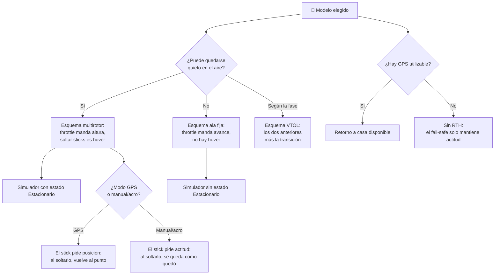

# 🧩 Modelos y variantes del dron

[🏠 Inicio](../../../README.md) · [🕹️ Curso: Drones](../README.md) · 🧩 Modelos

El [Módulo 2](../operacion/caracteristicas-dron.md) ya dijo qué tipos de dron
existen y para qué sirve cada uno. Este módulo responde a lo siguiente: **no
todos se pilotan igual**, y esa diferencia no es de matiz. Cambia qué mandos
tiene la máquina y, por tanto, qué debe modelar el simulador.

> 🎯 **La idea que sostiene el módulo.** "Un dron" no es una sola máquina desde
> el punto de vista del mando. Un ala fija no puede quedarse quieta en el aire:
> no es que le cueste más, es que el vuelo estacionario **no existe** para ella.
> Un simulador que presente un solo esquema de control está representando un
> multirotor concreto aunque diga representarlos todos.

---

## 🧭 Por qué el modelo decide el simulador

El [Módulo 5](../mandos/manual-mandos-dron.md) describe un puesto de mando de dos
sticks donde el throttle sube o baja el empuje total y, en el modo común,
controla la altura. El [Módulo 9](../simulacion/diseno-simulador-dron.md) expone
un estado `Estacionario` al que se llega **soltando los sticks**. Ambos describen
un multirotor en modo GPS.

En un ala fija, soltar los sticks no devuelve al aparato a un punto fijo, porque
no hay punto fijo al que volver: necesita avanzar para sostenerse. El estado
`Estacionario` no tiene contenido que representar y el throttle deja de ser el
mando de la altura. Si el simulador se construye sobre el esquema del multirotor
y luego se le "añade" un ala fija, el resultado es un ala fija que hace hover,
que no existe.

Lo mismo ocurre dentro del propio multirotor cuando cambia el modo de vuelo. El
[Módulo 5](../mandos/manual-mandos-dron.md) ya lo advierte: el modo activo
"cambia cómo responden los sticks". Eso no es un ajuste de sensibilidad, es otro
esquema de control sobre el mismo hardware.

---

## 🗂️ Qué cambia en el manejo

| Modelo | Qué cambia al pilotarlo |
| --- | --- |
| Multirotor / cuadricóptero | La referencia del curso: despega en vertical, se sostiene sobre un punto y todo el control nace de variar el rpm de cada rotor. |
| Multirotor / hexacóptero y más | Mismo pilotaje, más rotores: sobra empuje para carga útil y queda margen si falla un motor. |
| Ala fija | No se detiene en el aire: hay que mantener el avance. Gana alcance y autonomía, pero pierde el hover y el despegue vertical. |
| Híbrido VTOL | Se pilota como dos aparatos distintos según la fase: multirotor al despegar y aterrizar, ala fija en crucero, con una transición entre ambos. |
| Multirotor en modo GPS / posición | El aparato mantiene el punto y la altura solo; el piloto corrige poco y la atención se libera hacia la misión. |
| Multirotor en modo estabilizado | La controladora nivela la actitud pero no fija la posición: el viento deriva y el piloto compensa de forma continua. |
| Multirotor en modo manual / acro | Sin ayudas de posición ni de nivelación: el aparato conserva la actitud que el piloto le deja y no se recupera solo. |
| Con carga útil variable | La fumigación o el reparto vacían la carga durante el vuelo: el mismo aparato se comporta distinto al empezar y al terminar. |
| Terrestre UGV / submarino ROV | No vuelan. Comparten la idea de vehículo no tripulado, pero su física y sus mandos son otros. |

---

## 🎛️ Qué cambia en el mando

| Modelo | Qué mando aparece o desaparece | Consecuencia |
| --- | --- | --- |
| Multirotor, cuadricóptero o hexacóptero | Ninguno: el mapa de controles del Módulo 5 aplica tal cual. | Cambian los márgenes, no los controles. |
| Ala fija | **Desaparece** el vuelo estacionario y con él la idea de soltar los sticks para quedarse quieto. El throttle **deja de mandar la altura** y pasa a mandar el avance. | El piloto no puede "parar a pensar" en el aire: toda decisión se toma en movimiento. |
| Híbrido VTOL | **Aparece** un mando de transición entre el vuelo vertical y el crucero. | El mismo stick significa una cosa antes de la transición y otra después. |
| Multirotor en modo GPS / posición | Ninguno nuevo: es el caso base del Módulo 5. | El stick pide una posición y el aparato la sostiene al soltarlo. |
| Multirotor en modo manual / acro | Los mismos sticks, **otra orden**: dejan de pedir posición y pasan a pedir actitud. | Al soltar el stick el dron no se nivela ni vuelve al punto: se queda como quedó. |
| Sin GPS a bordo o con GPS degradado | **Desaparecen** el mantenimiento de posición y el retorno a casa, que dependen del GPS. | El interruptor de RTH queda sin función y el fail-safe ya no puede prometer el regreso. |
| Sin cámara ni gimbal | **Desaparecen** la rueda del gimbal y el botón de disparo; también la vista de cámara de la estación. | Se vuela mirando el aparato, no la pantalla. |
| Con carga útil variable | **Aparece** el mando de la carga (soltar, pulverizar) como masa que el piloto gestiona. | No es un mando de vuelo, pero altera el resultado de todos los demás. |

---

## 🎮 Qué cambia en el simulador

Contrastado con las variables del
[Módulo 9](../simulacion/diseno-simulador-dron.md):

| Modelo | Variables que cambian | Esquema de control |
| --- | --- | --- |
| Multirotor / cuadricóptero | Ninguna: es el caso base. | El del Módulo 5, en modo GPS. |
| Multirotor / hexacóptero y más | `Peso del conjunto` admite más carga sin agotar el empuje. | El mismo. |
| Ala fija | `Throttle` **deja de gobernar la altura** y pasa a gobernar el avance. `Cabeceo` y `Alabeo` **dejan de ser una inclinación acotada** que se traduce en desplazamiento. `Viento` cambia de signo: ya no es solo deriva, también sostiene o frena. | Sin estado estacionario: el estado `Estacionario` del Módulo 9 no tiene valores que tomar. |
| Híbrido VTOL | Las mismas variables, con **dos interpretaciones** según la fase, más una transición entre ellas. | Dos esquemas de control y un cambio de uno a otro. |
| Multirotor en modo estabilizado | `Calidad de GPS` deja de sostener la posición: pasa a informar, no a corregir. | El mismo, con deriva permanente a cargo del piloto. |
| Multirotor en modo manual / acro | `Cabeceo` y `Alabeo` **dejan de ser un ángulo** al que el aparato vuelve y pasan a ser una velocidad de rotación que el piloto debe detener. | Otro esquema: sin nivelación automática ni mantenimiento de punto. |
| Sin GPS o con GPS degradado | `Calidad de GPS` **se elimina o queda en cero**; el retorno automático que dispara `Batería` deja de estar disponible. | Sin RTH: el fail-safe de `Enlace de radio` solo puede mantener actitud. |
| Con carga útil variable | `Peso del conjunto` deja de ser `fijo + carga` y pasa a variar durante la partida. | El mismo. |
| Terrestre UGV / submarino ROV | Todas: no hay empuje que sostenga un peso en el aire. | Fuera del alcance de este simulador. |

---

## 🗺️ Del modelo al esquema de control

---

## ⚠️ Qué modelos no comparten simulador

Tres familias no se resuelven con un ajuste de parámetros, porque su esquema de
control es otro:

- **El ala fija y el VTOL** frente al multirotor: desaparece el vuelo
  estacionario y el throttle cambia de significado. Es un modo de control
  distinto, no una dificultad distinta. El VTOL además obliga a sostener los dos
  esquemas a la vez y la transición entre ellos.
- **El modo manual / acro** frente al modo GPS: los mismos sticks piden otra
  cosa. En GPS el stick pide una posición que el aparato sostiene; en acro pide
  una rotación que el piloto debe detener. Modelarlo como "el mismo control, más
  sensible" es representarlo mal.
- **El UGV y el ROV** frente a todo lo anterior: no vuelan. El
  [Módulo 2](../operacion/caracteristicas-dron.md) ya los deja fuera del foco, y
  aquí se confirma por qué: no comparten ni una variable del Módulo 9.

El resto de variantes sí caben en un mismo simulador ajustando rangos, tal como
plantean los [niveles de realismo](../../../docs/03-niveles-de-realismo.md): en
el nivel 1 casi todas se comportan igual, y las diferencias emergen a medida que
el nivel sube. Los modos de vuelo, la pérdida de GPS y el fail-safe entran, según
el [Módulo 6](../operacion/principios-dron.md), recién en el nivel 3.

Ninguna de estas variantes se separa por norma: los umbrales de peso, altura y
distancia de la **DAN 151** siguen marcados como "(por confirmar)" en el
[Módulo 8](../reglamentos/reglamentos-dron.md) y no se usan aquí para definir
categorías de modelo.

---

[⬅️ Anterior: Características](../operacion/caracteristicas-dron.md) · [➡️ Siguiente: Sistemas mecánicos](../operacion/sistemas-mecanicos-dron.md)
</content>
</invoke>
