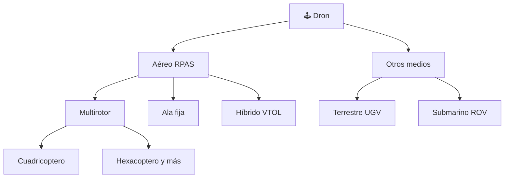

# 📋 Características funcionales del dron

[🏠 Inicio](../../../README.md) · [🕹️ Curso: Drones](../README.md) · 📋 Características

Que es un dron, que tipos existen y para que sirve cada uno. Este módulo da el
contexto antes de abrir la mecánica (Módulo 3).

---

## 🧭 Definición

Un dron es una **aeronave pilotada a distancia** (RPAS, por sus siglas en inglés
para sistema de aeronave pilotada a distancia; también llamada UAV). No lleva
piloto a bordo: se gobierna desde tierra con un radiocontrol y una estación, y
una controladora de vuelo estabiliza el aparato de forma automática. El foco de
este curso es el dron aéreo multirotor, el más común en uso civil.

Aunque la palabra "dron" también se aplica a vehículos no tripulados terrestres
(UGV) y submarinos (ROV), este curso trata el dron aéreo; los otros tipos se
mencionan al final solo como contexto.

---

## 🧬 Características clave

| Característica | Descripción |
| --- | --- |
| Vuelo sin piloto a bordo | Se opera a distancia; el piloto ve desde tierra o por cámara. |
| Estabilización automática | La controladora corrige la actitud varias veces por segundo. |
| Despegue y aterrizaje vertical | El multirotor no necesita pista. |
| Vuelo estacionario | Puede mantenerse inmóvil sobre un punto. |
| Autonomía limitada | La batería define minutos de vuelo, no horas. |
| Carga útil modular | Cámara, sensores o depósito según la misión. |

---

## 🗂️ Tipos de dron

| Tipo | Uso típico | Rasgo destacado |
| --- | --- | --- |
| Multirotor | Fotografía, inspección, ocio | Vuelo estacionario y despegue vertical. |
| Ala fija | Mapeo y agricultura extensa | Gran alcance y eficiencia de vuelo. |
| Híbrido VTOL | Mapeo de largo alcance | Despega vertical y cruza como ala fija. |
| Terrestre UGV | Inspección y logística en suelo | Rueda u oruga; no vuela. |
| Submarino ROV | Inspección bajo el agua | Va conectado por cable al operador. |

Los **UGV** y **ROV** se citan solo como contexto: comparten la idea de vehículo
no tripulado, pero su física y sus mandos son distintos y quedan fuera del foco
de este curso.

---

## 🎯 Para qué se usa

- **Fotografía y cine**: tomas aéreas estabilizadas.
- **Agricultura**: mapeo de cultivos, fumigación y siembra de precisión.
- **Inspección**: torres, líneas eléctricas, techos y estructuras.
- **Mapeo**: fotogrametría y modelos 3D del terreno.
- **Reparto**: entrega de paquetes ligeros en pruebas y rutas cortas.
- **Rescate**: búsqueda de personas y evaluación de zonas de riesgo.

---

[⬅️ Anterior: Historia](../historia/historia-dron.md) · [➡️ Siguiente: Sistemas mecánicos](sistemas-mecanicos-dron.md)
