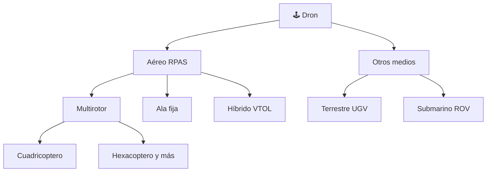

<!-- clase-meta
tipo_documento: clase
clase: 2
codigo: DRONES-02
curso: drones
titulo: "Características funcionales del dron"
modalidad: "teórica aplicada"
duracion_minutos: 45
nivel: introductorio
prerrequisito: DRONES-01
competencia: "identificacion_funcional"
resultados_aprendizaje:
  - "Explicar definición, rasgos funcionales, tipos y usos con vocabulario propio de Drones."
  - "Aplicar esos conceptos a una decisión segura o a un escenario de simulación de Drones."
evidencia: "Matriz comparativa y decisión justificada."
criterio_aprobacion: "La elección considera función, límites, mando y efecto en la simulación; no se apoya solo en preferencias."
fuentes: manuales/fuentes.md
ultima_revision: 2026-09-10
-->

# 📋 Características funcionales del dron

[🏠 Inicio](../../../README.md) · [🕹️ Curso: Drones](../README.md) · 📋 Características

Que es un dron, que tipos existen y para que sirve cada uno. Esta clase da el
contexto antes de abrir la mecánica (Clase 4).

---

## 🧭 Definición

Un dron es una **aeronave pilotada a distancia** (RPAS, por sus siglas en inglés
para sistema de aeronave pilotada a distancia; también llamada UAV). No lleva
piloto a bordo: se gobierna desde tierra con un radiocontrol y una estación, y
una controladora de vuelo estabiliza el aparato de forma automática. El foco de
este curso es el dron aéreo multirotor, el más común en uso civil.

Aunque la palabra "dron" también se aplica a vehículos no tripulados terrestres
(UGV) y submarinos (ROV), este curso trata el dron aéreo; los otros tipos se
mencionan al final solo como contexto.

---

## 🧬 Características clave

| Característica | Descripción |
| --- | --- |
| Vuelo sin piloto a bordo | Se opera a distancia; el piloto ve desde tierra o por cámara. |
| Estabilización automática | La controladora corrige la actitud varias veces por segundo. |
| Despegue y aterrizaje vertical | El multirotor no necesita pista. |
| Vuelo estacionario | Puede mantenerse inmóvil sobre un punto. |
| Autonomía limitada | La batería define minutos de vuelo, no horas. |
| Carga útil modular | Cámara, sensores o depósito según la misión. |

---

## 🗂️ Tipos de dron

```mermaid
flowchart TD
    Dron[🕹️ Dron] --> Aereo[Aéreo RPAS]
    Dron --> Otros[Otros medios]
    Aereo --> Multi[Multirotor]
    Aereo --> Ala[Ala fija]
    Aereo --> VTOL[Híbrido VTOL]
    Multi --> Quad[Cuadricoptero]
    Multi --> Hexa[Hexacoptero y más]
    Otros --> UGV[Terrestre UGV]
    Otros --> ROV[Submarino ROV]
```

| Tipo | Uso típico | Rasgo destacado |
| --- | --- | --- |
| Multirotor | Fotografía, inspección, ocio | Vuelo estacionario y despegue vertical. |
| Ala fija | Mapeo y agricultura extensa | Gran alcance y eficiencia de vuelo. |
| Híbrido VTOL | Mapeo de largo alcance | Despega vertical y cruza como ala fija. |
| Terrestre UGV | Inspección y logística en suelo | Rueda u oruga; no vuela. |
| Submarino ROV | Inspección bajo el agua | Va conectado por cable al operador. |

Los **UGV** y **ROV** se citan solo como contexto: comparten la idea de vehículo
no tripulado, pero su física y sus mandos son distintos y quedan fuera del foco
de este curso.

---

## 🎯 Para qué se usa

- **Fotografía y cine**: tomas aéreas estabilizadas.
- **Agricultura**: mapeo de cultivos, fumigación y siembra de precisión.
- **Inspección**: torres, líneas eléctricas, techos y estructuras.
- **Mapeo**: fotogrametría y modelos 3D del terreno.
- **Reparto**: entrega de paquetes ligeros en pruebas y rutas cortas.
- **Rescate**: búsqueda de personas y evaluación de zonas de riesgo.

## 🧭 Guía de estudio aplicada

### Pregunta guía

¿Cómo ayuda **Definición, Características clave, Tipos de dron y Para qué se usa** a **elegir una configuración adecuada para inspección próxima a una estructura con viento y señal GNSS degradada**?

### Explicación razonada

Una característica solo es útil cuando permite anticipar comportamiento. En Drones, la relación entre batería, controladores, motores y hélices y actitud y trayectoria determina capacidad, respuesta y límites. Por eso «multirrotor frente a ala fija» no se compara por apariencia: se compara por misión, entorno, carga de trabajo y exposición al riesgo «pérdida de enlace, deriva, impacto o invasión de espacio no autorizado».

Esta clase se conecta con el resto del curso mediante **el controlador estabiliza actitud, pero autonomía, enlace y entorno limitan la misión**. El hilo de
seguridad consiste en reconocer a tiempo **pérdida de enlace, deriva, impacto o invasión de espacio no autorizado** y poder justificar la decisión
**definir límites de viento, batería, enlace, geocerca y retorno antes de despegar**; en clases posteriores cambiará el ángulo de análisis, no esa relación causal.
La lectura funcional común sigue **batería → controladores → motores y hélices → actitud y trayectoria**, de modo que cada concepto pueda
ubicarse dentro del funcionamiento completo y no quede como un dato aislado.

**Apoyo documental:** [Unmanned Aircraft Systems](https://www.faa.gov/uas) aporta operación y normativa RPAS;
[Normativa aeronáutica](https://www.dgac.gob.cl/normativa/) se usa para marco aeronáutico chileno. Estas fuentes
se contrastan con el alcance de la clase y no sustituyen un manual de equipo concreto.

### Caso resuelto: de la observación a la decisión

1. **Definir la necesidad:** convierte «inspección próxima a una estructura con viento y señal GNSS degradada» en requisitos de capacidad, entorno y respuesta.
2. **Comparar:** contrasta **multirrotor frente a ala fija** usando esos requisitos y la cadena **batería → controladores → motores y hélices → actitud y trayectoria**.
3. **Descartar:** elimina la alternativa que deja menos margen frente a **pérdida de enlace, deriva, impacto o invasión de espacio no autorizado**.
4. **Elegir:** declara la variante escogida, la evidencia usada y una limitación que todavía debe respetarse.

### Comprueba tu comprensión

1. ¿Qué característica de **actitud y trayectoria** condiciona primero el caso «inspección próxima a una estructura con viento y señal GNSS degradada»?
2. ¿Qué requisito descartaría una de las alternativas **multirrotor frente a ala fija**?
3. ¿Qué límite debe declararse junto con la variante elegida?

Orientación para revisar tus respuestas

- La primera respuesta debe relacionar el eslabón elegido con un efecto posterior, no solo nombrarlo.
- La segunda debe proponer una señal medible u observable y explicar qué tendencia sería preocupante.
- La tercera debe cambiar al menos una variable de capacidad, mando, entorno o margen de seguridad.

## 🎓 Cierre de clase

- **Actividad:** Compara variantes de Drones mediante los ejes «definición, rasgos funcionales, tipos y usos» y elige una para un caso de uso razonado.
- **Evidencia:** Matriz comparativa y decisión justificada.
- **Criterio de aprobación:** La elección considera función, límites, mando y efecto en la simulación; no se apoya solo en preferencias.
- **Transferencia:** explica qué cambiaría al pasar a otra variante de esta máquina.

### Fuentes de esta clase

- [US-FAA-UAS](https://www.faa.gov/uas): Unmanned Aircraft Systems, FAA. Uso: operación y normativa RPAS.
- [CL-DGAC](https://www.dgac.gob.cl/normativa/): Normativa aeronáutica, DGAC Chile. Uso: marco aeronáutico chileno.

> Las fuentes sostienen el marco conceptual y normativo; esta clase no reemplaza el manual
> del fabricante, la formación certificada ni la habilitación exigida para operar equipos reales.

---

[⬅️ Anterior: Historia](../historia/historia-dron.md) · [➡️ Siguiente: Modelos y variantes](../modelos/modelos-dron.md)
