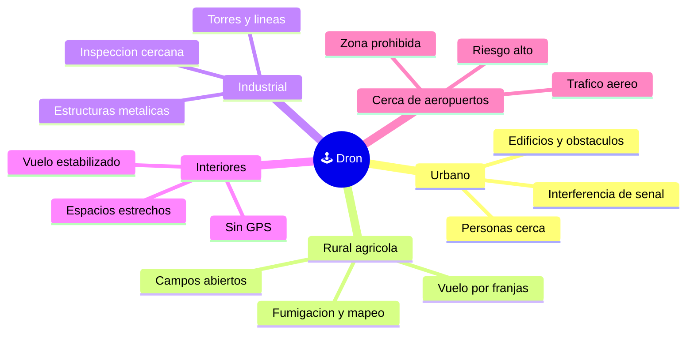

# 🌍 Entornos de trabajo del dron

[🏠 Inicio](../../../README.md) · [🕹️ Curso: Drones](../README.md) · 🌍 Entornos

Dónde opera un dron y cómo cambia el vuelo según el entorno. Cada entorno implica
reglas, riesgos y ajustes distintos, y en simulación se traduce en escenarios
diferentes.

---

## 🗺️ Entornos principales

| Entorno | Características | Riesgos típicos | Ajuste de vuelo |
| --- | --- | --- | --- |
| Urbano | Edificios, calles, público. | Interferencia, personas, obstáculos. | Baja altura, margenes amplios, sin sobrevolar gente. |
| Rural / agrícola | Campos abiertos y amplios. | Viento, distancia larga. | Vuelo por franjas, vigilar batería y enlace. |
| Industrial | Torres, líneas, estructuras. | Metal que altera la brújula. | Inspección cercana, atento al GPS. |
| Interiores | Sin GPS, espacio estrecho. | Choques, deriva sin posición. | Modo estabilizado, control manual fino. |
| Cerca de aeropuertos | Zona prohibida, tráfico aéreo. | Riesgo grave para la aviación. | No volar; respetar la restricción. |

---

## 🌦️ Factores del entorno

- **Viento**: empuja el dron y consume batería al compensarlo; con rachas fuertes
  puede superar el empuje disponible.
- **GPS**: cerca de edificios, bajo techo o entre estructuras metálicas, la señal
  se degrada y el dron pierde el mantenimiento de posición.
- **Interferencia**: otras radios, wifi o estructuras metálicas debilitan el
  enlace de mando y de video.
- **Temperatura**: el frío reduce el rendimiento de la batería LiPo y la autonomía.

---

## 🚫 Zonas prohibidas

Volar cerca de aeropuertos y sobre aglomeraciones de personas está restringido por
la seguridad aérea. En estos entornos la regla es no operar, no ajustar el vuelo.
El detalle está en el [Módulo 7: Reglamentos](../reglamentos/reglamentos-dron.md).

---

## 🎮 Traducción a simulación

Cada entorno es un escenario con su viento, calidad de GPS, interferencia y
obstáculos. Ver cómo se modela en el
[Módulo 8: Diseño de simulación](../simulacion/diseno-simulador-dron.md).

---

[⬅️ Anterior: Principios y operación](principios-dron.md) · [➡️ Siguiente: Reglamentos](../reglamentos/reglamentos-dron.md)
