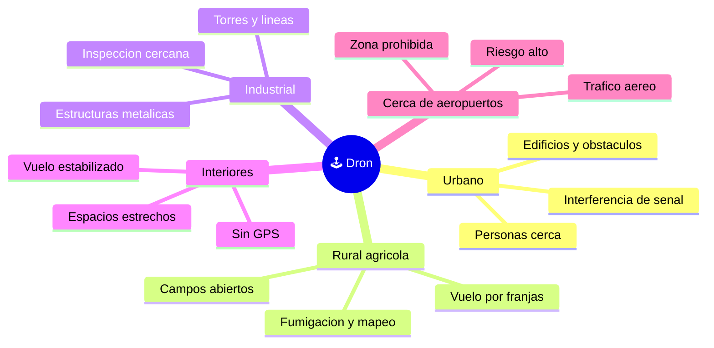

<!-- clase-meta
tipo_documento: clase
clase: 7
codigo: DRONES-07
curso: drones
titulo: "Entornos de trabajo del dron"
modalidad: "análisis de escenarios"
duracion_minutos: 60
nivel: introductorio
prerrequisito: DRONES-06
competencia: "adaptacion_al_entorno"
resultados_aprendizaje:
  - "Explicar entornos, factores ambientales, riesgos y respuesta de simulación con vocabulario propio de Drones."
  - "Aplicar esos conceptos a una decisión segura o a un escenario de simulación de Drones."
evidencia: "Matriz entorno–cambio–riesgo–respuesta."
criterio_aprobacion: "Cada respuesta se adapta al entorno y distingue riesgos que no son intercambiables entre escenarios."
fuentes: manuales/fuentes.md
ultima_revision: 2026-09-10
-->

# 🌍 Entornos de trabajo del dron

[🏠 Inicio](../../../README.md) · [🕹️ Curso: Drones](../README.md) · 🌍 Entornos

Dónde opera un dron y cómo cambia el vuelo según el entorno. Cada entorno implica
reglas, riesgos y ajustes distintos, y en simulación se traduce en escenarios
diferentes.

---

## 🗺️ Entornos principales

```mermaid
mindmap
  root((🕹️ Dron))
    Urbano
      Edificios y obstaculos
      Personas cerca
      Interferencia de senal
    Rural agricola
      Campos abiertos
      Vuelo por franjas
      Fumigacion y mapeo
    Industrial
      Torres y lineas
      Estructuras metalicas
      Inspeccion cercana
    Interiores
      Sin GPS
      Espacios estrechos
      Vuelo estabilizado
    Cerca de aeropuertos
      Zona prohibida
      Trafico aereo
      Riesgo alto
```

| Entorno | Características | Riesgos típicos | Ajuste de vuelo |
| --- | --- | --- | --- |
| Urbano | Edificios, calles, público. | Interferencia, personas, obstáculos. | Baja altura, margenes amplios, sin sobrevolar gente. |
| Rural / agrícola | Campos abiertos y amplios. | Viento, distancia larga. | Vuelo por franjas, vigilar batería y enlace. |
| Industrial | Torres, líneas, estructuras. | Metal que altera la brújula. | Inspección cercana, atento al GPS. |
| Interiores | Sin GPS, espacio estrecho. | Choques, deriva sin posición. | Modo estabilizado, control manual fino. |
| Cerca de aeropuertos | Zona prohibida, tráfico aéreo. | Riesgo grave para la aviación. | No volar; respetar la restricción. |

---

## 🌦️ Factores del entorno

- **Viento**: empuja el dron y consume batería al compensarlo; con rachas fuertes
  puede superar el empuje disponible.
- **GPS**: cerca de edificios, bajo techo o entre estructuras metálicas, la señal
  se degrada y el dron pierde el mantenimiento de posición.
- **Interferencia**: otras radios, wifi o estructuras metálicas debilitan el
  enlace de mando y de video.
- **Temperatura**: el frío reduce el rendimiento de la batería LiPo y la autonomía.

---

## 🚫 Zonas prohibidas

Volar cerca de aeropuertos y sobre aglomeraciones de personas está restringido por
la seguridad aérea. En estos entornos la regla es no operar, no ajustar el vuelo.
El detalle está en el [Clase 8: Reglamentos](../reglamentos/reglamentos-dron.md).

---

## 🎮 Traducción a simulación

Cada entorno es un escenario con su viento, calidad de GPS, interferencia y
obstáculos. Ver cómo se modela en el
[Clase 9: Diseño de simulación](../simulacion/diseno-simulador-dron.md).

## 🧭 Guía de estudio aplicada

### Pregunta guía

¿Cómo ayuda **Entornos principales, Factores del entorno, Zonas prohibidas y Traducción a simulación** a **adaptar inspección próxima a una estructura con viento y señal GNSS degradada a tres condiciones ambientales distintas**?

### Explicación razonada

El entorno no es decoración: modifica las fuerzas, la percepción y el tiempo disponible. En el caso «inspección próxima a una estructura con viento y señal GNSS degradada», cambia el comportamiento de actitud y trayectoria y aumenta la probabilidad de pérdida de enlace, deriva, impacto o invasión de espacio no autorizado. La respuesta correcta empieza por reconocer qué variable cambió y después adaptar límites, ruta o misión.

Esta clase se conecta con el resto del curso mediante **el controlador estabiliza actitud, pero autonomía, enlace y entorno limitan la misión**. El hilo de
seguridad consiste en reconocer a tiempo **pérdida de enlace, deriva, impacto o invasión de espacio no autorizado** y poder justificar la decisión
**definir límites de viento, batería, enlace, geocerca y retorno antes de despegar**; en clases posteriores cambiará el ángulo de análisis, no esa relación causal.
La lectura funcional común sigue **batería → controladores → motores y hélices → actitud y trayectoria**, de modo que cada concepto pueda
ubicarse dentro del funcionamiento completo y no quede como un dato aislado.

**Apoyo documental:** [Unmanned Aircraft Systems](https://www.faa.gov/uas) aporta operación y normativa RPAS;
[Normativa aeronáutica](https://www.dgac.gob.cl/normativa/) se usa para marco aeronáutico chileno. Estas fuentes
se contrastan con el alcance de la clase y no sustituyen un manual de equipo concreto.

### Caso resuelto: de la observación a la decisión

1. **Escenario base:** conserva la misión «inspección próxima a una estructura con viento y señal GNSS degradada» para poder comparar.
2. **Cambiar una condición:** modifica sucesivamente superficie o medio, visibilidad y perturbación externa.
3. **Recalcular margen:** explica cómo cada cambio afecta **actitud y trayectoria** y acerca o aleja **pérdida de enlace, deriva, impacto o invasión de espacio no autorizado**.
4. **Adaptar:** cambia límite, ruta, configuración o incluso cancela; no mantengas la misma respuesta por hábito.

### Comprueba tu comprensión

1. ¿Cómo cambiaría **actitud y trayectoria** si empeora la perturbación externa?
2. ¿Qué condición ambiental acerca más el escenario a **pérdida de enlace, deriva, impacto o invasión de espacio no autorizado**?
3. ¿Cuándo adaptarías la maniobra y cuándo la cancelarías?

Orientación para revisar tus respuestas

- La primera respuesta debe relacionar el eslabón elegido con un efecto posterior, no solo nombrarlo.
- La segunda debe proponer una señal medible u observable y explicar qué tendencia sería preocupante.
- La tercera debe cambiar al menos una variable de capacidad, mando, entorno o margen de seguridad.

## 🎓 Cierre de clase

- **Actividad:** Contrasta tres entornos de Drones a partir de entornos, factores ambientales, riesgos y respuesta de simulación y determina cómo cambian variables, percepción, riesgos y respuesta.
- **Evidencia:** Matriz entorno–cambio–riesgo–respuesta.
- **Criterio de aprobación:** Cada respuesta se adapta al entorno y distingue riesgos que no son intercambiables entre escenarios.
- **Transferencia:** explica qué cambiaría al pasar a otra variante de esta máquina.

### Fuentes de esta clase

- [US-FAA-UAS](https://www.faa.gov/uas): Unmanned Aircraft Systems, FAA. Uso: operación y normativa RPAS.
- [CL-DGAC](https://www.dgac.gob.cl/normativa/): Normativa aeronáutica, DGAC Chile. Uso: marco aeronáutico chileno.

> Las fuentes sostienen el marco conceptual y normativo; esta clase no reemplaza el manual
> del fabricante, la formación certificada ni la habilitación exigida para operar equipos reales.

---

[⬅️ Anterior: Principios y operación](principios-dron.md) · [➡️ Siguiente: Reglamentos](../reglamentos/reglamentos-dron.md)
