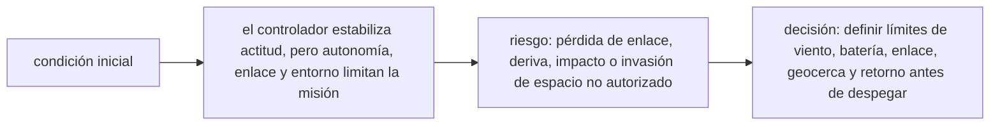

<!-- clase-meta
tipo_documento: clase
clase: 6
codigo: DRONES-06
curso: drones
titulo: "Principios y operación del dron"
modalidad: "resolución de problemas"
duracion_minutos: 90
nivel: introductorio
prerrequisito: DRONES-05
competencia: "razonamiento_operacional"
resultados_aprendizaje:
  - "Explicar principios físicos, fases de operación, decisiones y errores frecuentes con vocabulario propio de Drones."
  - "Aplicar esos conceptos a una decisión segura o a un escenario de simulación de Drones."
evidencia: "Resolución argumentada de un escenario operacional."
criterio_aprobacion: "Aplica los principios correctos, anticipa consecuencias y respeta los límites del curso."
fuentes: manuales/fuentes.md
ultima_revision: 2026-09-10
-->

# 🧪 Principios y operación del dron

[🏠 Inicio](../../../README.md) · [🕹️ Curso: Drones](../README.md) · 🧪 Principios

Documento general y educativo. No sustituye una formación de piloto de RPAS
certificada ni el manual del fabricante. Describe cómo se opera un dron en
simulación y que principios físicos conviene representar.

## Principios de funcionamiento

- **Sustentación por rotores**: cada hélice empuja aire hacia abajo y genera
  empuje hacia arriba; la suma de todos los rotores sostiene el dron.
- **Control por diferencia de empuje**: el multirotor no tiene superficies
  móviles; cabecea, alabea y guina variando el rpm de rotores concretos.
- **Estabilidad por control activo**: el dron no es estable por si mismo; la
  controladora corrige la actitud muchas veces por segundo con ayuda de la IMU.
- **Guiñada por par**: al acelerar los rotores que giran en un sentido y frenar
  los del otro, aparece un par neto que rota el dron sobre su eje vertical.
- **Autonomía y peso**: la batería limita el tiempo de vuelo; más carga exige más
  empuje y reduce los minutos disponibles.

## Fases de operación

| Fase | Que ocurre | Puntos clave |
| --- | --- | --- |
| Inspección previa | Revisión básica | Hélices, batería, GPS, enlace, firmware, zona permitida. |
| Armado | Preparar los motores | Confirmar modo, satélites suficientes, área despejada. |
| Despegue | Elevarse en vertical | Subir throttle suave, verificar estabilidad. |
| Misión | Volar y capturar datos | Mantener enlace, vigilar batería y distancia. |
| Retorno | Volver al punto de casa | Manual o automático; subir a altura segura. |
| Aterrizaje | Posarse con suavidad | Descenso controlado, desarmar motores. |

## Vuelo estacionario: idea general

1. Ajustar el **throttle** para que el empuje iguale el peso.
2. Dejar que el modo GPS **mantenga el punto** con pequeñas correcciones.
3. Usar cabeceo y alabeo con movimientos suaves para no derivar.
4. Vigilar **batería, altura y distancia** en la estación.
5. Corregir de forma continua: el viento empuja y hay que compensarlo.

## Errores comunes que la simulación puede enseñar a evitar

- Despegar con pocos satélites y perder el mantenimiento de posición.
- Alejarse hasta el límite del enlace de radio.
- Ignorar el aviso de batería baja y quedarse sin energía en el aire.
- Volar con viento fuerte que supera el empuje disponible.
- Sobrecontrolar los sticks y provocar oscilaciones.
- Olvidar revisar la zona: volar cerca de un aeropuerto o sobre personas.

## Relación con los niveles de realismo

- **Nivel 1 (educativo)**: despegar, mantener el hover, trasladar y aterrizar.
- **Nivel 2 (simplificado)**: agregar viento, autonomía de batería y límite de enlace.
- **Nivel 3 (técnico)**: sumar modos de vuelo, pérdida de GPS y fail-safe.

Ver [`docs/03-niveles-de-realismo.md`](../../../docs/03-niveles-de-realismo.md) para el detalle de cada nivel.

## 🧭 Guía de estudio aplicada

### Pregunta guía

¿Cómo ayuda **Principios de funcionamiento, Fases de operación, Vuelo estacionario: idea general y Errores comunes que la simulación puede enseñar a evitar** a **resolver inspección próxima a una estructura con viento y señal GNSS degradada sin agotar el margen operacional**?

### Explicación razonada

El principio rector puede resumirse así: el controlador estabiliza actitud, pero autonomía, enlace y entorno limitan la misión. Esto explica por qué una misma orden produce resultados distintos cuando cambian velocidad, carga, configuración o entorno. Operar bien consiste en leer la tendencia antes de agotar el margen y tomar esta decisión: definir límites de viento, batería, enlace, geocerca y retorno antes de despegar.

Esta clase se conecta con el resto del curso mediante **el controlador estabiliza actitud, pero autonomía, enlace y entorno limitan la misión**. El hilo de
seguridad consiste en reconocer a tiempo **pérdida de enlace, deriva, impacto o invasión de espacio no autorizado** y poder justificar la decisión
**definir límites de viento, batería, enlace, geocerca y retorno antes de despegar**; en clases posteriores cambiará el ángulo de análisis, no esa relación causal.
La lectura funcional común sigue **batería → controladores → motores y hélices → actitud y trayectoria**, de modo que cada concepto pueda
ubicarse dentro del funcionamiento completo y no quede como un dato aislado.

**Apoyo documental:** [Unmanned Aircraft Systems](https://www.faa.gov/uas) aporta operación y normativa RPAS;
[Normativa aeronáutica](https://www.dgac.gob.cl/normativa/) se usa para marco aeronáutico chileno. Estas fuentes
se contrastan con el alcance de la clase y no sustituyen un manual de equipo concreto.

### Caso resuelto: de la observación a la decisión

1. **Datos:** reconoce condiciones, configuración y margen disponibles en **inspección próxima a una estructura con viento y señal GNSS degradada**.
2. **Modelo:** aplica **el controlador estabiliza actitud, pero autonomía, enlace y entorno limitan la misión** para predecir una tendencia antes de actuar.
3. **Riesgo:** explica mediante qué cadena de causas podría ocurrir **pérdida de enlace, deriva, impacto o invasión de espacio no autorizado**.
4. **Decisión:** ejecuta mentalmente **definir límites de viento, batería, enlace, geocerca y retorno antes de despegar** y define qué observación confirmaría que funcionó.

### Comprueba tu comprensión

1. ¿Qué variable del principio «el controlador estabiliza actitud, pero autonomía, enlace y entorno limitan la misión» cambia primero en el caso?
2. ¿Cómo se propaga ese cambio hasta **actitud y trayectoria**?
3. ¿Qué evidencia confirmaría que **definir límites de viento, batería, enlace, geocerca y retorno antes de despegar** conservó margen operacional?

Orientación para revisar tus respuestas

- La primera respuesta debe relacionar el eslabón elegido con un efecto posterior, no solo nombrarlo.
- La segunda debe proponer una señal medible u observable y explicar qué tendencia sería preocupante.
- La tercera debe cambiar al menos una variable de capacidad, mando, entorno o margen de seguridad.

## 🎓 Cierre de clase

- **Actividad:** Resuelve un escenario de Drones explicando, paso a paso, cómo intervienen principios físicos, fases de operación, decisiones y errores frecuentes.
- **Evidencia:** Resolución argumentada de un escenario operacional.
- **Criterio de aprobación:** Aplica los principios correctos, anticipa consecuencias y respeta los límites del curso.
- **Transferencia:** explica qué cambiaría al pasar a otra variante de esta máquina.

### Fuentes de esta clase

- [US-FAA-UAS](https://www.faa.gov/uas): Unmanned Aircraft Systems, FAA. Uso: operación y normativa RPAS.
- [CL-DGAC](https://www.dgac.gob.cl/normativa/): Normativa aeronáutica, DGAC Chile. Uso: marco aeronáutico chileno.

> Las fuentes sostienen el marco conceptual y normativo; esta clase no reemplaza el manual
> del fabricante, la formación certificada ni la habilitación exigida para operar equipos reales.

---

[⬅️ Anterior: Mandos](../mandos/manual-mandos-dron.md) · [➡️ Siguiente: Entornos de trabajo](entornos-dron.md)
