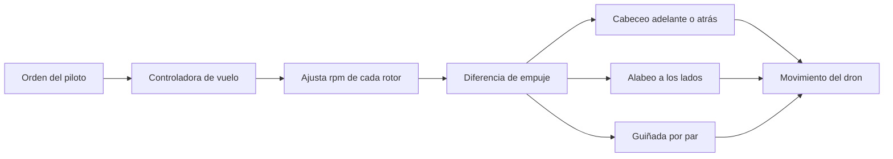

<!-- clase-meta
tipo_documento: clase
clase: 10
codigo: DRONES-10
curso: drones
titulo: "Recursos del dron"
modalidad: "taller documental"
duracion_minutos: 45
nivel: introductorio
prerrequisito: DRONES-09
competencia: "alfabetizacion_tecnica"
resultados_aprendizaje:
  - "Explicar glosario, esquemas y trazabilidad de fuentes con vocabulario propio de Drones."
  - "Aplicar esos conceptos a una decisión segura o a un escenario de simulación de Drones."
evidencia: "Glosario aplicado y ficha breve de trazabilidad."
criterio_aprobacion: "Los términos permiten interpretar el curso y las fuentes se distinguen por autoridad, alcance y vigencia."
fuentes: manuales/fuentes.md
ultima_revision: 2026-09-10
-->

# 🧰 Recursos del dron

[🏠 Inicio](../../../README.md) · [🕹️ Curso: Drones](../README.md) · 🧰 Recursos

Glosario específico, enlaces y diagramas de apoyo del curso de drones. Amplia el
[glosario general](../../../docs/05-glosario-general.md).

---

## 📖 Glosario específico

| Término | Definición |
| --- | --- |
| RPAS | Sistema de aeronave pilotada a distancia; nombre formal del dron. |
| Multirotor | Dron con varios rotores que controla el vuelo variando su rpm. |
| Motor brushless | Motor sin escobillas, eficiente y de respuesta rápida. |
| ESC | Controlador electrónico de velocidad de cada motor. |
| Controladora de vuelo | Cerebro que estabiliza el dron ajustando los motores. |
| IMU | Sensor de aceleraciones y giros que informa la actitud. |
| Batería LiPo | Batería de polimero de litio de alta densidad de energía. |
| Gimbal | Soporte motorizado que estabiliza la cámara. |
| Return to home | Retorno automático al punto de despegue. |
| Fail-safe | Reacción automática ante pérdida de enlace o batería baja. |
| Guiñada | Giro del dron sobre su eje vertical. |

---

## 🗺️ Diagrama de control por variación de rpm

```mermaid
flowchart LR
    Orden[Orden del piloto] --> FC[Controladora de vuelo]
    FC --> Rpm[Ajusta rpm de cada rotor]
    Rpm --> Empuje[Diferencia de empuje]
    Empuje --> Cabeceo[Cabeceo adelante o atrás]
    Empuje --> Alabeo[Alabeo a los lados]
    Empuje --> Guinada[Guiñada por par]
    Cabeceo --> Mov[Movimiento del dron]
    Alabeo --> Mov
    Guinada --> Mov
```

---

## 🔗 Enlaces y fuentes

- Marco legal: [⚖️ docs/07-marco-legal-chile.md](../../../docs/07-marco-legal-chile.md)
- Registro de fuentes: [📚 manuales/fuentes.md](../../../manuales/fuentes.md)
- Autoridad aeronáutica (DGAC): ver el registro de fuentes.

Registrar cada recurso nuevo con su origen y licencia, siguiendo
[`recursos/README.md`](../../../recursos/README.md).

## 🧭 Guía de estudio aplicada

### Pregunta guía

¿Cómo ayuda **Glosario específico, Diagrama de control por variación de rpm, Enlaces y fuentes y Guía de estudio aplicada** a **explicar con fuentes los términos batería, controladores, motores y hélices y actitud y trayectoria**?

### Explicación razonada

El vocabulario técnico organiza relaciones: batería, controladores, motores y hélices y actitud y trayectoria nombran partes distintas de una misma cadena funcional. Una fuente se usa para sostener una afirmación concreta —principio, límite, procedimiento o contexto— y debe distinguirse del manual particular de un fabricante o de una regla narrativa.

Esta clase se conecta con el resto del curso mediante **el controlador estabiliza actitud, pero autonomía, enlace y entorno limitan la misión**. El hilo de
seguridad consiste en reconocer a tiempo **pérdida de enlace, deriva, impacto o invasión de espacio no autorizado** y poder justificar la decisión
**definir límites de viento, batería, enlace, geocerca y retorno antes de despegar**; en clases posteriores cambiará el ángulo de análisis, no esa relación causal.
La lectura funcional común sigue **batería → controladores → motores y hélices → actitud y trayectoria**, de modo que cada concepto pueda
ubicarse dentro del funcionamiento completo y no quede como un dato aislado.

**Apoyo documental:** [Unmanned Aircraft Systems](https://www.faa.gov/uas) aporta operación y normativa RPAS;
[Normativa aeronáutica](https://www.dgac.gob.cl/normativa/) se usa para marco aeronáutico chileno. Estas fuentes
se contrastan con el alcance de la clase y no sustituyen un manual de equipo concreto.

### Caso resuelto: de la observación a la decisión

1. **Definir en contexto:** explica **batería**, **controladores**, **motores y hélices** y **actitud y trayectoria** por su función y relación.
2. **Respaldar:** enlaza cada afirmación importante con una fuente identificable y declara su alcance.
3. **Contrastar:** separa principios generales, requisitos locales, manual de fabricante y —si aplica— canon ficticio.
4. **Reformular:** convierte una definición copiada en una explicación propia con un ejemplo de **Drones**.

### Comprueba tu comprensión

1. Explica la diferencia funcional entre **controladores** y **motores y hélices** sin copiar una definición.
2. ¿Qué fuente respalda el principio «el controlador estabiliza actitud, pero autonomía, enlace y entorno limitan la misión» y cuál es su alcance?
3. ¿Qué dato exigiría un manual de fabricante en vez de una fuente general?

Orientación para revisar tus respuestas

- La primera respuesta debe relacionar el eslabón elegido con un efecto posterior, no solo nombrarlo.
- La segunda debe proponer una señal medible u observable y explicar qué tendencia sería preocupante.
- La tercera debe cambiar al menos una variable de capacidad, mando, entorno o margen de seguridad.

## 🎓 Cierre de clase

- **Actividad:** Selecciona términos de glosario, esquemas y trazabilidad de fuentes, explícalos en contexto de Drones y verifica la procedencia de las fuentes utilizadas.
- **Evidencia:** Glosario aplicado y ficha breve de trazabilidad.
- **Criterio de aprobación:** Los términos permiten interpretar el curso y las fuentes se distinguen por autoridad, alcance y vigencia.
- **Transferencia:** explica qué cambiaría al pasar a otra variante de esta máquina.

### Fuentes de esta clase

- [US-FAA-UAS](https://www.faa.gov/uas): Unmanned Aircraft Systems, FAA. Uso: operación y normativa RPAS.
- [CL-DGAC](https://www.dgac.gob.cl/normativa/): Normativa aeronáutica, DGAC Chile. Uso: marco aeronáutico chileno.

> Las fuentes sostienen el marco conceptual y normativo; esta clase no reemplaza el manual
> del fabricante, la formación certificada ni la habilitación exigida para operar equipos reales.

---

[🎓 Portada del curso](../README.md) · [⬅️ Anterior: Diseño de simulación](../simulacion/diseno-simulador-dron.md) · [➡️ Siguiente: Ejercicios](../ejercicios/ejercicios-dron.md)
