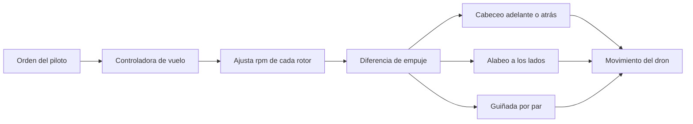

# 🧰 Recursos del dron

[🏠 Inicio](../../../README.md) · [🕹️ Curso: Drones](../README.md) · 🧰 Recursos

Glosario específico, enlaces y diagramas de apoyo del curso de drones. Amplia el
[glosario general](../../../docs/05-glosario-general.md).

---

## 📖 Glosario específico

| Término | Definición |
| --- | --- |
| RPAS | Sistema de aeronave pilotada a distancia; nombre formal del dron. |
| Multirotor | Dron con varios rotores que controla el vuelo variando su rpm. |
| Motor brushless | Motor sin escobillas, eficiente y de respuesta rápida. |
| ESC | Controlador electrónico de velocidad de cada motor. |
| Controladora de vuelo | Cerebro que estabiliza el dron ajustando los motores. |
| IMU | Sensor de aceleraciones y giros que informa la actitud. |
| Batería LiPo | Batería de polimero de litio de alta densidad de energía. |
| Gimbal | Soporte motorizado que estabiliza la cámara. |
| Return to home | Retorno automático al punto de despegue. |
| Fail-safe | Reacción automática ante pérdida de enlace o batería baja. |
| Guiñada | Giro del dron sobre su eje vertical. |

---

## 🗺️ Diagrama de control por variación de rpm

```mermaid
flowchart LR
    Orden[Orden del piloto] --> FC[Controladora de vuelo]
    FC --> Rpm[Ajusta rpm de cada rotor]
    Rpm --> Empuje[Diferencia de empuje]
    Empuje --> Cabeceo[Cabeceo adelante o atrás]
    Empuje --> Alabeo[Alabeo a los lados]
    Empuje --> Guinada[Guiñada por par]
    Cabeceo --> Mov[Movimiento del dron]
    Alabeo --> Mov
    Guinada --> Mov
```

---

## 🔗 Enlaces y fuentes

- Marco legal: [⚖️ docs/07-marco-legal-chile.md](../../../docs/07-marco-legal-chile.md)
- Registro de fuentes: [📚 manuales/fuentes.md](../../../manuales/fuentes.md)
- Autoridad aeronáutica (DGAC): ver el registro de fuentes.

Registrar cada recurso nuevo con su origen y licencia, siguiendo
[`recursos/README.md`](../../../recursos/README.md).

## 🎓 Cierre de clase

- **Actividad:** Selecciona términos de glosario, esquemas y trazabilidad de fuentes, explícalos en contexto de Drones y verifica la procedencia de las fuentes utilizadas.
- **Evidencia:** Glosario aplicado y ficha breve de trazabilidad.
- **Criterio de aprobación:** Los términos permiten interpretar el curso y las fuentes se distinguen por autoridad, alcance y vigencia.
- **Transferencia:** explica qué cambiaría al pasar a otra variante de esta máquina.

### Fuentes de esta clase

- [US-FAA-UAS](https://www.faa.gov/uas): Unmanned Aircraft Systems, FAA. Uso: operación y normativa RPAS.
- [CL-DGAC](https://www.dgac.gob.cl/normativa/): Normativa aeronáutica, DGAC Chile. Uso: marco aeronáutico chileno.

> Las fuentes sostienen el marco conceptual y normativo; esta clase no reemplaza el manual
> del fabricante, la formación certificada ni la habilitación exigida para operar equipos reales.

---

[🎓 Portada del curso](../README.md) · [⬅️ Anterior: Diseño de simulación](../simulacion/diseno-simulador-dron.md) · [➡️ Siguiente: Ejercicios](../ejercicios/ejercicios-dron.md)
