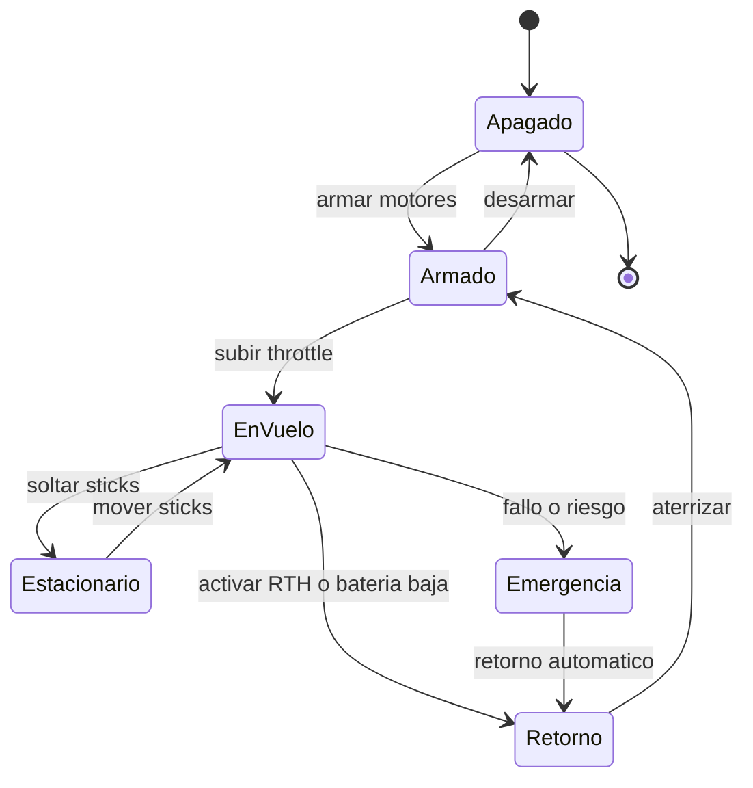

# 🎮 Diseño de simulación del dron

[🏠 Inicio](../../../README.md) · [🕹️ Curso: Drones](../README.md) · 🎮 Simulación

## Objetivo de la simulación

Que el usuario aprenda a armar los motores, despegar en vertical, mantener el
vuelo estacionario, trasladarse coordinando los dos sticks, gestionar la batería y
el enlace, y respetar las zonas prohibidas, de forma segura y progresiva.

## Nivel de realismo

- Nivel elegido: se ofrece del 1 al 3 (ver `docs/03-niveles-de-realismo.md`).
- Justificación: el dron es de dificultad intermedia; la controladora estabiliza
  el vuelo, lo que baja la carga respecto del helicóptero, pero agrega la gestión
  del enlace, la batería y las zonas restringidas.

## Variables principales

| Variable | Tipo | Rango | Afecta a | Comentarios |
| --- | --- | --- | --- | --- |
| Throttle | numérica | 0-100% | Empuje total | Sube o baja el dron. |
| Cabeceo | numérica | -30..30 grados | Avance y retroceso | Del stick derecho. |
| Alabeo | numérica | -30..30 grados | Desplazamiento lateral | Del stick derecho. |
| Guiñada | numérica | -100..100% | Rumbo de la nariz | Del stick izquierdo. |
| Batería | numérica | 0-100% | Autonomía y avisos | Dispara el retorno automático. |
| Viento | numérica | 0-alto | Deriva y consumo | Puede superar el empuje. |
| Calidad de GPS | numérica | 0-100% | Mantenimiento de posición | Baja entre obstáculos. |
| Enlace de radio | numérica | 0-100% | Control y fail-safe | Baja con distancia e interferencia. |
| Peso del conjunto | numérica | fijo + carga | Empuje necesario | Incluye cámara o carga útil. |

## Ciclo básico

1. Leer entrada del usuario (throttle, cabeceo, alabeo, guiñada, modo).
2. Actualizar el estado de la controladora, la batería y el enlace.
3. Calcular fuerzas: empuje de cada rotor, peso, viento y par.
4. Aplicar restricciones del entorno (GPS, interferencia, zona prohibida).
5. Actualizar posición, altura, actitud y rumbo.
6. Refrescar instrumentos y retroalimentación (telemetría, avisos, video).

## Modos de juego futuros

- Tutorial guiado de los dos sticks y del vuelo estacionario.
- Práctica libre de despegue y aterrizaje vertical.
- Misiones de fotografía y de mapeo por waypoints.
- Inspección de torres y líneas manteniendo distancia segura.
- Gestión de emergencias: batería baja, pérdida de enlace y retorno a casa.

## Elementos fuera de alcance

- Maniobras que presenten como recomendable volar sobre personas o aeropuertos.
- Reproducción de vuelo temerario o invasivo como objetivo del juego.
- Datos técnicos que permitan alterar sistemas reales o burlar restricciones.

## Pendientes

- [ ] Definir valores por defecto de cada variable por tipo de dron.
- [ ] Prototipar el ciclo básico del vuelo estacionario en un motor simple.
- [ ] Ajustar el modelo de viento y de consumo de batería.
- [ ] Confirmar los umbrales de la DAN 151 y reflejarlos en las zonas del escenario.
- [ ] Agregar fuentes técnicas públicas a [`manuales/fuentes.md`](../../../manuales/fuentes.md).

---

[⬅️ Anterior: Reglamentos](../reglamentos/reglamentos-dron.md) · [➡️ Siguiente: Recursos](../recursos/recursos-dron.md)
