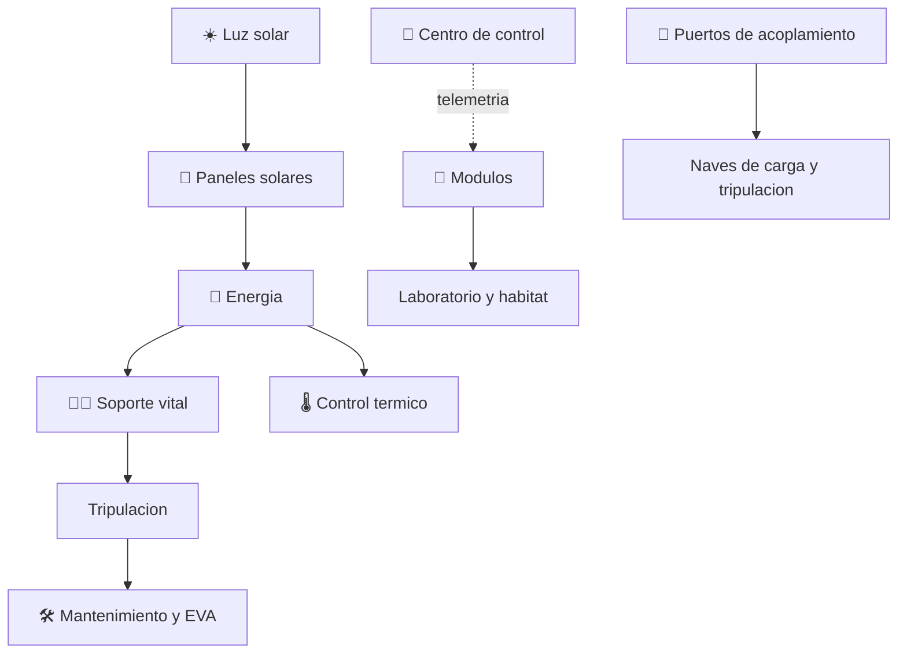

# 🛰️ Curso: Estacion espacial (ISS)

[🏠 Inicio](../../README.md) · [🚙 Catalogo de vehiculos](../README.md) · [🎓 Guia de curso](../../docs/08-guia-de-estilo-y-curso.md)

> **Curso del laboratorio orbital.** Documenta la estacion espacial de principio a
> fin: historia, caracteristicas, sistemas (modulos, paneles solares, soporte
> vital de ciclo cerrado, control termico, acoplamiento), centro de control y
> mandos, fisica de la microgravedad, entornos de la orbita baja, marco legal
> internacional y diseno de simulacion. Toma como referencia la **Estacion
> Espacial Internacional (ISS)**.

---

## 🎯 Objetivos de aprendizaje

Al terminar este curso deberias poder:

- Explicar que es una estacion espacial y como se mantiene en orbita baja.
- Identificar sus modulos, paneles solares y sistemas de soporte vital.
- Comprender el soporte vital de ciclo cerrado que recicla aire y agua.
- Entender la microgravedad, el acoplamiento y las caminatas espaciales (EVA).
- Reconocer el papel del centro de control y de la tripulacion.
- Conocer el acuerdo intergubernamental de los socios y los tratados espaciales.
- Traducir todo lo anterior en variables de un simulador educativo.

---

## 🗺️ Mapa del vehiculo

---

## 📚 Modulos del curso

| # | Modulo | Contenido | Enlace |
| :-: | --- | --- | --- |
| 1 | 📜 Historia | Origen y evolucion de las estaciones, linea de tiempo. | [Abrir](historia/historia-estacion-espacial.md) |
| 2 | 📋 Caracteristicas | Que es, sus partes y para que sirve. | [Abrir](operacion/caracteristicas-estacion-espacial.md) |
| 3 | 🔧 Sistemas mecanicos | Modulos, paneles, soporte vital, acoplamiento, EVA. | [Abrir](operacion/sistemas-mecanicos-estacion-espacial.md) |
| 4 | 🎛️ Mandos e instrumentos | Centro de control, telemetria y estaciones de trabajo. | [Abrir](mandos/manual-mandos-estacion-espacial.md) |
| 5 | 🧪 Principios y operacion | Microgravedad, orbita baja y fases de operacion. | [Abrir](operacion/principios-estacion-espacial.md) |
| 6 | 🌍 Entornos de trabajo | Orbita baja, interior habitable y espacio abierto. | [Abrir](operacion/entornos-estacion-espacial.md) |
| 7 | ⚖️ Reglamentos | Acuerdo intergubernamental y tratados espaciales. | [Abrir](reglamentos/reglamentos-estacion-espacial.md) |
| 8 | 🎮 Diseno de simulacion | Variables, ciclo y modos de juego. | [Abrir](simulacion/diseno-simulador-estacion-espacial.md) |
| 9 | 🧰 Recursos | Glosario, enlaces y diagramas. | [Abrir](recursos/recursos-estacion-espacial.md) |

---

## 🧩 Requisitos previos

Se recomienda revisar antes el curso de
[🚀 naves espaciales](../naves-espaciales/README.md), que introduce la orbita, el
delta-v y la microgravedad, y el de [🚀 cohetes](../cohetes/README.md), que explica
como llega la carga a la orbita. La estacion es un habitat permanente en orbita
baja. Marco legal comun en
[⚖️ docs/07-marco-legal-chile.md](../../docs/07-marco-legal-chile.md).

---

[➡️ Empezar por el Modulo 1: Historia](historia/historia-estacion-espacial.md)
