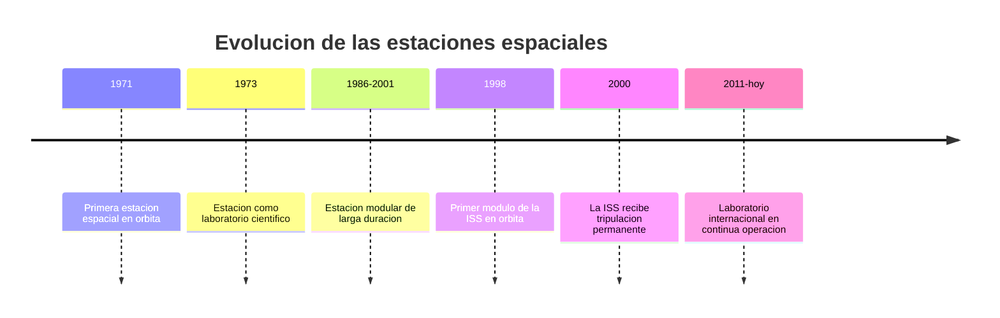

# 📜 Historia de la estación espacial

[🏠 Inicio](../../../README.md) · [🛰️ Curso: Estación espacial (ISS)](../README.md) · 📜 Historia

## Origen

Una estación espacial nace de una idea: en vez de misiones cortas, mantener un
laboratorio permanente en órbita donde vivir y trabajar. La primera llegó en 1971,
y de a poco las estaciones crecieron de un solo cuerpo a conjuntos de **módulos**
unidos en órbita. La Estación Espacial Internacional (ISS) es la mayor obra de
cooperación: se ensamblo pieza por pieza y recibe tripulación de forma continua
desde el año 2000. Esta es historia de **ciencia real**.

## Línea de tiempo

| Periodo | Hito | Importancia |
| --- | --- | --- |
| 1971 | Primera estación en órbita | Prueba de vivir en el espacio. |
| 1973 | Estación como laboratorio | Ciencia en microgravedad. |
| 1986-2001 | Estación modular de larga duración | Se aprende a unir módulos y reabastecer. |
| 1998 | Primer módulo de la ISS | Comienza el ensamblaje internacional. |
| 2000 | Tripulación permanente en la ISS | Presencia humana continua en órbita. |
| 2011-presente | Laboratorio en operación continua | Ciencia y cooperación global. |

## Evolución tecnológica

- **Módulos**: de un solo cuerpo a conjuntos ampliables en órbita.
- **Energía**: grandes paneles solares que siguen al Sol.
- **Soporte vital**: sistemas que reciclan aire y agua para durar más.
- **Acoplamiento**: puertos que reciben naves de carga y de tripulación.
- **Robotica**: brazos que mueven módulos y ayudan en las caminatas espaciales.
- **Cooperación**: varios países operan la estación como socios.

## Partes representativas

| Parte | Función | Característica destacada |
| --- | --- | --- |
| Módulo de laboratorio | Hacer ciencia en microgravedad | Interior presurizado y habitable. |
| Módulo habitat | Vivir y descansar | Zona de sueño, comida e higiene. |
| Paneles solares | Generar electricidad | Se orientan hacia el Sol. |
| Puerto de acoplamiento | Recibir naves | Une carga y tripulación. |
| Brazo robotico | Mover cargas y módulos | Ayuda en el mantenimiento. |

## Impacto social y económico

La estación espacial demostro que la humanidad puede vivir y trabajar en órbita de
forma continua. Es un laboratorio único para estudiar la microgravedad, la salud
en el espacio y nuevos materiales, y un ejemplo de cooperación internacional.
Países como Chile participan de esta ciencia a través de la investigación y la
observación astronómica.

## Fuentes

- Registrar aquí las fuentes públicas consultadas.
- Enlazar cada fuente también en [`manuales/fuentes.md`](../../../manuales/fuentes.md).

---

[🎓 Portada del curso](../README.md) · [➡️ Siguiente: Características](../operacion/caracteristicas-estacion-espacial.md)
