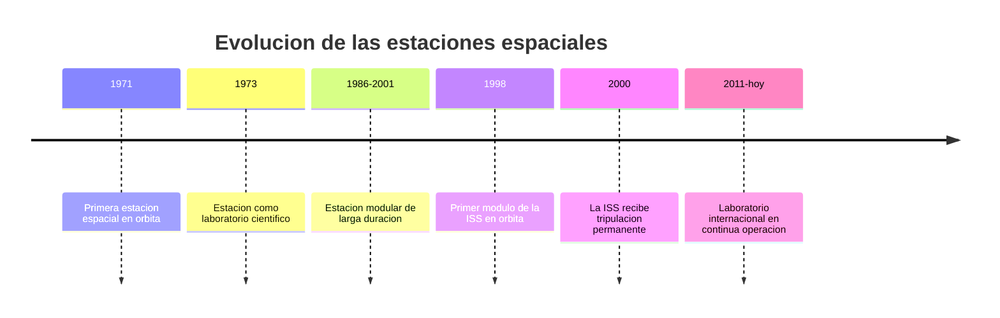

# 📜 Historia de la estacion espacial

[🏠 Inicio](../../../README.md) · [🛰️ Curso: Estacion espacial (ISS)](../README.md) · 📜 Historia

## Origen

Una estacion espacial nace de una idea: en vez de misiones cortas, mantener un
laboratorio permanente en orbita donde vivir y trabajar. La primera llego en 1971,
y de a poco las estaciones crecieron de un solo cuerpo a conjuntos de **modulos**
unidos en orbita. La Estacion Espacial Internacional (ISS) es la mayor obra de
cooperacion: se ensamblo pieza por pieza y recibe tripulacion de forma continua
desde el ano 2000. Esta es historia de **ciencia real**.

## Linea de tiempo

| Periodo | Hito | Importancia |
| --- | --- | --- |
| 1971 | Primera estacion en orbita | Prueba de vivir en el espacio. |
| 1973 | Estacion como laboratorio | Ciencia en microgravedad. |
| 1986-2001 | Estacion modular de larga duracion | Se aprende a unir modulos y reabastecer. |
| 1998 | Primer modulo de la ISS | Comienza el ensamblaje internacional. |
| 2000 | Tripulacion permanente en la ISS | Presencia humana continua en orbita. |
| 2011-presente | Laboratorio en operacion continua | Ciencia y cooperacion global. |

## Evolucion tecnologica

- **Modulos**: de un solo cuerpo a conjuntos ampliables en orbita.
- **Energia**: grandes paneles solares que siguen al Sol.
- **Soporte vital**: sistemas que reciclan aire y agua para durar mas.
- **Acoplamiento**: puertos que reciben naves de carga y de tripulacion.
- **Robotica**: brazos que mueven modulos y ayudan en las caminatas espaciales.
- **Cooperacion**: varios paises operan la estacion como socios.

## Partes representativas

| Parte | Funcion | Caracteristica destacada |
| --- | --- | --- |
| Modulo de laboratorio | Hacer ciencia en microgravedad | Interior presurizado y habitable. |
| Modulo habitat | Vivir y descansar | Zona de sueno, comida e higiene. |
| Paneles solares | Generar electricidad | Se orientan hacia el Sol. |
| Puerto de acoplamiento | Recibir naves | Une carga y tripulacion. |
| Brazo robotico | Mover cargas y modulos | Ayuda en el mantenimiento. |

## Impacto social y economico

La estacion espacial demostro que la humanidad puede vivir y trabajar en orbita de
forma continua. Es un laboratorio unico para estudiar la microgravedad, la salud
en el espacio y nuevos materiales, y un ejemplo de cooperacion internacional.
Paises como Chile participan de esta ciencia a traves de la investigacion y la
observacion astronomica.

## Fuentes

- Registrar aqui las fuentes publicas consultadas.
- Enlazar cada fuente tambien en [`manuales/fuentes.md`](../../../manuales/fuentes.md).

---

[🎓 Portada del curso](../README.md) · [➡️ Siguiente: Caracteristicas](../operacion/caracteristicas-estacion-espacial.md)
