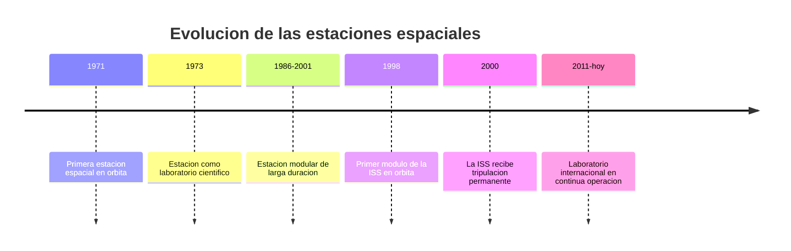

<!-- clase-meta
tipo_documento: clase
clase: 1
codigo: ESTACIONESPA-01
curso: estacion-espacial
titulo: "Historia de la estación espacial"
modalidad: "teórica dialogada"
duracion_minutos: 45
nivel: introductorio
prerrequisito: ninguno
competencia: "contexto_historico"
resultados_aprendizaje:
  - "Explicar origen, evolución tecnológica, variantes representativas e impacto con vocabulario propio de Estación espacial (ISS)."
  - "Aplicar esos conceptos a una decisión segura o a un escenario de simulación de Estación espacial (ISS)."
evidencia: "Línea de tiempo comentada con cuatro hitos o más."
criterio_aprobacion: "Los hitos están ordenados, son pertinentes y dos relaciones de causa y efecto quedan justificadas."
fuentes: manuales/fuentes.md
ultima_revision: 2026-09-10
-->

# 📜 Historia de la estación espacial

[🏠 Inicio](../../../README.md) · [🛰️ Curso: Estación espacial (ISS)](../README.md) · 📜 Historia

```mermaid
timeline
    title Evolucion de las estaciones espaciales
    1971 : Primera estacion espacial en orbita
    1973 : Estacion como laboratorio cientifico
    1986-2001 : Estacion modular de larga duracion
    1998 : Primer modulo de la ISS en orbita
    2000 : La ISS recibe tripulacion permanente
    2011-hoy : Laboratorio internacional en continua operacion
```

## Origen

Una estación espacial nace de una idea: en vez de misiones cortas, mantener un
laboratorio permanente en órbita donde vivir y trabajar. La primera llegó en 1971,
y de a poco las estaciones crecieron de un solo cuerpo a conjuntos de **módulos**
unidos en órbita. La Estación Espacial Internacional (ISS) es la mayor obra de
cooperación: se ensamblo pieza por pieza y recibe tripulación de forma continua
desde el año 2000. Esta es historia de **ciencia real**.

## Línea de tiempo

| Periodo | Hito | Importancia |
| --- | --- | --- |
| 1971 | Primera estación en órbita | Prueba de vivir en el espacio. |
| 1973 | Estación como laboratorio | Ciencia en microgravedad. |
| 1986-2001 | Estación modular de larga duración | Se aprende a unir módulos y reabastecer. |
| 1998 | Primer módulo de la ISS | Comienza el ensamblaje internacional. |
| 2000 | Tripulación permanente en la ISS | Presencia humana continua en órbita. |
| 2011-presente | Laboratorio en operación continua | Ciencia y cooperación global. |

## Evolución tecnológica

- **Módulos**: de un solo cuerpo a conjuntos ampliables en órbita.
- **Energía**: grandes paneles solares que siguen al Sol.
- **Soporte vital**: sistemas que reciclan aire y agua para durar más.
- **Acoplamiento**: puertos que reciben naves de carga y de tripulación.
- **Robotica**: brazos que mueven módulos y ayudan en las caminatas espaciales.
- **Cooperación**: varios países operan la estación como socios.

## Partes representativas

| Parte | Función | Característica destacada |
| --- | --- | --- |
| Módulo de laboratorio | Hacer ciencia en microgravedad | Interior presurizado y habitable. |
| Módulo habitat | Vivir y descansar | Zona de sueño, comida e higiene. |
| Paneles solares | Generar electricidad | Se orientan hacia el Sol. |
| Puerto de acoplamiento | Recibir naves | Une carga y tripulación. |
| Brazo robotico | Mover cargas y módulos | Ayuda en el mantenimiento. |

## Impacto social y económico

La estación espacial demostro que la humanidad puede vivir y trabajar en órbita de
forma continua. Es un laboratorio único para estudiar la microgravedad, la salud
en el espacio y nuevos materiales, y un ejemplo de cooperación internacional.
Países como Chile participan de esta ciencia a través de la investigación y la
observación astronómica.

## 🧭 Guía de estudio aplicada

### Pregunta guía

¿Cómo ayuda **Origen, Línea de tiempo, Evolución tecnológica y Partes representativas** a **explicar cómo la evolución hizo posibles alternativas como segmento presurizado frente a estructura externa**?

### Explicación razonada

La evolución de Estación espacial (ISS) se comprende mejor como una sucesión de respuestas a problemas, no como una lista de fechas. Los cambios en paneles solares, distribución eléctrica, soporte vital y módulos y tripulación alteraron qué podía hacer la máquina, quién podía usarla y qué riesgos debían controlarse. El contraste «segmento presurizado frente a estructura externa» permite observar qué decisiones de diseño permanecieron y cuáles cambiaron con la tecnología y el propósito.

Esta clase se conecta con el resto del curso mediante **equilibrio continuo de energía, atmósfera, calor y orientación orbital**. El hilo de
seguridad consiste en reconocer a tiempo **degradación de soporte vital o energía por priorización tardía** y poder justificar la decisión
**aislar la falla y priorizar cargas esenciales antes de recuperar la misión**; en clases posteriores cambiará el ángulo de análisis, no esa relación causal.
La lectura funcional común sigue **paneles solares → distribución eléctrica → soporte vital → módulos y tripulación**, de modo que cada concepto pueda
ubicarse dentro del funcionamiento completo y no quede como un dato aislado.

**Apoyo documental:** [International Space Station](https://www.nasa.gov/reference/international-space-station/) aporta módulos, órbita y soporte vital;
[Space Law Treaties and Principles](https://www.unoosa.org/oosa/SpaceLaw/treaties.html) se usa para derecho espacial internacional. Estas fuentes
se contrastan con el alcance de la clase y no sustituyen un manual de equipo concreto.

### Caso resuelto: de la observación a la decisión

1. **Situar:** ordena los hitos que explican cómo se llegó a **segmento presurizado frente a estructura externa** y describe la necesidad que impulsó cada cambio.
2. **Relacionar:** explica qué se modificó en **paneles solares**, **distribución eléctrica**, **soporte vital** o **módulos y tripulación**; una fecha sin mecanismo no basta.
3. **Interpretar:** vincula el cambio con una capacidad nueva y también con el riesgo **degradación de soporte vital o energía por priorización tardía**.
4. **Transferir:** usa la evolución para justificar por qué hoy conviene **aislar la falla y priorizar cargas esenciales antes de recuperar la misión**.

### Comprueba tu comprensión

1. ¿Qué necesidad histórica impulsó un cambio en **paneles solares** o **distribución eléctrica**?
2. ¿Qué hito modificó la relación entre capacidad y **degradación de soporte vital o energía por priorización tardía**?
3. ¿Por qué **segmento presurizado frente a estructura externa** no puede explicarse como una simple diferencia estética?

Orientación para revisar tus respuestas

- La primera respuesta debe relacionar el eslabón elegido con un efecto posterior, no solo nombrarlo.
- La segunda debe proponer una señal medible u observable y explicar qué tendencia sería preocupante.
- La tercera debe cambiar al menos una variable de capacidad, mando, entorno o margen de seguridad.

## 🎓 Cierre de clase

- **Actividad:** Construye una línea de tiempo de Estación espacial (ISS) y explica cómo dos cambios históricos transformaron su función o su puesto de mando.
- **Evidencia:** Línea de tiempo comentada con cuatro hitos o más.
- **Criterio de aprobación:** Los hitos están ordenados, son pertinentes y dos relaciones de causa y efecto quedan justificadas.
- **Transferencia:** explica qué cambiaría al pasar a otra variante de esta máquina.

### Fuentes de esta clase

- [NASA-ISS](https://www.nasa.gov/reference/international-space-station/): International Space Station, NASA. Uso: módulos, órbita y soporte vital.
- [UNOOSA-TREATIES](https://www.unoosa.org/oosa/SpaceLaw/treaties.html): Space Law Treaties and Principles, UNOOSA. Uso: derecho espacial internacional.

> Las fuentes sostienen el marco conceptual y normativo; esta clase no reemplaza el manual
> del fabricante, la formación certificada ni la habilitación exigida para operar equipos reales.

---

[🎓 Portada del curso](../README.md) · [➡️ Siguiente: Características](../operacion/caracteristicas-estacion-espacial.md)
