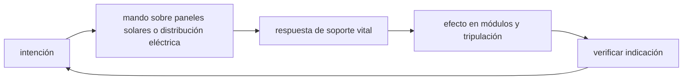

<!-- clase-meta
tipo_documento: clase
clase: 5
codigo: ESTACIONESPA-05
curso: estacion-espacial
titulo: "Mandos e instrumentos de la estación espacial"
modalidad: "taller de simulación"
duracion_minutos: 60
nivel: introductorio
prerrequisito: ESTACIONESPA-04
competencia: "lectura_y_mando"
resultados_aprendizaje:
  - "Explicar controles, instrumentos, entradas y estados del sistema con vocabulario propio de Estación espacial (ISS)."
  - "Aplicar esos conceptos a una decisión segura o a un escenario de simulación de Estación espacial (ISS)."
evidencia: "Mapa de mandos y resolución de dos estados del tablero."
criterio_aprobacion: "Reconoce los controles críticos y responde a los estados sin introducir acciones inseguras."
fuentes: manuales/fuentes.md
ultima_revision: 2026-09-10
-->

# 🎛️ Mandos e instrumentos de la estación espacial

[🏠 Inicio](../../../README.md) · [🛰️ Curso: Estación espacial (ISS)](../README.md) · 🎛️ Mandos

## Vista general

La estación espacial no se "pilota" como una nave: se **opera**. La tripulación a
bordo trabaja en estaciones de trabajo y paneles de sistema, mientras varios
**centros de control** en tierra vigilan la telemetría y coordinan las tareas. La
estación mantiene su órbita y su orientación de forma casi automática; el trabajo
humano se centra en la ciencia, el mantenimiento, el acoplamiento y las EVA.

## Mapa de controles

| Zona | Control | Tipo | Función | Prioridad | Comentarios |
| --- | --- | --- | --- | --- | --- |
| A bordo | Panel de soporte vital | Mandos y lecturas | Aire, agua, CO2, temperatura | Alta | Vital cada día. |
| A bordo | Panel de energía | Interruptores | Repartir potencia | Alta | Gestiona paneles y baterías. |
| A bordo | Estación de brazo robotico | Palancas y pantallas | Mover el brazo | Alta | Captura naves y cargas. |
| A bordo | Control de acoplamiento | Pantallas | Vigilar la aproximación | Alta | Encuentro lento y preciso. |
| A bordo | Esclusa de EVA | Mandos | Preparar caminatas | Alta | Presión y trajes. |
| A bordo | Comunicaciones | Radio | Contacto con tierra | Media | Enlace con el centro de control. |
| Tierra | Consolas de control | Telemetría | Vigilar todos los sistemas | Alta | Varios centros por país socio. |
| A bordo y tierra | Alarmas | Luces y sonido | Avisar fallas | Alta | Fuego, presión, energía. |

## Instrumentos y telemetría

| Instrumento | Mide o muestra | Unidad | Importancia | Notas |
| --- | --- | --- | --- | --- |
| Altitud orbital | Altura sobre la Tierra | km | Alta | Ronda los 400 km (aproximado). |
| Recursos vitales | Oxígeno, CO2, agua | varias | Alta | Estado del soporte vital. |
| Energía disponible | Carga de baterías y paneles | porcentaje | Alta | Sube al Sol, baja en sombra. |
| Temperatura interior | Ambiente de los módulos | grados | Alta | La regula el control térmico. |
| Orientación | Actitud de la estación | grados | Media | Casi siempre automática. |
| Estado de puertos | Libre u ocupado | discreto | Alta | Para recibir naves. |

## Entradas de simulación

| Acción | Teclado | Controlador | Panel táctil | Comentarios |
| --- | --- | --- | --- | --- |
| Revisar soporte vital | Tecla L | Botón | Panel vital | Aire, agua, CO2. |
| Gestionar energía | Tecla P | Cruceta | Panel de energía | Reparte potencia. |
| Operar brazo robotico | Teclas WASDQE | Sticks | Estación de brazo | Mueve cargas y captura naves. |
| Guiar acoplamiento | Flechas | Stick | Zona de acople | Aproximación lenta. |
| Preparar EVA | Tecla V | Botón | Panel de esclusa | Presión y traje. |
| Atender alarma | Tecla espacio | Botón | Botón de alarma | Aislar la falla. |
| Comunicar con tierra | Tecla T | Botón | Radio | Coordinar tareas. |

## Estados del sistema

| Estado | Descripción | Indicadores | Acciones disponibles |
| --- | --- | --- | --- |
| Operación normal | Estación estable en órbita | Sistemas en verde | Ciencia, mantenimiento, ejercicio. |
| Acoplamiento | Llega una nave | Datos de aproximación | Guiar acople, capturar con el brazo. |
| Reabastecimiento | Traspaso de carga | Puerto ocupado | Descargar agua, aire, comida, equipos. |
| Caminata espacial | Tripulación en el exterior | Estado de esclusa y traje | Instalar o reparar equipos. |
| Ajuste de órbita | Corrección de altura | Empuje de una nave acoplada | Elevar la órbita. |
| Emergencia | Fuego, fuga o falla | Alarmas activas | Aislar, cerrar módulo, aplicar checklist. |

## Observaciones ergonomicas

- Los recursos vitales y la energía deben verse siempre de un vistazo.
- Las alarmas de fuego, presión y fuga deben ser inconfundibles.
- El control del brazo robotico exige vistas claras y movimientos suaves.
- La interfaz debe recordar que la estación se opera en equipo con tierra.
- La preparación de una EVA debe seguir una lista de pasos ordenada.

## 🧭 Guía de estudio aplicada

### Pregunta guía

¿Cómo ayuda **Vista general, Mapa de controles, Instrumentos y telemetría y Entradas de simulación** a **interpretar mandos e indicaciones durante pérdida parcial de generación durante una actividad planificada**?

### Explicación razonada

Un mando no se aprende memorizando su nombre, sino recorriendo el ciclo intención → acción → indicación → verificación. En Estación espacial (ISS), el operador actúa sobre paneles solares o distribución eléctrica, observa la respuesta en soporte vital y confirma el efecto en módulos y tripulación. Una indicación inesperada exige detener la secuencia mental, identificar el modo activo y evitar una segunda orden que agrave el estado.

Esta clase se conecta con el resto del curso mediante **equilibrio continuo de energía, atmósfera, calor y orientación orbital**. El hilo de
seguridad consiste en reconocer a tiempo **degradación de soporte vital o energía por priorización tardía** y poder justificar la decisión
**aislar la falla y priorizar cargas esenciales antes de recuperar la misión**; en clases posteriores cambiará el ángulo de análisis, no esa relación causal.
La lectura funcional común sigue **paneles solares → distribución eléctrica → soporte vital → módulos y tripulación**, de modo que cada concepto pueda
ubicarse dentro del funcionamiento completo y no quede como un dato aislado.

**Apoyo documental:** [International Space Station](https://www.nasa.gov/reference/international-space-station/) aporta módulos, órbita y soporte vital;
[Space Law Treaties and Principles](https://www.unoosa.org/oosa/SpaceLaw/treaties.html) se usa para derecho espacial internacional. Estas fuentes
se contrastan con el alcance de la clase y no sustituyen un manual de equipo concreto.

### Caso resuelto: de la observación a la decisión

1. **Intención:** formula qué cambio se necesita durante **pérdida parcial de generación durante una actividad planificada**.
2. **Mando:** identifica el control que actúa sobre **paneles solares** o **distribución eléctrica** y el modo que debe estar activo.
3. **Lectura:** localiza la indicación que confirma la respuesta de **soporte vital** y el efecto en **módulos y tripulación**.
4. **Verificación:** si la lectura no coincide, no acumules órdenes; estabiliza e investiga el estado.

### Comprueba tu comprensión

1. ¿Qué mando inicia la respuesta y qué instrumento confirma que el modo correcto está activo?
2. ¿Qué indicación temprana advertiría **degradación de soporte vital o energía por priorización tardía**?
3. ¿Qué secuencia usarías si la respuesta de **módulos y tripulación** no coincide con la orden?

Orientación para revisar tus respuestas

- La primera respuesta debe relacionar el eslabón elegido con un efecto posterior, no solo nombrarlo.
- La segunda debe proponer una señal medible u observable y explicar qué tendencia sería preocupante.
- La tercera debe cambiar al menos una variable de capacidad, mando, entorno o margen de seguridad.

## 🎓 Cierre de clase

- **Actividad:** Recorre el puesto de mando simulado de Estación espacial (ISS): localiza los controles de controles, instrumentos, entradas y estados del sistema y asocia cada indicación con una decisión.
- **Evidencia:** Mapa de mandos y resolución de dos estados del tablero.
- **Criterio de aprobación:** Reconoce los controles críticos y responde a los estados sin introducir acciones inseguras.
- **Transferencia:** explica qué cambiaría al pasar a otra variante de esta máquina.

### Fuentes de esta clase

- [NASA-ISS](https://www.nasa.gov/reference/international-space-station/): International Space Station, NASA. Uso: módulos, órbita y soporte vital.
- [UNOOSA-TREATIES](https://www.unoosa.org/oosa/SpaceLaw/treaties.html): Space Law Treaties and Principles, UNOOSA. Uso: derecho espacial internacional.

> Las fuentes sostienen el marco conceptual y normativo; esta clase no reemplaza el manual
> del fabricante, la formación certificada ni la habilitación exigida para operar equipos reales.

---

[⬅️ Anterior: Sistemas mecánicos](../operacion/sistemas-mecanicos-estacion-espacial.md) · [➡️ Siguiente: Principios y operación](../operacion/principios-estacion-espacial.md)
