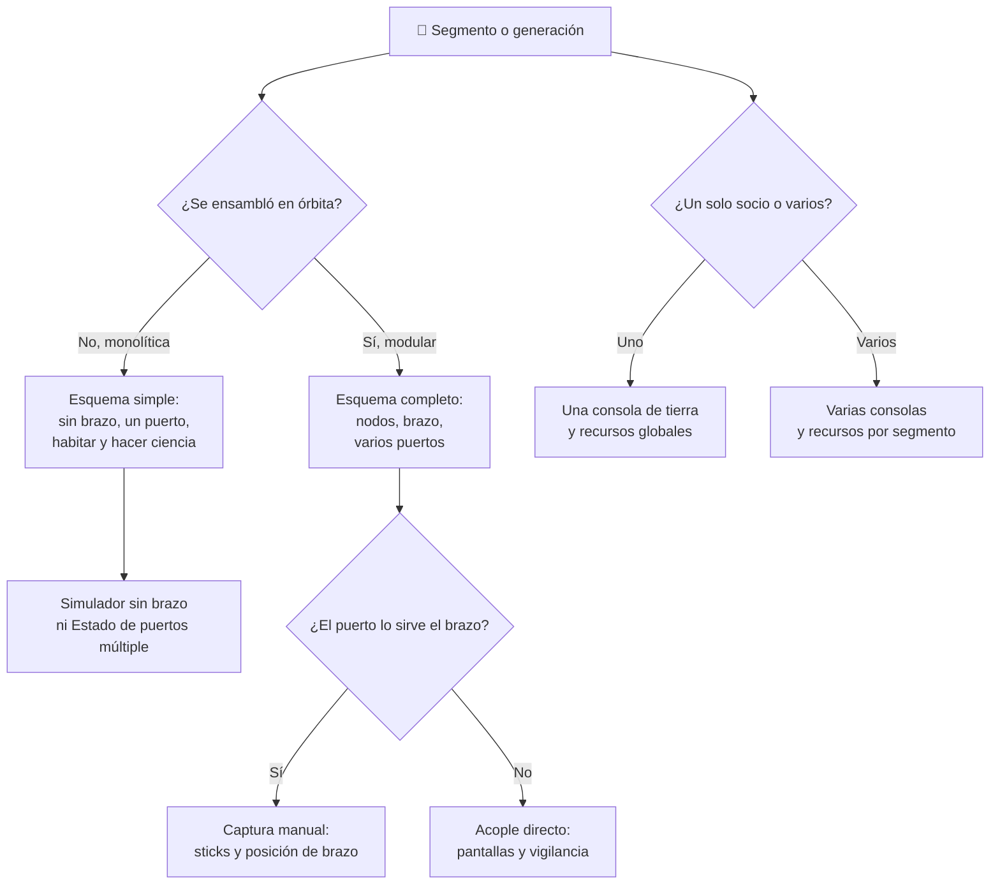

# 🧩 Modelos y variantes de la estación espacial

[🏠 Inicio](../../../README.md) · [🛰️ Curso: Estación espacial (ISS)](../README.md) · 🧩 Modelos

El [Módulo 2](../operacion/caracteristicas-estacion-espacial.md) ya dijo qué es
una estación espacial y de qué partes se compone. Este módulo responde a otra
cosa: **no todas las partes se operan igual**, y esa diferencia no es de matiz.
Cambia qué mandos tiene la máquina y, por tanto, qué debe modelar el simulador.

> 🎯 **La idea que sostiene el módulo.** Aquí "modelo" no significa lo mismo que
> en una moto. La ISS es **una sola estación**: no hay catálogo del que elegir.
> El eje real es el **segmento** y la **generación** — monolítica frente a
> modular ensamblada en órbita, segmentos con jurisdicción distinta, módulos de
> laboratorio frente a módulos habitat. Un simulador que presente un solo
> esquema de control está representando un segmento concreto aunque diga
> representar la estación entera.

---

## 🧭 Por qué el modelo decide el simulador

El [Módulo 5](../mandos/manual-mandos-estacion-espacial.md) describe un puesto
de mando con estación de brazo robótico (palancas y pantallas), esclusa de EVA,
paneles de soporte vital y de energía, y consolas en tierra. El
[Módulo 9](../simulacion/diseno-simulador-estacion-espacial.md) expone variables
como `Estado de puertos`, `Energía` y `Altitud orbital`. Ambos describen una
estación **modular, ensamblada en órbita y operada en equipo con tierra**: la
ISS.

Una estación monolítica no tiene nada de eso. Sin módulos que unir no hay nodos,
no hay brazo que mueva cargas y `Estado de puertos` tiene, como mucho, un único
valor. Si el simulador se construye sobre el esquema modular y luego se le
"añade" una estación de una pieza, el resultado es una estación monolítica con
brazo robótico, que no es lo que fue.

Y dentro de la propia ISS pasa algo parecido en pequeño: el
[Módulo 1](../historia/historia-estacion-espacial.md) recuerda que se ensambló
pieza por pieza entre socios distintos, y el Módulo 5 lo confirma al hablar de
**varios centros de control por país socio**. No hay "la consola" de la
estación. Hay consolas, en plural, y eso es una decisión de diseño, no un
detalle.

---

## 🗂️ Qué cambia en el manejo

| Modelo o segmento | Qué cambia en su operación |
| --- | --- |
| Estación modular ensamblada en órbita (ISS) | La referencia del curso: módulos unidos por nodos, brazo robótico, varios puertos y operación repartida con tierra. |
| Estación monolítica (una sola pieza) | No se ensambla nada: llega hecha. Sin nodos que gestionar ni módulos que mover, la operación se reduce a habitar y hacer ciencia. |
| Segmento con jurisdicción propia | Los mismos sistemas se vigilan desde un centro de control distinto. Coordinar deja de ser una tarea de fondo y pasa a ser parte del trabajo. |
| Módulo de laboratorio | El trabajo es experimental y planificado. La microgravedad es el objeto de estudio, no un estorbo. |
| Módulo habitat | El trabajo es vivir: dormir, comer, higiene y ejercicio diario. La rutina manda sobre la tarea. |
| Nodo de unión | No se "opera": se atraviesa. Reparte el paso interno y, en emergencia, es lo que se cierra. |
| Esclusa de EVA | Es el único punto desde el que se sale al vacío. Impone una secuencia de pasos ordenada antes de cualquier trabajo exterior. |
| Puerto servido por el brazo | Recibir una nave es una tarea manual a bordo: capturarla y llevarla al puerto. |
| Puerto de acople directo | Recibir una nave es una tarea de vigilancia: la aproximación se guía sola y la tripulación observa. |

---

## 🎛️ Qué cambia en el mando

| Modelo o segmento | Qué mando aparece o desaparece | Consecuencia |
| --- | --- | --- |
| Estación modular ensamblada en órbita (ISS) | Ninguno: el mapa de controles del Módulo 5 aplica tal cual. | Es el caso base del curso. |
| Estación monolítica (una sola pieza) | **Desaparecen** la estación de brazo robótico y el control de acoplamiento múltiple. | Se pierde el puesto de mando más exigente del Módulo 5: los sticks dejan de tener función. |
| Segmento con jurisdicción propia | **Se duplican** las comunicaciones y las consolas de tierra: no hay un interlocutor, hay varios. | Atender una alarma deja de ser pulsar un botón y pasa a ser coordinar quién la atiende. |
| Módulo de laboratorio | **Aparecen** los mandos de experimento; el panel de soporte vital se lee pero rara vez se toca. | El día se organiza alrededor de la ciencia. |
| Módulo habitat | **No aporta** mandos de sistema: aporta rutina y sujeciones. | No es un mando, pero consume tiempo de tripulación como si lo fuera. |
| Esclusa de EVA | **Aparece** el panel de esclusa: presión y trajes. | Sin esclusa no hay EVA posible, por muchos sistemas externos que haya que reparar. |
| Puerto servido por el brazo | **Aparece** la estación de brazo (palancas, teclas `WASDQE`) como mando activo del acoplamiento. | La nave no se acopla: se captura. Hay un humano en el lazo. |
| Puerto de acople directo | **Desaparece** el brazo del acoplamiento; queda el control de aproximación (pantallas, flechas). | La misma acción — recibir una nave — se resuelve con dos mandos incompatibles entre sí. |

---

## 🎮 Qué cambia en el simulador

Contrastado con las variables del
[Módulo 9](../simulacion/diseno-simulador-estacion-espacial.md):

| Modelo o segmento | Variables que cambian | Esquema de control |
| --- | --- | --- |
| Estación modular ensamblada en órbita (ISS) | Ninguna: es el caso base. | El del Módulo 5. |
| Estación monolítica (una sola pieza) | `Estado de puertos` **se reduce** a un solo puerto o desaparece. La `Altitud orbital` sigue viva, pero sin nave acoplada que la eleve. | Sin entrada de brazo robótico. |
| Segmento con jurisdicción propia | `Energía`, `Oxígeno`, `Nivel de CO2` y `Agua reciclada` dejan de ser un valor único de la estación y pasan a tener lectura por segmento. | El mismo, con un interlocutor de tierra distinto por segmento. |
| Módulo de laboratorio | `Energía` gana un consumidor que compite con el soporte vital durante la fase de sombra. | El mismo. |
| Módulo habitat | `Oxígeno`, `Nivel de CO2` y `Agua reciclada` se acoplan al número de personas a bordo, no al reloj. | El mismo. |
| Nodo de unión | `Temperatura interior` deja de ser un valor global: cerrar un nodo aísla un volumen. | El mismo, más el cierre de módulo en emergencia. |
| Esclusa de EVA | `Oxígeno` pierde masa en cada ciclo de esclusa; `Energía` sube por el traje. | El mismo, más el panel de esclusa. |
| Puerto servido por el brazo | `Estado de puertos` no basta: hace falta la posición del brazo como estado propio. | Con entrada continua de brazo. |
| Puerto de acople directo | `Estado de puertos` basta: `libre u ocupado` describe todo. | Sin entrada continua: solo vigilancia. |

---

## 🗺️ Del modelo al esquema de control

---

## ⚠️ Qué modelos no comparten simulador

Tres casos no se resuelven con un ajuste de parámetros, porque su esquema de
control es otro:

- **La estación monolítica** frente a la modular: falta un puesto de mando
  entero. No es una estación más fácil, es una máquina con menos controles.
- **El puerto servido por el brazo** frente al puerto de acople directo: uno
  pide una entrada continua con un humano en el lazo y el otro pide una pantalla
  que se mira. Es un modo de control distinto, no una dificultad distinta.
- **Los segmentos con jurisdicción propia** frente a una estación de un solo
  socio: obligan a que los recursos vitales y la energía sean valores por
  segmento y no constantes globales, y a que exista más de un interlocutor en
  tierra.

El resto de variantes — laboratorio, habitat, nodo, esclusa — sí caben en un
mismo simulador ajustando rangos y consumidores, tal como plantean los
[niveles de realismo](../../../docs/03-niveles-de-realismo.md): en el nivel 1
casi todo se comporta igual, y las diferencias emergen a medida que el nivel
sube.

---

[⬅️ Anterior: Características](../operacion/caracteristicas-estacion-espacial.md) · [➡️ Siguiente: Sistemas mecánicos](../operacion/sistemas-mecanicos-estacion-espacial.md)
