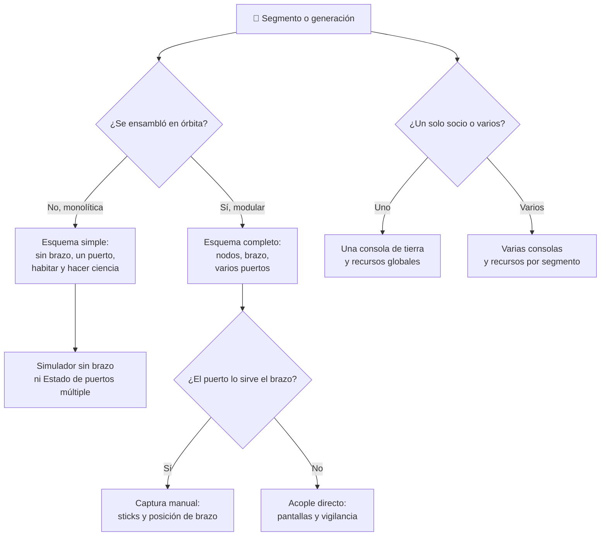

<!-- clase-meta
tipo_documento: clase
clase: 3
codigo: ESTACIONESPA-03
curso: estacion-espacial
titulo: "Modelos y variantes de la estación espacial"
modalidad: "comparativa guiada"
duracion_minutos: 60
nivel: introductorio
prerrequisito: ESTACIONESPA-02
competencia: "seleccion_de_configuracion"
resultados_aprendizaje:
  - "Explicar manejo, arquitectura de mandos y variables de simulación con vocabulario propio de Estación espacial (ISS)."
  - "Aplicar esos conceptos a una decisión segura o a un escenario de simulación de Estación espacial (ISS)."
evidencia: "Matriz comparativa y decisión justificada."
criterio_aprobacion: "La elección considera función, límites, mando y efecto en la simulación; no se apoya solo en preferencias."
fuentes: manuales/fuentes.md
ultima_revision: 2026-09-10
-->

# 🧩 Modelos y variantes de la estación espacial

[🏠 Inicio](../../../README.md) · [🛰️ Curso: Estación espacial (ISS)](../README.md) · 🧩 Modelos

El [Clase 2](../operacion/caracteristicas-estacion-espacial.md) ya dijo qué es
una estación espacial y de qué partes se compone. Esta clase responde a otra
cosa: **no todas las partes se operan igual**, y esa diferencia no es de matiz.
Cambia qué mandos tiene la máquina y, por tanto, qué debe modelar el simulador.

> 🎯 **La idea que sostiene el módulo.** Aquí "modelo" no significa lo mismo que
> en una moto. La ISS es **una sola estación**: no hay catálogo del que elegir.
> El eje real es el **segmento** y la **generación** — monolítica frente a
> modular ensamblada en órbita, segmentos con jurisdicción distinta, módulos de
> laboratorio frente a módulos habitat. Un simulador que presente un solo
> esquema de control está representando un segmento concreto aunque diga
> representar la estación entera.

---

## 🧭 Por qué el modelo decide el simulador

El [Clase 5](../mandos/manual-mandos-estacion-espacial.md) describe un puesto
de mando con estación de brazo robótico (palancas y pantallas), esclusa de EVA,
paneles de soporte vital y de energía, y consolas en tierra. El
[Clase 9](../simulacion/diseno-simulador-estacion-espacial.md) expone variables
como `Estado de puertos`, `Energía` y `Altitud orbital`. Ambos describen una
estación **modular, ensamblada en órbita y operada en equipo con tierra**: la
ISS.

Una estación monolítica no tiene nada de eso. Sin módulos que unir no hay nodos,
no hay brazo que mueva cargas y `Estado de puertos` tiene, como mucho, un único
valor. Si el simulador se construye sobre el esquema modular y luego se le
"añade" una estación de una pieza, el resultado es una estación monolítica con
brazo robótico, que no es lo que fue.

Y dentro de la propia ISS pasa algo parecido en pequeño: el
[Clase 1](../historia/historia-estacion-espacial.md) recuerda que se ensambló
pieza por pieza entre socios distintos, y el Clase 5 lo confirma al hablar de
**varios centros de control por país socio**. No hay "la consola" de la
estación. Hay consolas, en plural, y eso es una decisión de diseño, no un
detalle.

---

## 🗂️ Qué cambia en el manejo

| Modelo o segmento | Qué cambia en su operación |
| --- | --- |
| Estación modular ensamblada en órbita (ISS) | La referencia del curso: módulos unidos por nodos, brazo robótico, varios puertos y operación repartida con tierra. |
| Estación monolítica (una sola pieza) | No se ensambla nada: llega hecha. Sin nodos que gestionar ni módulos que mover, la operación se reduce a habitar y hacer ciencia. |
| Segmento con jurisdicción propia | Los mismos sistemas se vigilan desde un centro de control distinto. Coordinar deja de ser una tarea de fondo y pasa a ser parte del trabajo. |
| Módulo de laboratorio | El trabajo es experimental y planificado. La microgravedad es el objeto de estudio, no un estorbo. |
| Módulo habitat | El trabajo es vivir: dormir, comer, higiene y ejercicio diario. La rutina manda sobre la tarea. |
| Nodo de unión | No se "opera": se atraviesa. Reparte el paso interno y, en emergencia, es lo que se cierra. |
| Esclusa de EVA | Es el único punto desde el que se sale al vacío. Impone una secuencia de pasos ordenada antes de cualquier trabajo exterior. |
| Puerto servido por el brazo | Recibir una nave es una tarea manual a bordo: capturarla y llevarla al puerto. |
| Puerto de acople directo | Recibir una nave es una tarea de vigilancia: la aproximación se guía sola y la tripulación observa. |

---

## 🎛️ Qué cambia en el mando

| Modelo o segmento | Qué mando aparece o desaparece | Consecuencia |
| --- | --- | --- |
| Estación modular ensamblada en órbita (ISS) | Ninguno: el mapa de controles del Clase 5 aplica tal cual. | Es el caso base del curso. |
| Estación monolítica (una sola pieza) | **Desaparecen** la estación de brazo robótico y el control de acoplamiento múltiple. | Se pierde el puesto de mando más exigente del Clase 5: los sticks dejan de tener función. |
| Segmento con jurisdicción propia | **Se duplican** las comunicaciones y las consolas de tierra: no hay un interlocutor, hay varios. | Atender una alarma deja de ser pulsar un botón y pasa a ser coordinar quién la atiende. |
| Módulo de laboratorio | **Aparecen** los mandos de experimento; el panel de soporte vital se lee pero rara vez se toca. | El día se organiza alrededor de la ciencia. |
| Módulo habitat | **No aporta** mandos de sistema: aporta rutina y sujeciones. | No es un mando, pero consume tiempo de tripulación como si lo fuera. |
| Esclusa de EVA | **Aparece** el panel de esclusa: presión y trajes. | Sin esclusa no hay EVA posible, por muchos sistemas externos que haya que reparar. |
| Puerto servido por el brazo | **Aparece** la estación de brazo (palancas, teclas `WASDQE`) como mando activo del acoplamiento. | La nave no se acopla: se captura. Hay un humano en el lazo. |
| Puerto de acople directo | **Desaparece** el brazo del acoplamiento; queda el control de aproximación (pantallas, flechas). | La misma acción — recibir una nave — se resuelve con dos mandos incompatibles entre sí. |

---

## 🎮 Qué cambia en el simulador

Contrastado con las variables del
[Clase 9](../simulacion/diseno-simulador-estacion-espacial.md):

| Modelo o segmento | Variables que cambian | Esquema de control |
| --- | --- | --- |
| Estación modular ensamblada en órbita (ISS) | Ninguna: es el caso base. | El del Clase 5. |
| Estación monolítica (una sola pieza) | `Estado de puertos` **se reduce** a un solo puerto o desaparece. La `Altitud orbital` sigue viva, pero sin nave acoplada que la eleve. | Sin entrada de brazo robótico. |
| Segmento con jurisdicción propia | `Energía`, `Oxígeno`, `Nivel de CO2` y `Agua reciclada` dejan de ser un valor único de la estación y pasan a tener lectura por segmento. | El mismo, con un interlocutor de tierra distinto por segmento. |
| Módulo de laboratorio | `Energía` gana un consumidor que compite con el soporte vital durante la fase de sombra. | El mismo. |
| Módulo habitat | `Oxígeno`, `Nivel de CO2` y `Agua reciclada` se acoplan al número de personas a bordo, no al reloj. | El mismo. |
| Nodo de unión | `Temperatura interior` deja de ser un valor global: cerrar un nodo aísla un volumen. | El mismo, más el cierre de módulo en emergencia. |
| Esclusa de EVA | `Oxígeno` pierde masa en cada ciclo de esclusa; `Energía` sube por el traje. | El mismo, más el panel de esclusa. |
| Puerto servido por el brazo | `Estado de puertos` no basta: hace falta la posición del brazo como estado propio. | Con entrada continua de brazo. |
| Puerto de acople directo | `Estado de puertos` basta: `libre u ocupado` describe todo. | Sin entrada continua: solo vigilancia. |

---

## 🗺️ Del modelo al esquema de control

```mermaid
flowchart TD
    Modelo[🧩 Segmento o generación] --> Ensam{¿Se ensambló en órbita?}
    Ensam -- No, monolítica --> Mono[Esquema simple:<br/>sin brazo, un puerto,<br/>habitar y hacer ciencia]
    Ensam -- Sí, modular --> Mod[Esquema completo:<br/>nodos, brazo,<br/>varios puertos]
    Mono --> Var1[Simulador sin brazo<br/>ni Estado de puertos múltiple]
    Mod --> Puerto{¿El puerto lo sirve el brazo?}
    Puerto -- Sí --> Captura[Captura manual:<br/>sticks y posición de brazo]
    Puerto -- No --> Acople[Acople directo:<br/>pantallas y vigilancia]
    Modelo --> Juris{¿Un solo socio o varios?}
    Juris -- Uno --> Consola[Una consola de tierra<br/>y recursos globales]
    Juris -- Varios --> Consolas[Varias consolas<br/>y recursos por segmento]
```

---

## ⚠️ Qué modelos no comparten simulador

Tres casos no se resuelven con un ajuste de parámetros, porque su esquema de
control es otro:

- **La estación monolítica** frente a la modular: falta un puesto de mando
  entero. No es una estación más fácil, es una máquina con menos controles.
- **El puerto servido por el brazo** frente al puerto de acople directo: uno
  pide una entrada continua con un humano en el lazo y el otro pide una pantalla
  que se mira. Es un modo de control distinto, no una dificultad distinta.
- **Los segmentos con jurisdicción propia** frente a una estación de un solo
  socio: obligan a que los recursos vitales y la energía sean valores por
  segmento y no constantes globales, y a que exista más de un interlocutor en
  tierra.

El resto de variantes — laboratorio, habitat, nodo, esclusa — sí caben en un
mismo simulador ajustando rangos y consumidores, tal como plantean los
[niveles de realismo](../../../docs/03-niveles-de-realismo.md): en el nivel 1
casi todo se comporta igual, y las diferencias emergen a medida que el nivel
sube.

## 🧭 Guía de estudio aplicada

### Pregunta guía

¿Cómo ayuda **Por qué el modelo decide el simulador, Qué cambia en el manejo, Qué cambia en el mando y Qué cambia en el simulador** a **comparar segmento presurizado frente a estructura externa frente al mismo encargo**?

### Explicación razonada

Las variantes «segmento presurizado frente a estructura externa» resuelven prioridades distintas. Una comparación profesional sigue la cadena paneles solares → distribución eléctrica → soporte vital → módulos y tripulación: cada cambio de arquitectura modifica mandos, respuesta, mantenimiento y variables que una simulación debe representar. Elegir un modelo significa justificar qué compromiso sirve mejor al caso, no declarar un favorito.

Esta clase se conecta con el resto del curso mediante **equilibrio continuo de energía, atmósfera, calor y orientación orbital**. El hilo de
seguridad consiste en reconocer a tiempo **degradación de soporte vital o energía por priorización tardía** y poder justificar la decisión
**aislar la falla y priorizar cargas esenciales antes de recuperar la misión**; en clases posteriores cambiará el ángulo de análisis, no esa relación causal.
La lectura funcional común sigue **paneles solares → distribución eléctrica → soporte vital → módulos y tripulación**, de modo que cada concepto pueda
ubicarse dentro del funcionamiento completo y no quede como un dato aislado.

**Apoyo documental:** [International Space Station](https://www.nasa.gov/reference/international-space-station/) aporta módulos, órbita y soporte vital;
[Space Law Treaties and Principles](https://www.unoosa.org/oosa/SpaceLaw/treaties.html) se usa para derecho espacial internacional. Estas fuentes
se contrastan con el alcance de la clase y no sustituyen un manual de equipo concreto.

### Caso resuelto: de la observación a la decisión

1. **Mantener el encargo constante:** ambas variantes deben evaluarse ante **pérdida parcial de generación durante una actividad planificada**.
2. **Trazar consecuencias:** para cada variante sigue el efecto desde **paneles solares** hasta **módulos y tripulación**.
3. **Comparar el puesto de mando:** determina qué debe percibir y controlar el operador en cada arquitectura.
4. **Justificar:** elige una variante y explica qué sacrifica; toda selección técnica contiene un compromiso.

### Comprueba tu comprensión

1. ¿Qué cambia en la cadena **paneles solares → distribución eléctrica → soporte vital → módulos y tripulación** entre las dos variantes?
2. ¿Qué indicación o mando adicional necesitaría una de ellas?
3. ¿Cuál elegirías para «pérdida parcial de generación durante una actividad planificada» y qué desventaja aceptarías?

Orientación para revisar tus respuestas

- La primera respuesta debe relacionar el eslabón elegido con un efecto posterior, no solo nombrarlo.
- La segunda debe proponer una señal medible u observable y explicar qué tendencia sería preocupante.
- La tercera debe cambiar al menos una variable de capacidad, mando, entorno o margen de seguridad.

## 🎓 Cierre de clase

- **Actividad:** Compara variantes de Estación espacial (ISS) mediante los ejes «manejo, arquitectura de mandos y variables de simulación» y elige una para un caso de uso razonado.
- **Evidencia:** Matriz comparativa y decisión justificada.
- **Criterio de aprobación:** La elección considera función, límites, mando y efecto en la simulación; no se apoya solo en preferencias.
- **Transferencia:** explica qué cambiaría al pasar a otra variante de esta máquina.

### Fuentes de esta clase

- [NASA-ISS](https://www.nasa.gov/reference/international-space-station/): International Space Station, NASA. Uso: módulos, órbita y soporte vital.
- [UNOOSA-TREATIES](https://www.unoosa.org/oosa/SpaceLaw/treaties.html): Space Law Treaties and Principles, UNOOSA. Uso: derecho espacial internacional.

> Las fuentes sostienen el marco conceptual y normativo; esta clase no reemplaza el manual
> del fabricante, la formación certificada ni la habilitación exigida para operar equipos reales.

---

[⬅️ Anterior: Características](../operacion/caracteristicas-estacion-espacial.md) · [➡️ Siguiente: Sistemas mecánicos](../operacion/sistemas-mecanicos-estacion-espacial.md)
