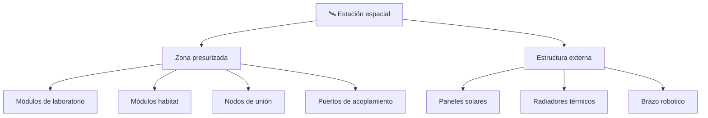

# 📋 Características funcionales de la estación espacial

[🏠 Inicio](../../../README.md) · [🛰️ Curso: Estación espacial (ISS)](../README.md) · 📋 Características

Que es una estación espacial, cuales son sus partes y para que sirve. Este módulo
da el contexto antes de abrir los sistemas de la estación (Módulo 3).

---

## 🧭 Definición

Una estación espacial es un habitat permanente en órbita baja donde una
tripulación vive y trabaja durante largos periodos. No despega ni aterriza como
una nave: se ensambla en órbita a partir de **módulos** y se mantiene cayendo de
forma continua alrededor de la Tierra. Su valor está en ser un laboratorio de
microgravedad ocupado sin interrupción.

---

## 🧬 Características clave

| Característica | Descripción |
| --- | --- |
| Habitat permanente | Alberga tripulación de forma continua. |
| Estructura modular | Se compone de módulos unidos en órbita. |
| Microgravedad | Todo flota en caída libre continua. |
| Soporte vital de ciclo cerrado | Recicla aire y agua para durar más. |
| Energía solar | Grandes paneles alimentan la estación. |
| Puertos de acoplamiento | Recibe naves de carga y de tripulación. |

---

## 🗂️ Partes de la estación

| Parte | Uso típico | Rasgo destacado |
| --- | --- | --- |
| Módulo de laboratorio | Experimentos en microgravedad | Interior presurizado. |
| Módulo habitat | Vivir, dormir y comer | Zona de descanso e higiene. |
| Nodo de unión | Conectar módulos | Distribuye el paso interno. |
| Paneles solares | Generar energía | Se orientan hacia el Sol. |
| Radiadores | Expulsar el calor sobrante | Regulan la temperatura. |
| Puerto de acoplamiento | Recibir naves | Une carga y tripulación. |

---

## 🎯 Para qué se usa

- Investigación científica en microgravedad (biología, materiales, medicina).
- Estudiar como afecta el espacio a la salud humana en misiones largas.
- Observar la Tierra y el espacio desde una plataforma estable.
- Probar tecnología para futuras misiones lejanas.
- Educación, cooperación internacional y simulación de la vida en órbita.

---

[⬅️ Anterior: Historia](../historia/historia-estacion-espacial.md) · [➡️ Siguiente: Sistemas mecánicos](sistemas-mecanicos-estacion-espacial.md)
