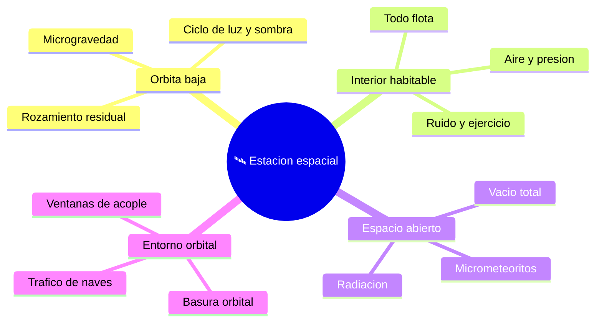

# 🌍 Entornos de trabajo de la estación espacial

[🏠 Inicio](../../../README.md) · [🛰️ Curso: Estación espacial (ISS)](../README.md) · 🌍 Entornos

Dónde opera una estación espacial y cómo cambian las condiciones según la zona.
Cada entorno implica riesgos y ajustes distintos, y en simulación se traduce en
escenarios diferentes.

---

## 🗺️ Entornos principales

| Entorno | Características | Riesgos típicos | Ajuste de operación |
| --- | --- | --- | --- |
| Órbita baja | Microgravedad, vueltas rápidas. | Pérdida de altura, radiación parcial. | Reimpulso, gestión de energía. |
| Interior habitable | Aire, presión, todo flota. | Fuego, fuga de aire. | Sujetar objetos, atender alarmas. |
| Espacio abierto | Vacío, radiación, micrometeoritos. | Falla de traje, impactos. | Traje, esclusa, sujeciones. |
| Entorno orbital | Basura y tráfico de naves. | Colisión con desechos. | Vigilancia, maniobras de evasión. |

---

## 🌦️ Factores del entorno

- **Radiación**: fuera de la parte más protegida de la atmósfera aumenta y afecta
  a personas y equipos.
- **Micrometeoritos y basura**: pequeños objetos a gran velocidad son un riesgo;
  la estación lleva escudos y a veces esquiva desechos.
- **Ciclo térmico**: el paso continuo de luz a sombra somete a la estructura a
  cambios de temperatura.
- **Rozamiento residual**: el aire tenue a 400 km frena la estación poco a poco.

---

## 🎮 Traducción a simulación

Cada entorno es un escenario con su radiación, su ciclo de luz y su nivel de
riesgo. Ver cómo se modela en el
[Módulo 9: Diseño de simulación](../simulacion/diseno-simulador-estacion-espacial.md).

---

[⬅️ Anterior: Principios y operación](principios-estacion-espacial.md) · [➡️ Siguiente: Reglamentos](../reglamentos/reglamentos-estacion-espacial.md)
