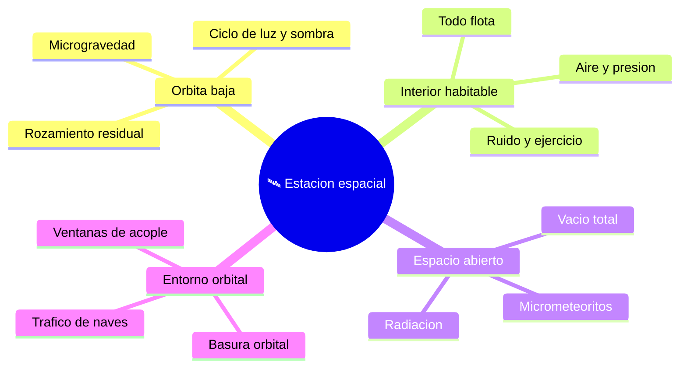

# 🌍 Entornos de trabajo de la estacion espacial

[🏠 Inicio](../../../README.md) · [🛰️ Curso: Estacion espacial (ISS)](../README.md) · 🌍 Entornos

Donde opera una estacion espacial y como cambian las condiciones segun la zona.
Cada entorno implica riesgos y ajustes distintos, y en simulacion se traduce en
escenarios diferentes.

---

## 🗺️ Entornos principales

| Entorno | Caracteristicas | Riesgos tipicos | Ajuste de operacion |
| --- | --- | --- | --- |
| Orbita baja | Microgravedad, vueltas rapidas. | Perdida de altura, radiacion parcial. | Reimpulso, gestion de energia. |
| Interior habitable | Aire, presion, todo flota. | Fuego, fuga de aire. | Sujetar objetos, atender alarmas. |
| Espacio abierto | Vacio, radiacion, micrometeoritos. | Falla de traje, impactos. | Traje, esclusa, sujeciones. |
| Entorno orbital | Basura y trafico de naves. | Colision con desechos. | Vigilancia, maniobras de evasion. |

---

## 🌦️ Factores del entorno

- **Radiacion**: fuera de la parte mas protegida de la atmosfera aumenta y afecta
  a personas y equipos.
- **Micrometeoritos y basura**: pequenos objetos a gran velocidad son un riesgo;
  la estacion lleva escudos y a veces esquiva desechos.
- **Ciclo termico**: el paso continuo de luz a sombra somete a la estructura a
  cambios de temperatura.
- **Rozamiento residual**: el aire tenue a 400 km frena la estacion poco a poco.

---

## 🎮 Traduccion a simulacion

Cada entorno es un escenario con su radiacion, su ciclo de luz y su nivel de
riesgo. Ver como se modela en el
[Modulo 8: Diseno de simulacion](../simulacion/diseno-simulador-estacion-espacial.md).

---

[⬅️ Anterior: Principios y operacion](principios-estacion-espacial.md) · [➡️ Siguiente: Reglamentos](../reglamentos/reglamentos-estacion-espacial.md)
