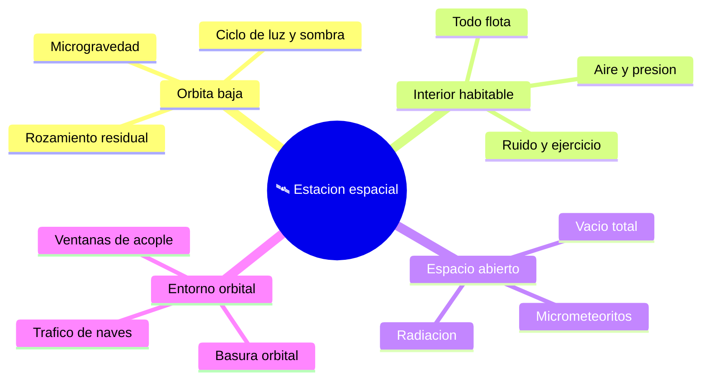

# 🌍 Entornos de trabajo de la estación espacial

[🏠 Inicio](../../../README.md) · [🛰️ Curso: Estación espacial (ISS)](../README.md) · 🌍 Entornos

Dónde opera una estación espacial y cómo cambian las condiciones según la zona.
Cada entorno implica riesgos y ajustes distintos, y en simulación se traduce en
escenarios diferentes.

---

## 🗺️ Entornos principales

```mermaid
mindmap
  root((🛰️ Estacion espacial))
    Orbita baja
      Microgravedad
      Ciclo de luz y sombra
      Rozamiento residual
    Interior habitable
      Aire y presion
      Todo flota
      Ruido y ejercicio
    Espacio abierto
      Vacio total
      Radiacion
      Micrometeoritos
    Entorno orbital
      Basura orbital
      Trafico de naves
      Ventanas de acople
```

| Entorno | Características | Riesgos típicos | Ajuste de operación |
| --- | --- | --- | --- |
| Órbita baja | Microgravedad, vueltas rápidas. | Pérdida de altura, radiación parcial. | Reimpulso, gestión de energía. |
| Interior habitable | Aire, presión, todo flota. | Fuego, fuga de aire. | Sujetar objetos, atender alarmas. |
| Espacio abierto | Vacío, radiación, micrometeoritos. | Falla de traje, impactos. | Traje, esclusa, sujeciones. |
| Entorno orbital | Basura y tráfico de naves. | Colisión con desechos. | Vigilancia, maniobras de evasión. |

---

## 🌦️ Factores del entorno

- **Radiación**: fuera de la parte más protegida de la atmósfera aumenta y afecta
  a personas y equipos.
- **Micrometeoritos y basura**: pequeños objetos a gran velocidad son un riesgo;
  la estación lleva escudos y a veces esquiva desechos.
- **Ciclo térmico**: el paso continuo de luz a sombra somete a la estructura a
  cambios de temperatura.
- **Rozamiento residual**: el aire tenue a 400 km frena la estación poco a poco.

---

## 🎮 Traducción a simulación

Cada entorno es un escenario con su radiación, su ciclo de luz y su nivel de
riesgo. Ver cómo se modela en el
[Módulo 9: Diseño de simulación](../simulacion/diseno-simulador-estacion-espacial.md).

## 🎓 Cierre de clase

- **Actividad:** Contrasta tres entornos de Estación espacial (ISS) a partir de entornos, factores ambientales, riesgos y respuesta de simulación y determina cómo cambian variables, percepción, riesgos y respuesta.
- **Evidencia:** Matriz entorno–cambio–riesgo–respuesta.
- **Criterio de aprobación:** Cada respuesta se adapta al entorno y distingue riesgos que no son intercambiables entre escenarios.
- **Transferencia:** explica qué cambiaría al pasar a otra variante de esta máquina.

### Fuentes de esta clase

- [NASA-ISS](https://www.nasa.gov/reference/international-space-station/): International Space Station, NASA. Uso: módulos, órbita y soporte vital.
- [UNOOSA-TREATIES](https://www.unoosa.org/oosa/SpaceLaw/treaties.html): Space Law Treaties and Principles, UNOOSA. Uso: derecho espacial internacional.

> Las fuentes sostienen el marco conceptual y normativo; esta clase no reemplaza el manual
> del fabricante, la formación certificada ni la habilitación exigida para operar equipos reales.

---

[⬅️ Anterior: Principios y operación](principios-estacion-espacial.md) · [➡️ Siguiente: Reglamentos](../reglamentos/reglamentos-estacion-espacial.md)
