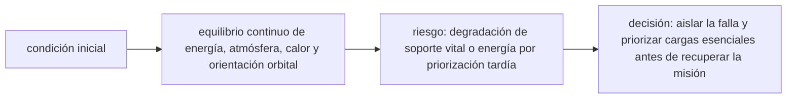

<!-- clase-meta
tipo_documento: clase
clase: 6
codigo: ESTACIONESPA-06
curso: estacion-espacial
titulo: "Principios y operación de la estación espacial"
modalidad: "resolución de problemas"
duracion_minutos: 90
nivel: introductorio
prerrequisito: ESTACIONESPA-05
competencia: "razonamiento_operacional"
resultados_aprendizaje:
  - "Explicar principios físicos, fases de operación, decisiones y errores frecuentes con vocabulario propio de Estación espacial (ISS)."
  - "Aplicar esos conceptos a una decisión segura o a un escenario de simulación de Estación espacial (ISS)."
evidencia: "Resolución argumentada de un escenario operacional."
criterio_aprobacion: "Aplica los principios correctos, anticipa consecuencias y respeta los límites del curso."
fuentes: manuales/fuentes.md
ultima_revision: 2026-09-10
-->

# 🧪 Principios y operación de la estación espacial

[🏠 Inicio](../../../README.md) · [🛰️ Curso: Estación espacial (ISS)](../README.md) · 🧪 Principios

Documento general y educativo. Describe cómo se opera una estación espacial en
simulación y que principios físicos conviene representar. Todo es **ciencia
real**: la microgravedad y la órbita se modelan con rigor.

## Principios de funcionamiento

- **Órbita baja**: la estación cae de forma continua alrededor de la Tierra a unos
  400 km de altura (aproximado), dando una vuelta en poco más de una hora y media.
- **Microgravedad**: no es ausencia de gravedad, sino caída libre; por eso todo
  flota dentro de la estación.
- **Ciclo de luz y sombra**: en cada vuelta la estación pasa por día y noche, lo
  que obliga a guardar energía en baterías.
- **Rozamiento residual**: el aire muy tenue a esa altura frena poco a poco la
  estación, que debe elevar su órbita cada cierto tiempo.
- **Soporte vital de ciclo cerrado**: aire y agua se reciclan porque reabastecer
  desde la Tierra es caro y lento.

## La microgravedad en una idea

La tripulación no flota porque "no haya gravedad", sino porque la estación y todo
lo que hay dentro caen juntos en la misma órbita.

## Fases de operación

| Fase | Que ocurre | Puntos clave |
| --- | --- | --- |
| Operación diaria | Ciencia y vida a bordo | Rutina, ejercicio, mantenimiento. |
| Acoplamiento | Llega una nave | Aproximación lenta, captura o acople. |
| Reabastecimiento | Traspaso de carga | Agua, aire, comida, equipos. |
| Caminata espacial | Trabajo en el exterior | Traje, esclusa, sujeciones. |
| Ajuste de órbita | Elevar la altura | Empuje de una nave acoplada. |
| Relevo de tripulación | Cambio de personas | Traspaso de tareas y despedida de la nave. |

## Vida en microgravedad: idea general

1. Todo debe sujetarse: objetos, personas y líquidos flotan.
2. El agua no cae; se maneja con cuidado para no dañar equipos.
3. El cuerpo pierde músculo y hueso, por eso se hace ejercicio a diario.
4. Dormir es amarrarse a un saco para no chocar con las paredes.
5. Cada tarea usa asideros y anclajes para trabajar sin flotar a la deriva.

## Errores comunes que la simulación puede enseñar a evitar

- Pensar que en órbita "no hay gravedad" en vez de caída libre.
- Olvidar que la estación pierde altura y necesita reimpulso.
- No administrar la energía en la fase de sombra.
- Descuidar el reciclaje de aire y agua en misiones largas.
- Aproximar una nave demasiado rápido al acoplar.

## Relación con los niveles de realismo

- **Nivel 1 (educativo)**: entender la vida a bordo y la microgravedad de forma guiada.
- **Nivel 2 (simplificado)**: agregar energía solar, ciclo de sombra y recursos vitales.
- **Nivel 3 (técnico)**: sumar acoplamiento preciso, reimpulso de órbita y EVA.

Ver [`docs/03-niveles-de-realismo.md`](../../../docs/03-niveles-de-realismo.md) para el detalle de cada nivel.

## 🧭 Guía de estudio aplicada

### Pregunta guía

¿Cómo ayuda **Principios de funcionamiento, La microgravedad en una idea, Fases de operación y Vida en microgravedad: idea general** a **resolver pérdida parcial de generación durante una actividad planificada sin agotar el margen operacional**?

### Explicación razonada

El principio rector puede resumirse así: equilibrio continuo de energía, atmósfera, calor y orientación orbital. Esto explica por qué una misma orden produce resultados distintos cuando cambian velocidad, carga, configuración o entorno. Operar bien consiste en leer la tendencia antes de agotar el margen y tomar esta decisión: aislar la falla y priorizar cargas esenciales antes de recuperar la misión.

Esta clase se conecta con el resto del curso mediante **equilibrio continuo de energía, atmósfera, calor y orientación orbital**. El hilo de
seguridad consiste en reconocer a tiempo **degradación de soporte vital o energía por priorización tardía** y poder justificar la decisión
**aislar la falla y priorizar cargas esenciales antes de recuperar la misión**; en clases posteriores cambiará el ángulo de análisis, no esa relación causal.
La lectura funcional común sigue **paneles solares → distribución eléctrica → soporte vital → módulos y tripulación**, de modo que cada concepto pueda
ubicarse dentro del funcionamiento completo y no quede como un dato aislado.

**Apoyo documental:** [International Space Station](https://www.nasa.gov/reference/international-space-station/) aporta módulos, órbita y soporte vital;
[Space Law Treaties and Principles](https://www.unoosa.org/oosa/SpaceLaw/treaties.html) se usa para derecho espacial internacional. Estas fuentes
se contrastan con el alcance de la clase y no sustituyen un manual de equipo concreto.

### Caso resuelto: de la observación a la decisión

1. **Datos:** reconoce condiciones, configuración y margen disponibles en **pérdida parcial de generación durante una actividad planificada**.
2. **Modelo:** aplica **equilibrio continuo de energía, atmósfera, calor y orientación orbital** para predecir una tendencia antes de actuar.
3. **Riesgo:** explica mediante qué cadena de causas podría ocurrir **degradación de soporte vital o energía por priorización tardía**.
4. **Decisión:** ejecuta mentalmente **aislar la falla y priorizar cargas esenciales antes de recuperar la misión** y define qué observación confirmaría que funcionó.

### Comprueba tu comprensión

1. ¿Qué variable del principio «equilibrio continuo de energía, atmósfera, calor y orientación orbital» cambia primero en el caso?
2. ¿Cómo se propaga ese cambio hasta **módulos y tripulación**?
3. ¿Qué evidencia confirmaría que **aislar la falla y priorizar cargas esenciales antes de recuperar la misión** conservó margen operacional?

Orientación para revisar tus respuestas

- La primera respuesta debe relacionar el eslabón elegido con un efecto posterior, no solo nombrarlo.
- La segunda debe proponer una señal medible u observable y explicar qué tendencia sería preocupante.
- La tercera debe cambiar al menos una variable de capacidad, mando, entorno o margen de seguridad.

## 🎓 Cierre de clase

- **Actividad:** Resuelve un escenario de Estación espacial (ISS) explicando, paso a paso, cómo intervienen principios físicos, fases de operación, decisiones y errores frecuentes.
- **Evidencia:** Resolución argumentada de un escenario operacional.
- **Criterio de aprobación:** Aplica los principios correctos, anticipa consecuencias y respeta los límites del curso.
- **Transferencia:** explica qué cambiaría al pasar a otra variante de esta máquina.

### Fuentes de esta clase

- [NASA-ISS](https://www.nasa.gov/reference/international-space-station/): International Space Station, NASA. Uso: módulos, órbita y soporte vital.
- [UNOOSA-TREATIES](https://www.unoosa.org/oosa/SpaceLaw/treaties.html): Space Law Treaties and Principles, UNOOSA. Uso: derecho espacial internacional.

> Las fuentes sostienen el marco conceptual y normativo; esta clase no reemplaza el manual
> del fabricante, la formación certificada ni la habilitación exigida para operar equipos reales.

---

[⬅️ Anterior: Mandos](../mandos/manual-mandos-estacion-espacial.md) · [➡️ Siguiente: Entornos de trabajo](entornos-estacion-espacial.md)
