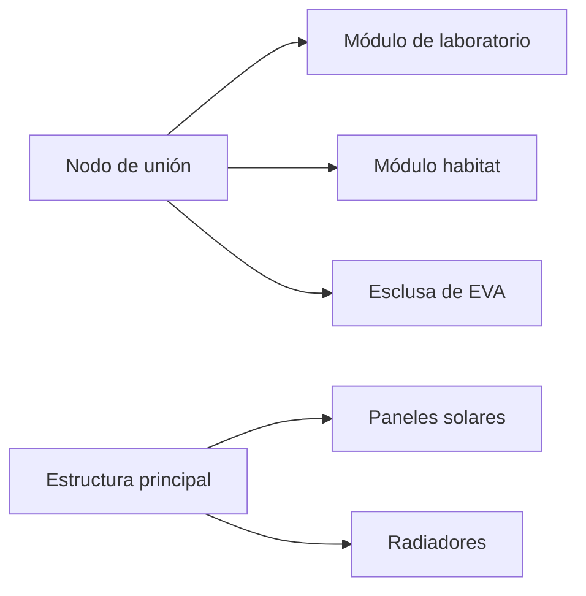
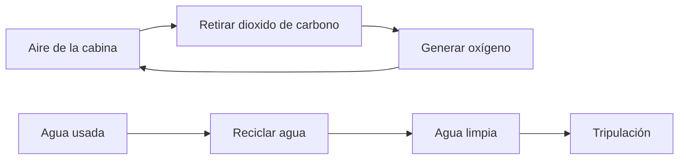

# 🔧 Sistemas mecánicos de la estación espacial

[🏠 Inicio](../../../README.md) · [🛰️ Curso: Estación espacial (ISS)](../README.md) · 🔧 Sistemas mecánicos

Este módulo abre la estación por dentro. Explica cada sistema, como funciona y como
se conecta con los demás. Es la base técnica para entender el centro de control
(Módulo 5) y la física de la microgravedad (Módulo 6). Todo es **ciencia real**.

---

## 1. 🧩 Módulos y estructura

La estación es un conjunto de **módulos** presurizados unidos por nodos, montados
sobre una estructura larga que sostiene los paneles y radiadores.

| Elemento | Función |
| --- | --- |
| Módulo presurizado | Espacio habitable con aire y presión. |
| Nodo de unión | Conecta módulos y reparte el paso interno. |
| Estructura principal | Sostiene paneles, radiadores y equipos externos. |
| Esclusa de aire | Permite salir al espacio sin despresurizar todo. |
| Escudo de micrometeoritos | Capas que protegen de pequeños impactos. |

---

## 2. 🔆 Energía

La estación se alimenta del Sol y guarda energía para la parte de la órbita en
sombra.

| Subsistema | Función |
| --- | --- |
| Paneles solares | Convierten la luz del Sol en electricidad. |
| Seguimiento solar | Giran los paneles para apuntar al Sol. |
| Baterías | Guardan energía para la fase de sombra. |
| Red eléctrica | Reparte la potencia entre todos los sistemas. |

En cada vuelta a la Tierra la estación pasa por luz y sombra, por eso las baterías
son esenciales para no quedar sin energía de noche.

---

## 3. 🧑‍🚀 Soporte vital de ciclo cerrado

Mantiene el aire y el agua en condiciones de vida, reciclando lo más posible.

| Subsistema | Función |
| --- | --- |
| Generación de oxígeno | Produce oxígeno, a veces a partir del agua. |
| Control de CO2 | Retira el dioxido de carbono que exhala la tripulación. |
| Reciclaje de agua | Recupera agua del sudor, la humedad y la orina. |
| Control de humedad | Evita que el vapor se condense donde no debe. |
| Gestión de residuos | Maneja los desechos en microgravedad. |

Reciclar aire y agua es clave: cada kilo que sube en un cohete es caro, así que se
aprovecha al máximo lo que ya está a bordo.

---

## 4. 🌡️ Control térmico

En el espacio no hay aire para llevarse el calor, así que la estación lo expulsa
por radiadores.

- **Circuitos de refrigerante**: recogen el calor de los equipos y la tripulación.
- **Radiadores**: expulsan ese calor al espacio como radiación.
- **Aislamiento**: capas que reducen el frío de la sombra y el calor del Sol.
- **Regla clave**: sin control térmico, los equipos se sobrecalientan o se congelan.

---

## 5. 🔗 Acoplamiento, mantenimiento y EVA

La estación recibe naves y se repara desde dentro y desde fuera.

| Sistema | Función |
| --- | --- |
| Puerto de acoplamiento | Une la nave a la estación de forma hermética. |
| Sistema de aproximación | Guía el encuentro lento y preciso. |
| Brazo robotico | Captura naves y mueve módulos y equipos. |
| Esclusa de aire | Permite salir al espacio en una EVA. |
| Traje espacial | Da aire, presión y protección en el exterior. |

Una **EVA** (caminata espacial) es salir al vacío para instalar, reparar o revisar
equipos, siempre con traje presurizado y sujeciones de seguridad.

---

## 🔁 Cómo se conecta todo

1. Los **paneles** dan energía y las **baterías** cubren la sombra.
2. Los **módulos** ofrecen un espacio habitable y presurizado.
3. El **soporte vital** recicla aire y agua para durar más.
4. El **control térmico** expulsa el calor sobrante.
5. El **acoplamiento y las EVA** permiten reabastecer y mantener la estación.

Con esto entendido, el
[Módulo 5: Mandos](../mandos/manual-mandos-estacion-espacial.md) muestra como el
centro de control y la tripulación operan estos sistemas.

---

[⬅️ Anterior: Modelos y variantes](../modelos/modelos-estacion-espacial.md) · [➡️ Siguiente: Mandos e instrumentos](../mandos/manual-mandos-estacion-espacial.md)
