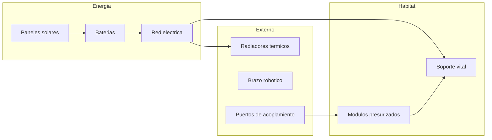
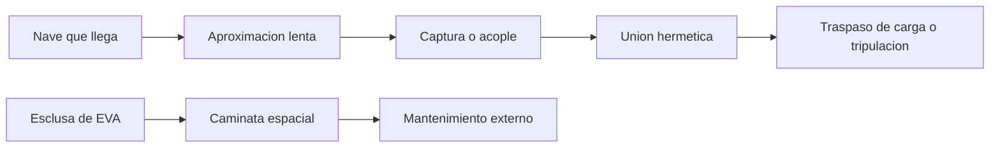

# 🔧 Sistemas mecanicos de la estacion espacial

[🏠 Inicio](../../../README.md) · [🛰️ Curso: Estacion espacial (ISS)](../README.md) · 🔧 Sistemas mecanicos

Este modulo abre la estacion por dentro. Explica cada sistema, como funciona y como
se conecta con los demas. Es la base tecnica para entender el centro de control
(Modulo 4) y la fisica de la microgravedad (Modulo 5). Todo es **ciencia real**.

---

## 1. 🧩 Modulos y estructura

La estacion es un conjunto de **modulos** presurizados unidos por nodos, montados
sobre una estructura larga que sostiene los paneles y radiadores.

| Elemento | Funcion |
| --- | --- |
| Modulo presurizado | Espacio habitable con aire y presion. |
| Nodo de union | Conecta modulos y reparte el paso interno. |
| Estructura principal | Sostiene paneles, radiadores y equipos externos. |
| Esclusa de aire | Permite salir al espacio sin despresurizar todo. |
| Escudo de micrometeoritos | Capas que protegen de pequenos impactos. |

---

## 2. 🔆 Energia

La estacion se alimenta del Sol y guarda energia para la parte de la orbita en
sombra.

| Subsistema | Funcion |
| --- | --- |
| Paneles solares | Convierten la luz del Sol en electricidad. |
| Seguimiento solar | Giran los paneles para apuntar al Sol. |
| Baterias | Guardan energia para la fase de sombra. |
| Red electrica | Reparte la potencia entre todos los sistemas. |

En cada vuelta a la Tierra la estacion pasa por luz y sombra, por eso las baterias
son esenciales para no quedar sin energia de noche.

---

## 3. 🧑‍🚀 Soporte vital de ciclo cerrado

Mantiene el aire y el agua en condiciones de vida, reciclando lo mas posible.

| Subsistema | Funcion |
| --- | --- |
| Generacion de oxigeno | Produce oxigeno, a veces a partir del agua. |
| Control de CO2 | Retira el dioxido de carbono que exhala la tripulacion. |
| Reciclaje de agua | Recupera agua del sudor, la humedad y la orina. |
| Control de humedad | Evita que el vapor se condense donde no debe. |
| Gestion de residuos | Maneja los desechos en microgravedad. |

Reciclar aire y agua es clave: cada kilo que sube en un cohete es caro, asi que se
aprovecha al maximo lo que ya esta a bordo.

---

## 4. 🌡️ Control termico

En el espacio no hay aire para llevarse el calor, asi que la estacion lo expulsa
por radiadores.

- **Circuitos de refrigerante**: recogen el calor de los equipos y la tripulacion.
- **Radiadores**: expulsan ese calor al espacio como radiacion.
- **Aislamiento**: capas que reducen el frio de la sombra y el calor del Sol.
- **Regla clave**: sin control termico, los equipos se sobrecalientan o se congelan.

---

## 5. 🔗 Acoplamiento, mantenimiento y EVA

La estacion recibe naves y se repara desde dentro y desde fuera.

| Sistema | Funcion |
| --- | --- |
| Puerto de acoplamiento | Une la nave a la estacion de forma hermetica. |
| Sistema de aproximacion | Guia el encuentro lento y preciso. |
| Brazo robotico | Captura naves y mueve modulos y equipos. |
| Esclusa de aire | Permite salir al espacio en una EVA. |
| Traje espacial | Da aire, presion y proteccion en el exterior. |

Una **EVA** (caminata espacial) es salir al vacio para instalar, reparar o revisar
equipos, siempre con traje presurizado y sujeciones de seguridad.

---

## 🔁 Como se conecta todo

1. Los **paneles** dan energia y las **baterias** cubren la sombra.
2. Los **modulos** ofrecen un espacio habitable y presurizado.
3. El **soporte vital** recicla aire y agua para durar mas.
4. El **control termico** expulsa el calor sobrante.
5. El **acoplamiento y las EVA** permiten reabastecer y mantener la estacion.

Con esto entendido, el
[Modulo 4: Mandos](../mandos/manual-mandos-estacion-espacial.md) muestra como el
centro de control y la tripulacion operan estos sistemas.

---

[⬅️ Anterior: Caracteristicas](caracteristicas-estacion-espacial.md) · [➡️ Siguiente: Mandos e instrumentos](../mandos/manual-mandos-estacion-espacial.md)
