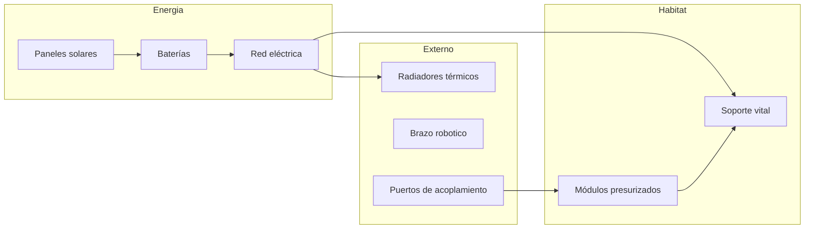
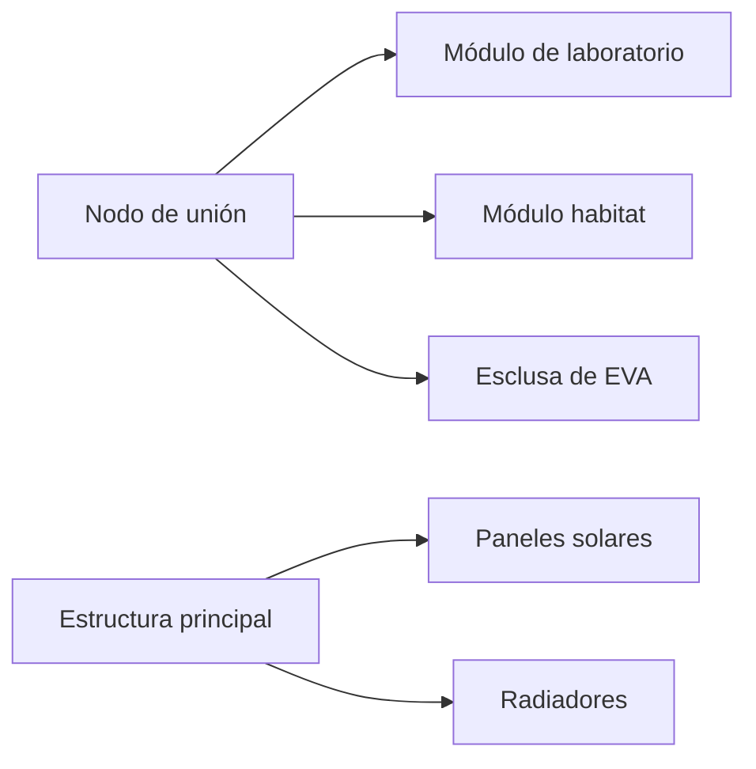
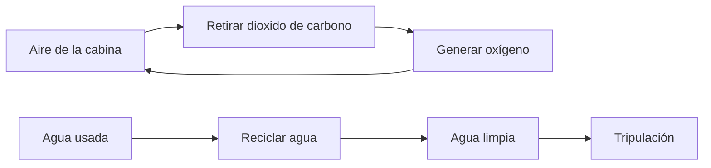
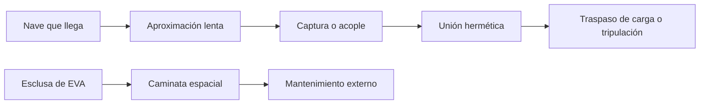
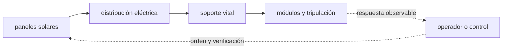

<!-- clase-meta
tipo_documento: clase
clase: 4
codigo: ESTACIONESPA-04
curso: estacion-espacial
titulo: "Sistemas mecánicos de la estación espacial"
modalidad: "teórica aplicada"
duracion_minutos: 90
nivel: introductorio
prerrequisito: ESTACIONESPA-03
competencia: "comprension_de_sistemas"
resultados_aprendizaje:
  - "Explicar Módulos y estructura, Energía, Soporte vital de ciclo cerrado y Control térmico con vocabulario propio de Estación espacial (ISS)."
  - "Aplicar esos conceptos a una decisión segura o a un escenario de simulación de Estación espacial (ISS)."
evidencia: "Esquema con flujos de energía, materia o información anotados."
criterio_aprobacion: "Las conexiones esenciales son correctas y la consecuencia de la falla se propaga de manera coherente."
fuentes: manuales/fuentes.md
ultima_revision: 2026-09-10
-->

# 🔧 Sistemas mecánicos de la estación espacial

[🏠 Inicio](../../../README.md) · [🛰️ Curso: Estación espacial (ISS)](../README.md) · 🔧 Sistemas mecánicos

Esta clase abre la estación por dentro. Explica cada sistema, como funciona y como
se conecta con los demás. Es la base técnica para entender el centro de control
(Clase 5) y la física de la microgravedad (Clase 6). Todo es **ciencia real**.

```mermaid
flowchart LR
    subgraph Energia
        Paneles[Paneles solares] --> Baterias[Baterías]
        Baterias --> Red[Red eléctrica]
    end
    subgraph Habitat
        Modulos[Módulos presurizados]
        Vital[Soporte vital]
    end
    subgraph Externo
        Radiadores[Radiadores térmicos]
        Brazo[Brazo robotico]
        Puertos[Puertos de acoplamiento]
    end
    Red --> Vital
    Red --> Radiadores
    Modulos --> Vital
    Puertos --> Modulos
```

---

## 1. 🧩 Módulos y estructura

La estación es un conjunto de **módulos** presurizados unidos por nodos, montados
sobre una estructura larga que sostiene los paneles y radiadores.

```mermaid
flowchart LR
    Nodo[Nodo de unión] --> Lab[Módulo de laboratorio]
    Nodo --> Hab[Módulo habitat]
    Nodo --> Esclusa[Esclusa de EVA]
    Estructura[Estructura principal] --> Paneles[Paneles solares]
    Estructura --> Radiadores[Radiadores]
```

| Elemento | Función |
| --- | --- |
| Módulo presurizado | Espacio habitable con aire y presión. |
| Nodo de unión | Conecta módulos y reparte el paso interno. |
| Estructura principal | Sostiene paneles, radiadores y equipos externos. |
| Esclusa de aire | Permite salir al espacio sin despresurizar todo. |
| Escudo de micrometeoritos | Capas que protegen de pequeños impactos. |

---

## 2. 🔆 Energía

La estación se alimenta del Sol y guarda energía para la parte de la órbita en
sombra.

| Subsistema | Función |
| --- | --- |
| Paneles solares | Convierten la luz del Sol en electricidad. |
| Seguimiento solar | Giran los paneles para apuntar al Sol. |
| Baterías | Guardan energía para la fase de sombra. |
| Red eléctrica | Reparte la potencia entre todos los sistemas. |

En cada vuelta a la Tierra la estación pasa por luz y sombra, por eso las baterías
son esenciales para no quedar sin energía de noche.

---

## 3. 🧑‍🚀 Soporte vital de ciclo cerrado

Mantiene el aire y el agua en condiciones de vida, reciclando lo más posible.

```mermaid
flowchart LR
    Aire[Aire de la cabina] --> CO2[Retirar dioxido de carbono]
    CO2 --> Oxigeno[Generar oxígeno]
    Oxigeno --> Aire
    Agua[Agua usada] --> Recicla[Reciclar agua]
    Recicla --> Limpia[Agua limpia]
    Limpia --> Tripulacion[Tripulación]
```

| Subsistema | Función |
| --- | --- |
| Generación de oxígeno | Produce oxígeno, a veces a partir del agua. |
| Control de CO2 | Retira el dioxido de carbono que exhala la tripulación. |
| Reciclaje de agua | Recupera agua del sudor, la humedad y la orina. |
| Control de humedad | Evita que el vapor se condense donde no debe. |
| Gestión de residuos | Maneja los desechos en microgravedad. |

Reciclar aire y agua es clave: cada kilo que sube en un cohete es caro, así que se
aprovecha al máximo lo que ya está a bordo.

---

## 4. 🌡️ Control térmico

En el espacio no hay aire para llevarse el calor, así que la estación lo expulsa
por radiadores.

- **Circuitos de refrigerante**: recogen el calor de los equipos y la tripulación.
- **Radiadores**: expulsan ese calor al espacio como radiación.
- **Aislamiento**: capas que reducen el frío de la sombra y el calor del Sol.
- **Regla clave**: sin control térmico, los equipos se sobrecalientan o se congelan.

---

## 5. 🔗 Acoplamiento, mantenimiento y EVA

La estación recibe naves y se repara desde dentro y desde fuera.

```mermaid
flowchart LR
    Nave[Nave que llega] --> Aproxima[Aproximación lenta]
    Aproxima --> Captura[Captura o acople]
    Captura --> Union[Unión hermética]
    Union --> Traspaso[Traspaso de carga o tripulación]
    Esclusa[Esclusa de EVA] --> Salida[Caminata espacial]
    Salida --> Repara[Mantenimiento externo]
```

| Sistema | Función |
| --- | --- |
| Puerto de acoplamiento | Une la nave a la estación de forma hermética. |
| Sistema de aproximación | Guía el encuentro lento y preciso. |
| Brazo robotico | Captura naves y mueve módulos y equipos. |
| Esclusa de aire | Permite salir al espacio en una EVA. |
| Traje espacial | Da aire, presión y protección en el exterior. |

Una **EVA** (caminata espacial) es salir al vacío para instalar, reparar o revisar
equipos, siempre con traje presurizado y sujeciones de seguridad.

---

## 🔁 Cómo se conecta todo

1. Los **paneles** dan energía y las **baterías** cubren la sombra.
2. Los **módulos** ofrecen un espacio habitable y presurizado.
3. El **soporte vital** recicla aire y agua para durar más.
4. El **control térmico** expulsa el calor sobrante.
5. El **acoplamiento y las EVA** permiten reabastecer y mantener la estación.

Con esto entendido, el
[Clase 5: Mandos](../mandos/manual-mandos-estacion-espacial.md) muestra como el
centro de control y la tripulación operan estos sistemas.

## 🧭 Guía de estudio aplicada

### Pregunta guía

¿Cómo ayuda **Módulos y estructura, Energía, Soporte vital de ciclo cerrado y Control térmico** a **seguir una alteración desde paneles solares hasta módulos y tripulación durante pérdida parcial de generación durante una actividad planificada**?

### Explicación razonada

El funcionamiento puede leerse como una cadena causal: paneles solares entrega o transforma energía; distribución eléctrica la adapta; soporte vital la transmite o gobierna; y módulos y tripulación produce el efecto observable. La cadena no es lineal en sentido estricto: sensores, estructura y operador cierran el lazo. Si un eslabón se degrada, la señal importante es cómo cambia el estado de módulos y tripulación y qué margen queda.

```mermaid
flowchart LR
    A["paneles solares"] --> B["distribución eléctrica"] --> C["soporte vital"] --> D["módulos y tripulación"]
    D -. respuesta observable .-> O["operador o control"]
    O -. orden y verificación .-> A
```

Esta clase se conecta con el resto del curso mediante **equilibrio continuo de energía, atmósfera, calor y orientación orbital**. El hilo de
seguridad consiste en reconocer a tiempo **degradación de soporte vital o energía por priorización tardía** y poder justificar la decisión
**aislar la falla y priorizar cargas esenciales antes de recuperar la misión**; en clases posteriores cambiará el ángulo de análisis, no esa relación causal.
La lectura funcional común sigue **paneles solares → distribución eléctrica → soporte vital → módulos y tripulación**, de modo que cada concepto pueda
ubicarse dentro del funcionamiento completo y no quede como un dato aislado.

**Apoyo documental:** [International Space Station](https://www.nasa.gov/reference/international-space-station/) aporta módulos, órbita y soporte vital;
[Space Law Treaties and Principles](https://www.unoosa.org/oosa/SpaceLaw/treaties.html) se usa para derecho espacial internacional. Estas fuentes
se contrastan con el alcance de la clase y no sustituyen un manual de equipo concreto.

### Caso resuelto: de la observación a la decisión

1. **Entrada:** identifica el estado inicial de **paneles solares** durante **pérdida parcial de generación durante una actividad planificada**.
2. **Transformación:** explica qué hacen **distribución eléctrica** y **soporte vital**, y qué magnitud cambia en cada paso.
3. **Salida:** comprueba el efecto esperado en **módulos y tripulación** y busca una desviación temprana.
4. **Falla razonada:** si aparece **degradación de soporte vital o energía por priorización tardía**, retrocede por la cadena antes de ordenar otra acción.

### Comprueba tu comprensión

1. Si se degrada **distribución eléctrica**, ¿qué efecto esperarías primero en **soporte vital** y después en **módulos y tripulación**?
2. ¿Qué observación ayudaría a diferenciar una falla de **paneles solares** de una falla de **soporte vital**?
3. ¿Por qué una segunda orden podría agravar **degradación de soporte vital o energía por priorización tardía**?

Orientación para revisar tus respuestas

- La primera respuesta debe relacionar el eslabón elegido con un efecto posterior, no solo nombrarlo.
- La segunda debe proponer una señal medible u observable y explicar qué tendencia sería preocupante.
- La tercera debe cambiar al menos una variable de capacidad, mando, entorno o margen de seguridad.

## 🎓 Cierre de clase

- **Actividad:** Dibuja un esquema funcional de Estación espacial (ISS) que conecte Módulos y estructura, Energía, Soporte vital de ciclo cerrado y Control térmico; después predice el efecto de una falla simulada.
- **Evidencia:** Esquema con flujos de energía, materia o información anotados.
- **Criterio de aprobación:** Las conexiones esenciales son correctas y la consecuencia de la falla se propaga de manera coherente.
- **Transferencia:** explica qué cambiaría al pasar a otra variante de esta máquina.

### Fuentes de esta clase

- [NASA-ISS](https://www.nasa.gov/reference/international-space-station/): International Space Station, NASA. Uso: módulos, órbita y soporte vital.
- [UNOOSA-TREATIES](https://www.unoosa.org/oosa/SpaceLaw/treaties.html): Space Law Treaties and Principles, UNOOSA. Uso: derecho espacial internacional.

> Las fuentes sostienen el marco conceptual y normativo; esta clase no reemplaza el manual
> del fabricante, la formación certificada ni la habilitación exigida para operar equipos reales.

---

[⬅️ Anterior: Modelos y variantes](../modelos/modelos-estacion-espacial.md) · [➡️ Siguiente: Mandos e instrumentos](../mandos/manual-mandos-estacion-espacial.md)
