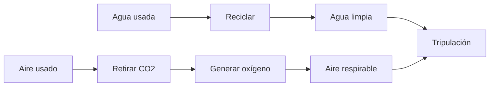

# 🧰 Recursos de la estación espacial

[🏠 Inicio](../../../README.md) · [🛰️ Curso: Estación espacial (ISS)](../README.md) · 🧰 Recursos

Glosario específico, enlaces y diagramas de apoyo del curso de estación espacial.
Amplia el [glosario general](../../../docs/05-glosario-general.md).

---

## 📖 Glosario específico

| Término | Definición |
| --- | --- |
| Estación espacial | Habitat permanente en órbita donde vive y trabaja una tripulación. |
| Módulo | Cada sección presurizada que se une a otras para formar la estación. |
| Nodo de unión | Módulo que conecta otros módulos y reparte el paso interno. |
| Microgravedad | Estado de caída libre en que los objetos parecen flotar. |
| Soporte vital de ciclo cerrado | Sistema que recicla aire y agua para durar más. |
| Acoplamiento | Unión hermética de una nave con la estación. |
| EVA | Actividad extravehicular o caminata espacial en el exterior. |
| Esclusa de aire | Cierre que permite salir al vacío sin despresurizar toda la estación. |
| Reimpulso | Maniobra para elevar la órbita que baja por el rozamiento. |
| Radiador | Panel que expulsa el calor sobrante al espacio. |

---

## 🗺️ Diagrama del soporte vital de ciclo cerrado

---

## 🔗 Enlaces y fuentes

- Marco legal: [⚖️ docs/07-marco-legal-chile.md](../../../docs/07-marco-legal-chile.md)
- Seguridad y límites: [🦺 docs/04-seguridad-y-limites.md](../../../docs/04-seguridad-y-limites.md)
- Registro de fuentes: [📚 manuales/fuentes.md](../../../manuales/fuentes.md)

Registrar cada recurso nuevo con su origen y licencia, siguiendo
[`recursos/README.md`](../../../recursos/README.md).

---

[🎓 Portada del curso](../README.md) · [⬅️ Anterior: Diseño de simulación](../simulacion/diseno-simulador-estacion-espacial.md) · [➡️ Siguiente: Ejercicios](../ejercicios/ejercicios-estacion-espacial.md)
