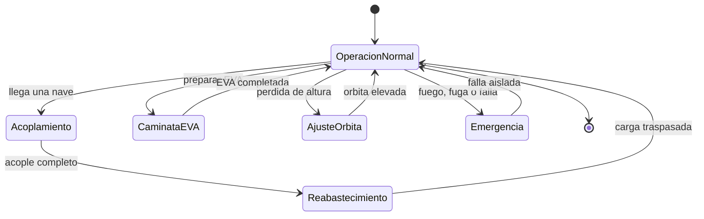

# 🎮 Diseño de simulación de la estación espacial

[🏠 Inicio](../../../README.md) · [🛰️ Curso: Estación espacial (ISS)](../README.md) · 🎮 Simulación

Simulación educativa de la operación de una estación espacial. Modela con rigor la
microgravedad, la órbita baja y la gestión de recursos, y añade los retos del
acoplamiento, el reimpulso de órbita y las caminatas espaciales.

## Objetivo de la simulación

Que el usuario aprenda a operar una estación: gestionar energía y soporte vital,
recibir naves con un acoplamiento seguro, reabastecer, elevar la órbita cuando
baja, preparar caminatas espaciales y responder a emergencias, entendiendo la
física de la microgravedad.

## Nivel de realismo

- Nivel elegido: se ofrece del 1 al 3 (ver `docs/03-niveles-de-realismo.md`).
- Justificación: la estación combina muchos sistemas a la vez y una física
  abstracta, por lo que se recomienda como vehículo avanzado.

## Variables principales

| Variable | Tipo | Rango | Afecta a | Comentarios |
| --- | --- | --- | --- | --- |
| Altitud orbital | numérica | 300-450 km | Estabilidad de la órbita | Baja por rozamiento residual. |
| Energía | numérica | 0-100 porciento | Sistemas de a bordo | Sube al Sol, baja en sombra. |
| Ciclo luz/sombra | discreta | día u noche | Energía y temperatura | Se repite cada órbita. |
| Oxígeno | numérica | 0-100 porciento | Tripulación | Lo repone el soporte vital. |
| Nivel de CO2 | numérica | 0-100 porciento | Aire respirable | Debe mantenerse bajo. |
| Agua reciclada | numérica | 0-100 porciento | Autonomía | Se recupera y reutiliza. |
| Estado de puertos | discreta | libre u ocupado | Acoplamiento | Para recibir naves. |
| Temperatura interior | numérica | rango habitable | Confort y equipos | La regula el control térmico. |

## Ciclo básico

1. Leer entrada del usuario (energía, soporte vital, brazo, acople, EVA).
2. Actualizar recursos vitales, energía y estado de los puertos.
3. Calcular la física orbital (altura, ciclo de luz y sombra, rozamiento).
4. Aplicar el entorno (radiación, basura orbital, aproximación de naves).
5. Actualizar órbita, recursos y estado de los sistemas.
6. Refrescar instrumentos y alarmas (oxígeno, energía, temperatura).

## Modos de juego futuros

- Tutorial de vida diaria y soporte vital en microgravedad.
- Práctica de acoplamiento de una nave de carga.
- Desafíos de gestión de energía en el ciclo de sombra.
- Reto de reimpulso de órbita con una nave acoplada.
- Escenario de caminata espacial para instalar o reparar equipos.

## Elementos fuera de alcance

- Datos técnicos sensibles de sistemas reales de defensa.
- Detalles que permitan replicar tecnología clasificada.
- Reproducción de operaciones peligrosas como si fueran seguras.

## Pendientes

- [ ] Definir valores por defecto de recursos vitales y energía.
- [ ] Prototipar el modelo de ciclo de luz y sombra.
- [ ] Ajustar el modelo de acoplamiento lento y preciso.
- [ ] Agregar fuentes técnicas públicas a [`manuales/fuentes.md`](../../../manuales/fuentes.md).

---

[⬅️ Anterior: Reglamentos](../reglamentos/reglamentos-estacion-espacial.md) · [➡️ Siguiente: Recursos](../recursos/recursos-estacion-espacial.md)
