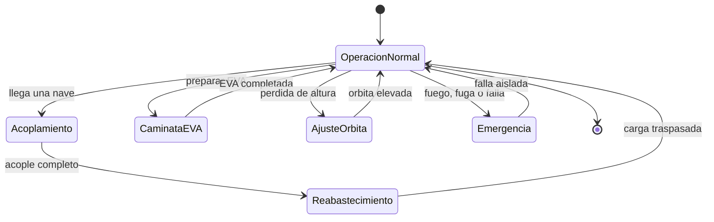

# 🎮 Diseno de simulacion de la estacion espacial

[🏠 Inicio](../../../README.md) · [🛰️ Curso: Estacion espacial (ISS)](../README.md) · 🎮 Simulacion

Simulacion educativa de la operacion de una estacion espacial. Modela con rigor la
microgravedad, la orbita baja y la gestion de recursos, y anade los retos del
acoplamiento, el reimpulso de orbita y las caminatas espaciales.

## Objetivo de la simulacion

Que el usuario aprenda a operar una estacion: gestionar energia y soporte vital,
recibir naves con un acoplamiento seguro, reabastecer, elevar la orbita cuando
baja, preparar caminatas espaciales y responder a emergencias, entendiendo la
fisica de la microgravedad.

## Nivel de realismo

- Nivel elegido: se ofrece del 1 al 3 (ver `docs/03-niveles-de-realismo.md`).
- Justificacion: la estacion combina muchos sistemas a la vez y una fisica
  abstracta, por lo que se recomienda como vehiculo avanzado.

## Variables principales

| Variable | Tipo | Rango | Afecta a | Comentarios |
| --- | --- | --- | --- | --- |
| Altitud orbital | numerica | 300-450 km | Estabilidad de la orbita | Baja por rozamiento residual. |
| Energia | numerica | 0-100 porciento | Sistemas de a bordo | Sube al Sol, baja en sombra. |
| Ciclo luz/sombra | discreta | dia u noche | Energia y temperatura | Se repite cada orbita. |
| Oxigeno | numerica | 0-100 porciento | Tripulacion | Lo repone el soporte vital. |
| Nivel de CO2 | numerica | 0-100 porciento | Aire respirable | Debe mantenerse bajo. |
| Agua reciclada | numerica | 0-100 porciento | Autonomia | Se recupera y reutiliza. |
| Estado de puertos | discreta | libre u ocupado | Acoplamiento | Para recibir naves. |
| Temperatura interior | numerica | rango habitable | Confort y equipos | La regula el control termico. |

## Ciclo basico

1. Leer entrada del usuario (energia, soporte vital, brazo, acople, EVA).
2. Actualizar recursos vitales, energia y estado de los puertos.
3. Calcular la fisica orbital (altura, ciclo de luz y sombra, rozamiento).
4. Aplicar el entorno (radiacion, basura orbital, aproximacion de naves).
5. Actualizar orbita, recursos y estado de los sistemas.
6. Refrescar instrumentos y alarmas (oxigeno, energia, temperatura).

## Modos de juego futuros

- Tutorial de vida diaria y soporte vital en microgravedad.
- Practica de acoplamiento de una nave de carga.
- Desafios de gestion de energia en el ciclo de sombra.
- Reto de reimpulso de orbita con una nave acoplada.
- Escenario de caminata espacial para instalar o reparar equipos.

## Elementos fuera de alcance

- Datos tecnicos sensibles de sistemas reales de defensa.
- Detalles que permitan replicar tecnologia clasificada.
- Reproduccion de operaciones peligrosas como si fueran seguras.

## Pendientes

- [ ] Definir valores por defecto de recursos vitales y energia.
- [ ] Prototipar el modelo de ciclo de luz y sombra.
- [ ] Ajustar el modelo de acoplamiento lento y preciso.
- [ ] Agregar fuentes tecnicas publicas a [`manuales/fuentes.md`](../../../manuales/fuentes.md).

---

[⬅️ Anterior: Reglamentos](../reglamentos/reglamentos-estacion-espacial.md) · [➡️ Siguiente: Recursos](../recursos/recursos-estacion-espacial.md)
