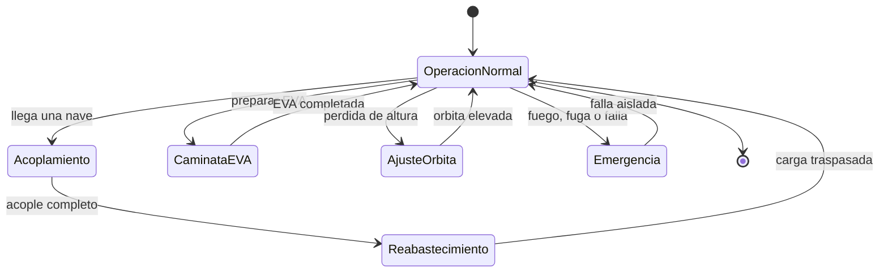
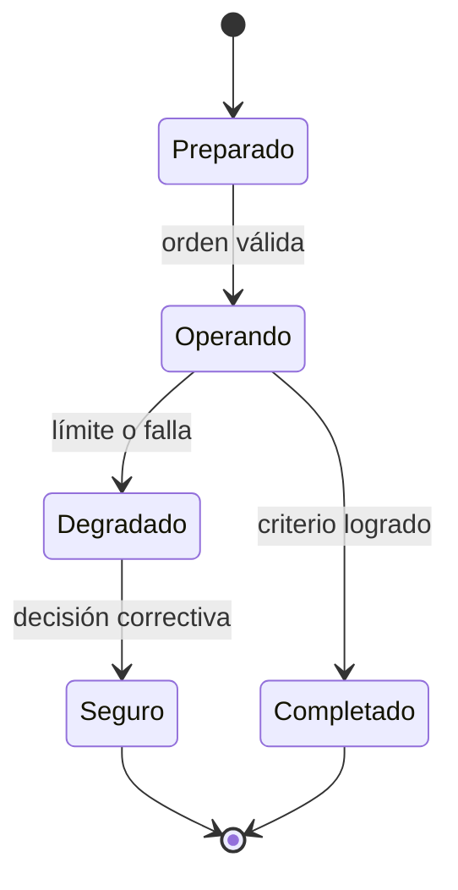

<!-- clase-meta
tipo_documento: clase
clase: 9
codigo: ESTACIONESPA-09
curso: estacion-espacial
titulo: "Diseño de simulación de la estación espacial"
modalidad: "laboratorio de diseño"
duracion_minutos: 90
nivel: introductorio
prerrequisito: ESTACIONESPA-08
competencia: "modelado_de_simulacion"
resultados_aprendizaje:
  - "Explicar objetivo, variables, estados, ciclo y escenarios de simulación con vocabulario propio de Estación espacial (ISS)."
  - "Aplicar esos conceptos a una decisión segura o a un escenario de simulación de Estación espacial (ISS)."
evidencia: "Ficha de escenario y diagrama de estados."
criterio_aprobacion: "El modelo es específico de la máquina, medible, seguro y trazable a clases anteriores."
fuentes: manuales/fuentes.md
ultima_revision: 2026-09-10
-->

# 🎮 Diseño de simulación de la estación espacial

[🏠 Inicio](../../../README.md) · [🛰️ Curso: Estación espacial (ISS)](../README.md) · 🎮 Simulación

Simulación educativa de la operación de una estación espacial. Modela con rigor la
microgravedad, la órbita baja y la gestión de recursos, y añade los retos del
acoplamiento, el reimpulso de órbita y las caminatas espaciales.

```mermaid
stateDiagram-v2
    [*] --> OperacionNormal
    OperacionNormal --> Acoplamiento: llega una nave
    Acoplamiento --> Reabastecimiento: acople completo
    Reabastecimiento --> OperacionNormal: carga traspasada
    OperacionNormal --> CaminataEVA: preparar EVA
    CaminataEVA --> OperacionNormal: EVA completada
    OperacionNormal --> AjusteOrbita: perdida de altura
    AjusteOrbita --> OperacionNormal: orbita elevada
    OperacionNormal --> Emergencia: fuego, fuga o falla
    Emergencia --> OperacionNormal: falla aislada
    OperacionNormal --> [*]
```

## Objetivo de la simulación

Que el usuario aprenda a operar una estación: gestionar energía y soporte vital,
recibir naves con un acoplamiento seguro, reabastecer, elevar la órbita cuando
baja, preparar caminatas espaciales y responder a emergencias, entendiendo la
física de la microgravedad.

## Nivel de realismo

- Nivel elegido: se ofrece del 1 al 3 (ver `docs/03-niveles-de-realismo.md`).
- Justificación: la estación combina muchos sistemas a la vez y una física
  abstracta, por lo que se recomienda como vehículo avanzado.

## Variables principales

| Variable | Tipo | Rango | Afecta a | Comentarios |
| --- | --- | --- | --- | --- |
| Altitud orbital | numérica | 300-450 km | Estabilidad de la órbita | Baja por rozamiento residual. |
| Energía | numérica | 0-100 porciento | Sistemas de a bordo | Sube al Sol, baja en sombra. |
| Ciclo luz/sombra | discreta | día u noche | Energía y temperatura | Se repite cada órbita. |
| Oxígeno | numérica | 0-100 porciento | Tripulación | Lo repone el soporte vital. |
| Nivel de CO2 | numérica | 0-100 porciento | Aire respirable | Debe mantenerse bajo. |
| Agua reciclada | numérica | 0-100 porciento | Autonomía | Se recupera y reutiliza. |
| Estado de puertos | discreta | libre u ocupado | Acoplamiento | Para recibir naves. |
| Temperatura interior | numérica | rango habitable | Confort y equipos | La regula el control térmico. |

## Ciclo básico

1. Leer entrada del usuario (energía, soporte vital, brazo, acople, EVA).
2. Actualizar recursos vitales, energía y estado de los puertos.
3. Calcular la física orbital (altura, ciclo de luz y sombra, rozamiento).
4. Aplicar el entorno (radiación, basura orbital, aproximación de naves).
5. Actualizar órbita, recursos y estado de los sistemas.
6. Refrescar instrumentos y alarmas (oxígeno, energía, temperatura).

## Modos de juego futuros

- Tutorial de vida diaria y soporte vital en microgravedad.
- Práctica de acoplamiento de una nave de carga.
- Desafíos de gestión de energía en el ciclo de sombra.
- Reto de reimpulso de órbita con una nave acoplada.
- Escenario de caminata espacial para instalar o reparar equipos.

## Elementos fuera de alcance

- Datos técnicos sensibles de sistemas reales de defensa.
- Detalles que permitan replicar tecnología clasificada.
- Reproducción de operaciones peligrosas como si fueran seguras.

## Pendientes

- [ ] Definir valores por defecto de recursos vitales y energía.
- [ ] Prototipar el modelo de ciclo de luz y sombra.
- [ ] Ajustar el modelo de acoplamiento lento y preciso.
- [ ] Agregar fuentes técnicas públicas a [`manuales/fuentes.md`](../../../manuales/fuentes.md).

## 🧭 Guía de estudio aplicada

### Pregunta guía

¿Cómo ayuda **Objetivo de la simulación, Nivel de realismo, Variables principales y Ciclo básico** a **modelar pérdida parcial de generación durante una actividad planificada como estados, variables y decisiones observables**?

### Explicación razonada

Una simulación de Estación espacial (ISS) es educativa si representa decisiones y consecuencias. Como mínimo debe modelar el estado de paneles solares, la respuesta de distribución eléctrica, la transición en soporte vital y el resultado en módulos y tripulación. El escenario «pérdida parcial de generación durante una actividad planificada» es valioso porque obliga a observar, formular una hipótesis, actuar y comprobar.

```mermaid
stateDiagram-v2
    [*] --> Preparado
    Preparado --> Operando: orden válida
    Operando --> Degradado: límite o falla
    Degradado --> Seguro: decisión correctiva
    Operando --> Completado: criterio logrado
    Seguro --> [*]
    Completado --> [*]
```

Esta clase se conecta con el resto del curso mediante **equilibrio continuo de energía, atmósfera, calor y orientación orbital**. El hilo de
seguridad consiste en reconocer a tiempo **degradación de soporte vital o energía por priorización tardía** y poder justificar la decisión
**aislar la falla y priorizar cargas esenciales antes de recuperar la misión**; en clases posteriores cambiará el ángulo de análisis, no esa relación causal.
La lectura funcional común sigue **paneles solares → distribución eléctrica → soporte vital → módulos y tripulación**, de modo que cada concepto pueda
ubicarse dentro del funcionamiento completo y no quede como un dato aislado.

**Apoyo documental:** [International Space Station](https://www.nasa.gov/reference/international-space-station/) aporta módulos, órbita y soporte vital;
[Space Law Treaties and Principles](https://www.unoosa.org/oosa/SpaceLaw/treaties.html) se usa para derecho espacial internacional. Estas fuentes
se contrastan con el alcance de la clase y no sustituyen un manual de equipo concreto.

### Caso resuelto: de la observación a la decisión

1. **Estado inicial:** representa pérdida parcial de generación durante una actividad planificada con valores observables para **paneles solares**, **distribución eléctrica**, **soporte vital** y **módulos y tripulación**.
2. **Decisión del estudiante:** ofrece una elección que cambie el estado, no una animación automática.
3. **Consecuencia:** modela la tendencia hacia **degradación de soporte vital o energía por priorización tardía** y una señal previa que permita corregir.
4. **Cierre:** evalúa la explicación de la decisión, además de si el estudiante “ganó” el escenario.

### Comprueba tu comprensión

1. ¿Qué cuatro estados mínimos necesita el escenario «pérdida parcial de generación durante una actividad planificada»?
2. ¿Qué variable anticipa **degradación de soporte vital o energía por priorización tardía** antes de llegar al estado de falla?
3. ¿Cómo evaluarías la explicación del estudiante y no solo el resultado final?

Orientación para revisar tus respuestas

- La primera respuesta debe relacionar el eslabón elegido con un efecto posterior, no solo nombrarlo.
- La segunda debe proponer una señal medible u observable y explicar qué tendencia sería preocupante.
- La tercera debe cambiar al menos una variable de capacidad, mando, entorno o margen de seguridad.

## 🎓 Cierre de clase

- **Actividad:** Diseña un escenario educativo de Estación espacial (ISS) basado en objetivo, variables, estados, ciclo y escenarios de simulación, con entradas, estados, variables y criterio de cierre.
- **Evidencia:** Ficha de escenario y diagrama de estados.
- **Criterio de aprobación:** El modelo es específico de la máquina, medible, seguro y trazable a clases anteriores.
- **Transferencia:** explica qué cambiaría al pasar a otra variante de esta máquina.

### Fuentes de esta clase

- [NASA-ISS](https://www.nasa.gov/reference/international-space-station/): International Space Station, NASA. Uso: módulos, órbita y soporte vital.
- [UNOOSA-TREATIES](https://www.unoosa.org/oosa/SpaceLaw/treaties.html): Space Law Treaties and Principles, UNOOSA. Uso: derecho espacial internacional.

> Las fuentes sostienen el marco conceptual y normativo; esta clase no reemplaza el manual
> del fabricante, la formación certificada ni la habilitación exigida para operar equipos reales.

---

[⬅️ Anterior: Reglamentos](../reglamentos/reglamentos-estacion-espacial.md) · [➡️ Siguiente: Recursos](../recursos/recursos-estacion-espacial.md)
