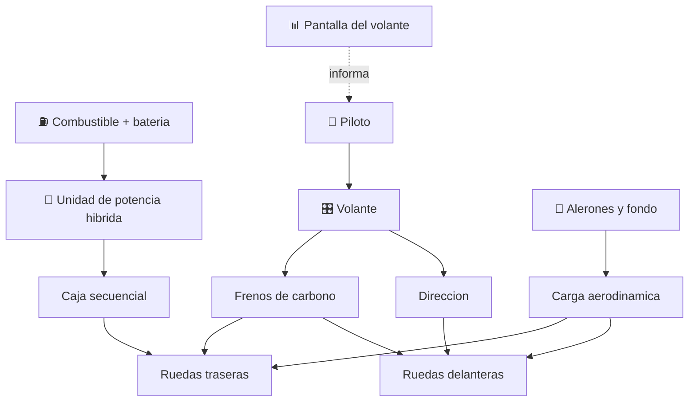

# 🏎️ Curso: Formula 1

[🏠 Inicio](../../README.md) · [🚙 Catalogo de vehiculos](../README.md) · [🎓 Guia de curso](../../docs/08-guia-de-estilo-y-curso.md)

> **Curso tecnico de competicion.** Documenta el monoplaza de Formula 1 de
> principio a fin: historia, caracteristicas, mecanica en profundidad, puesto de
> mando, fisica del rendimiento, circuitos, reglamento FIA y diseno de
> simulacion. No es un vehiculo de via publica: se rige por el reglamento
> deportivo y tecnico de la FIA, no por la ley de transito.

---

## 🎯 Objetivos de aprendizaje

Al terminar este curso deberias poder:

- Explicar como un monoplaza acelera, frena, gira y genera carga aerodinamica.
- Identificar la unidad de potencia hibrida y los sistemas de recuperacion.
- Reconocer los mandos del volante y el tablero de datos del piloto.
- Comprender la fisica del agarre: carga aerodinamica, efecto suelo y neumaticos.
- Conocer el reglamento deportivo y tecnico de la FIA que rige la competicion.
- Traducir todo lo anterior en variables de un simulador educativo.

---

## 🗺️ Mapa del vehiculo

---

## 📚 Modulos del curso

| # | Modulo | Contenido | Enlace |
| :-: | --- | --- | --- |
| 1 | 📜 Historia | Origen y evolucion de la Formula 1, linea de tiempo. | [Abrir](historia/historia-formula-1.md) |
| 2 | 📋 Caracteristicas | Que es un monoplaza, tipos y para que sirve cada uno. | [Abrir](operacion/caracteristicas-formula-1.md) |
| 3 | 🔧 Sistemas mecanicos | Unidad hibrida, aerodinamica, neumaticos, frenos, caja. | [Abrir](operacion/sistemas-mecanicos-formula-1.md) |
| 4 | 🎛️ Mandos e instrumentos | Volante multifuncion, pedales y telemetria. | [Abrir](mandos/manual-mandos-formula-1.md) |
| 5 | 🧪 Principios y operacion | Fisica del rendimiento y fases de una vuelta. | [Abrir](operacion/principios-formula-1.md) |
| 6 | 🌍 Entornos de trabajo | Circuitos urbanos, permanentes y mixtos. | [Abrir](operacion/entornos-formula-1.md) |
| 7 | ⚖️ Reglamentos | Reglamento deportivo y tecnico de la FIA. | [Abrir](reglamentos/reglamentos-formula-1.md) |
| 8 | 🎮 Diseno de simulacion | Variables, ciclo y modos de juego. | [Abrir](simulacion/diseno-simulador-formula-1.md) |
| 9 | 🧰 Recursos | Glosario, enlaces y diagramas. | [Abrir](recursos/recursos-formula-1.md) |

---

## 🧩 Requisitos previos

Se recomienda haber revisado antes el curso de
[🚗 automoviles](../automoviles/README.md), que introduce motor, transmision y
frenos con menor complejidad. La Formula 1 lleva esos principios al limite:
hibridacion, carga aerodinamica y efecto suelo. Marco tecnico de competicion en
[⚖️ docs/07-marco-legal-chile.md](../../docs/07-marco-legal-chile.md), seccion
1.9 (Formula 1).

---

[➡️ Empezar por el Modulo 1: Historia](historia/historia-formula-1.md)
