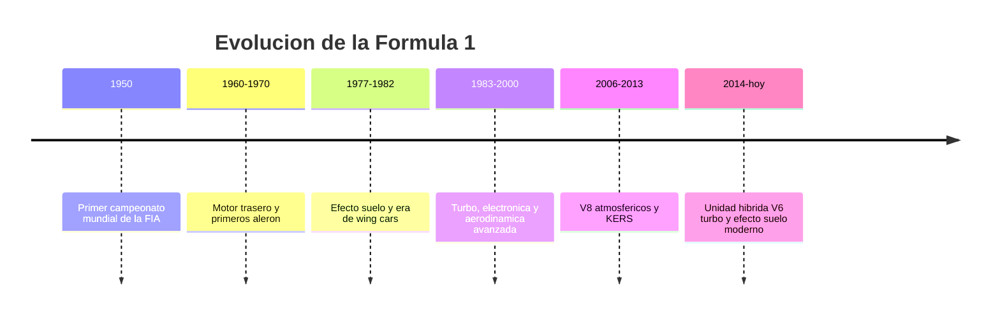

# 📜 Historia de la Fórmula 1

[🏠 Inicio](../../../README.md) · [🏎️ Curso: Fórmula 1](../README.md) · 📜 Historia

## Origen

La Fórmula 1 nace en 1950 con el primer Campeonato Mundial de Pilotos de la FIA.
La palabra "fórmula" designa el conjunto de reglas técnicas que definen el
monoplaza. Desde el inicio fue la máxima categoría del automovilismo de
circuito: coches abiertos, de una sola plaza, construidos solo para competir.

## Línea de tiempo

| Periodo | Hito | Importancia |
| --- | --- | --- |
| 1950 | Primer campeonato mundial FIA | Nace la categoría reina del automovilismo. |
| 1960-1970 | Motor trasero y primeros alerones | Cambia el reparto de peso y aparece la aerodinámica. |
| 1977-1982 | Efecto suelo y wing cars | El fondo del coche genera carga por depresión. |
| 1983-2000 | Turbo, electrónica y túneles de viento | Salto de potencia y de refinamiento aerodinámico. |
| 2006-2013 | V8 atmosféricos y KERS | Primeros sistemas de recuperación de energía. |
| 2014-presente | Unidad híbrida V6 turbo | Eficiencia energética y recuperación térmica. |

## Evolución tecnológica

- **Motor**: de V16 y V12 atmosféricos a V6 turbo híbridos de alta eficiencia.
- **Aerodinámica**: de carrocerías lisas a alerones, fondo plano y efecto suelo.
- **Materiales**: del aluminio y el acero al monocasco de fibra de carbono.
- **Seguridad**: barreras, monocasco, HANS y el arco de protección halo.
- **Electrónica**: telemetría, control de motor y volante multifunción.
- **Neumáticos**: compuestos específicos por circuito y ventana de temperatura.

## Hitos representativos

| Innovación | Efecto en la categoría |
| --- | --- |
| Motor trasero central | Mejor reparto de peso y agilidad. |
| Alerones | Aparece la carga aerodinámica como recurso de agarre. |
| Efecto suelo | Enorme agarre en curva sin peso extra. |
| Monocasco de carbono | Ligereza y resistencia estructural en impactos. |
| Sistemas híbridos KERS y ERS | Recuperar energía de frenada y calor. |
| Halo | Protección de la cabeza del piloto. |

## Impacto técnico y cultural

La Fórmula 1 funciona como laboratorio de tecnología: frenos de carbono,
hibridación, aerodinámica y materiales compuestos llegaron o maduraron en la
categoría antes de pasar a otros ámbitos. Es también un fenómeno deportivo
global, con equipos, fabricantes y circuitos en varios continentes.

## Fuentes

- Registrar aquí las fuentes públicas consultadas.
- Enlazar cada fuente también en [`manuales/fuentes.md`](../../../manuales/fuentes.md).

---

[🎓 Portada del curso](../README.md) · [➡️ Siguiente: Características](../operacion/caracteristicas-formula-1.md)
