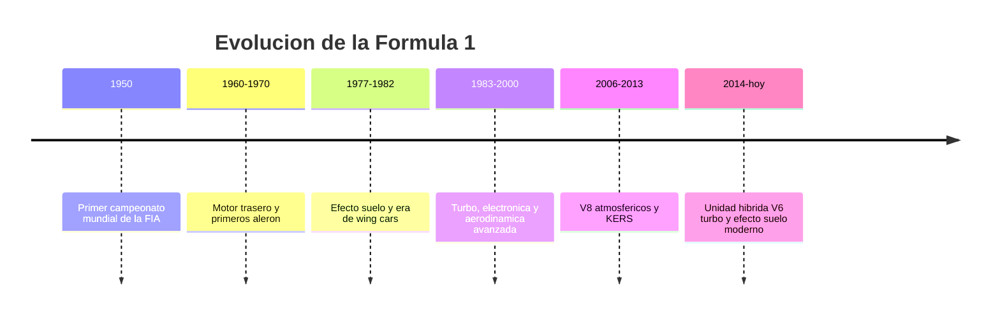

# 📜 Historia de la Formula 1

[🏠 Inicio](../../../README.md) · [🏎️ Curso: Formula 1](../README.md) · 📜 Historia

## Origen

La Formula 1 nace en 1950 con el primer Campeonato Mundial de Pilotos de la FIA.
La palabra "formula" designa el conjunto de reglas tecnicas que definen el
monoplaza. Desde el inicio fue la maxima categoria del automovilismo de
circuito: coches abiertos, de una sola plaza, construidos solo para competir.

## Linea de tiempo

| Periodo | Hito | Importancia |
| --- | --- | --- |
| 1950 | Primer campeonato mundial FIA | Nace la categoria reina del automovilismo. |
| 1960-1970 | Motor trasero y primeros alerones | Cambia el reparto de peso y aparece la aerodinamica. |
| 1977-1982 | Efecto suelo y wing cars | El fondo del coche genera carga por depresion. |
| 1983-2000 | Turbo, electronica y tuneles de viento | Salto de potencia y de refinamiento aerodinamico. |
| 2006-2013 | V8 atmosfericos y KERS | Primeros sistemas de recuperacion de energia. |
| 2014-presente | Unidad hibrida V6 turbo | Eficiencia energetica y recuperacion termica. |

## Evolucion tecnologica

- **Motor**: de V16 y V12 atmosfericos a V6 turbo hibridos de alta eficiencia.
- **Aerodinamica**: de carrocerias lisas a alerones, fondo plano y efecto suelo.
- **Materiales**: del aluminio y el acero al monocasco de fibra de carbono.
- **Seguridad**: barreras, monocasco, HANS y el arco de proteccion halo.
- **Electronica**: telemetria, control de motor y volante multifuncion.
- **Neumaticos**: compuestos especificos por circuito y ventana de temperatura.

## Hitos representativos

| Innovacion | Efecto en la categoria |
| --- | --- |
| Motor trasero central | Mejor reparto de peso y agilidad. |
| Alerones | Aparece la carga aerodinamica como recurso de agarre. |
| Efecto suelo | Enorme agarre en curva sin peso extra. |
| Monocasco de carbono | Ligereza y resistencia estructural en impactos. |
| Sistemas hibridos KERS y ERS | Recuperar energia de frenada y calor. |
| Halo | Proteccion de la cabeza del piloto. |

## Impacto tecnico y cultural

La Formula 1 funciona como laboratorio de tecnologia: frenos de carbono,
hibridacion, aerodinamica y materiales compuestos llegaron o maduraron en la
categoria antes de pasar a otros ambitos. Es tambien un fenomeno deportivo
global, con equipos, fabricantes y circuitos en varios continentes.

## Fuentes

- Registrar aqui las fuentes publicas consultadas.
- Enlazar cada fuente tambien en [`manuales/fuentes.md`](../../../manuales/fuentes.md).

---

[🎓 Portada del curso](../README.md) · [➡️ Siguiente: Caracteristicas](../operacion/caracteristicas-formula-1.md)
