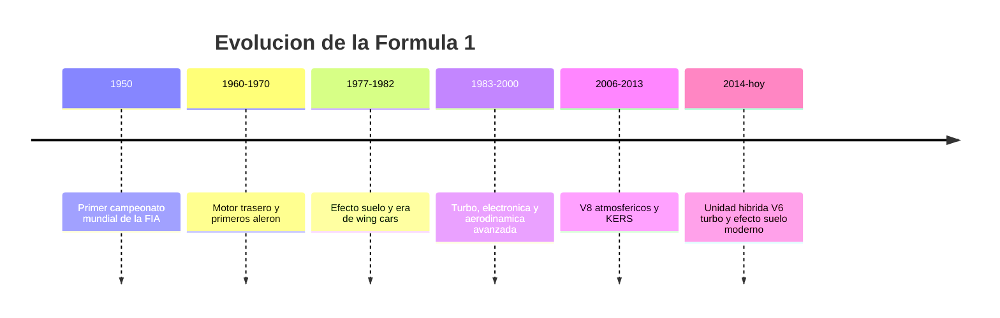

<!-- clase-meta
tipo_documento: clase
clase: 1
codigo: FORMULA1-01
curso: formula-1
titulo: "Historia de la Fórmula 1"
modalidad: "teórica dialogada"
duracion_minutos: 45
nivel: introductorio
prerrequisito: ninguno
competencia: "contexto_historico"
resultados_aprendizaje:
  - "Explicar origen, evolución tecnológica, variantes representativas e impacto con vocabulario propio de Fórmula 1."
  - "Aplicar esos conceptos a una decisión segura o a un escenario de simulación de Fórmula 1."
evidencia: "Línea de tiempo comentada con cuatro hitos o más."
criterio_aprobacion: "Los hitos están ordenados, son pertinentes y dos relaciones de causa y efecto quedan justificadas."
fuentes: manuales/fuentes.md
ultima_revision: 2026-09-10
-->

# 📜 Historia de la Fórmula 1

[🏠 Inicio](../../../README.md) · [🏎️ Curso: Fórmula 1](../README.md) · 📜 Historia

```mermaid
timeline
    title Evolucion de la Formula 1
    1950 : Primer campeonato mundial de la FIA
    1960-1970 : Motor trasero y primeros aleron
    1977-1982 : Efecto suelo y era de wing cars
    1983-2000 : Turbo, electronica y aerodinamica avanzada
    2006-2013 : V8 atmosfericos y KERS
    2014-hoy : Unidad hibrida V6 turbo y efecto suelo moderno
```

## Origen

La Fórmula 1 nace en 1950 con el primer Campeonato Mundial de Pilotos de la FIA.
La palabra "fórmula" designa el conjunto de reglas técnicas que definen el
monoplaza. Desde el inicio fue la máxima categoría del automovilismo de
circuito: coches abiertos, de una sola plaza, construidos solo para competir.

## Línea de tiempo

| Periodo | Hito | Importancia |
| --- | --- | --- |
| 1950 | Primer campeonato mundial FIA | Nace la categoría reina del automovilismo. |
| 1960-1970 | Motor trasero y primeros alerones | Cambia el reparto de peso y aparece la aerodinámica. |
| 1977-1982 | Efecto suelo y wing cars | El fondo del coche genera carga por depresión. |
| 1983-2000 | Turbo, electrónica y túneles de viento | Salto de potencia y de refinamiento aerodinámico. |
| 2006-2013 | V8 atmosféricos y KERS | Primeros sistemas de recuperación de energía. |
| 2014-presente | Unidad híbrida V6 turbo | Eficiencia energética y recuperación térmica. |

## Evolución tecnológica

- **Motor**: de V16 y V12 atmosféricos a V6 turbo híbridos de alta eficiencia.
- **Aerodinámica**: de carrocerías lisas a alerones, fondo plano y efecto suelo.
- **Materiales**: del aluminio y el acero al monocasco de fibra de carbono.
- **Seguridad**: barreras, monocasco, HANS y el arco de protección halo.
- **Electrónica**: telemetría, control de motor y volante multifunción.
- **Neumáticos**: compuestos específicos por circuito y ventana de temperatura.

## Hitos representativos

| Innovación | Efecto en la categoría |
| --- | --- |
| Motor trasero central | Mejor reparto de peso y agilidad. |
| Alerones | Aparece la carga aerodinámica como recurso de agarre. |
| Efecto suelo | Enorme agarre en curva sin peso extra. |
| Monocasco de carbono | Ligereza y resistencia estructural en impactos. |
| Sistemas híbridos KERS y ERS | Recuperar energía de frenada y calor. |
| Halo | Protección de la cabeza del piloto. |

## Impacto técnico y cultural

La Fórmula 1 funciona como laboratorio de tecnología: frenos de carbono,
hibridación, aerodinámica y materiales compuestos llegaron o maduraron en la
categoría antes de pasar a otros ámbitos. Es también un fenómeno deportivo
global, con equipos, fabricantes y circuitos en varios continentes.

## 🧭 Guía de estudio aplicada

### Pregunta guía

¿Cómo ayuda **Origen, Línea de tiempo, Evolución tecnológica y Hitos representativos** a **explicar cómo la evolución hizo posibles alternativas como configuración de alta carga frente a baja carga aerodinámica**?

### Explicación razonada

La evolución de Fórmula 1 se comprende mejor como una sucesión de respuestas a problemas, no como una lista de fechas. Los cambios en unidad de potencia, caja secuencial, diferencial y neumáticos alteraron qué podía hacer la máquina, quién podía usarla y qué riesgos debían controlarse. El contraste «configuración de alta carga frente a baja carga aerodinámica» permite observar qué decisiones de diseño permanecieron y cuáles cambiaron con la tecnología y el propósito.

Esta clase se conecta con el resto del curso mediante **interacción entre carga aerodinámica, temperatura del neumático y balance del monoplaza**. El hilo de
seguridad consiste en reconocer a tiempo **sobrepasar el agarre disponible al cambiar el balance con freno, volante o acelerador** y poder justificar la decisión
**sacrificar velocidad de entrada para conservar estabilidad y tracción de salida**; en clases posteriores cambiará el ángulo de análisis, no esa relación causal.
La lectura funcional común sigue **unidad de potencia → caja secuencial → diferencial → neumáticos**, de modo que cada concepto pueda
ubicarse dentro del funcionamiento completo y no quede como un dato aislado.

**Apoyo documental:** [Formula 1 Regulations](https://www.fia.com/regulations/formula-1) aporta reglamento, arquitectura y seguridad de Fórmula 1;
[Vehicle Safety](https://www.nhtsa.gov/vehicle-safety) se usa para seguridad de vehículos terrestres. Estas fuentes
se contrastan con el alcance de la clase y no sustituyen un manual de equipo concreto.

### Caso resuelto: de la observación a la decisión

1. **Situar:** ordena los hitos que explican cómo se llegó a **configuración de alta carga frente a baja carga aerodinámica** y describe la necesidad que impulsó cada cambio.
2. **Relacionar:** explica qué se modificó en **unidad de potencia**, **caja secuencial**, **diferencial** o **neumáticos**; una fecha sin mecanismo no basta.
3. **Interpretar:** vincula el cambio con una capacidad nueva y también con el riesgo **sobrepasar el agarre disponible al cambiar el balance con freno, volante o acelerador**.
4. **Transferir:** usa la evolución para justificar por qué hoy conviene **sacrificar velocidad de entrada para conservar estabilidad y tracción de salida**.

### Comprueba tu comprensión

1. ¿Qué necesidad histórica impulsó un cambio en **unidad de potencia** o **caja secuencial**?
2. ¿Qué hito modificó la relación entre capacidad y **sobrepasar el agarre disponible al cambiar el balance con freno, volante o acelerador**?
3. ¿Por qué **configuración de alta carga frente a baja carga aerodinámica** no puede explicarse como una simple diferencia estética?

Orientación para revisar tus respuestas

- La primera respuesta debe relacionar el eslabón elegido con un efecto posterior, no solo nombrarlo.
- La segunda debe proponer una señal medible u observable y explicar qué tendencia sería preocupante.
- La tercera debe cambiar al menos una variable de capacidad, mando, entorno o margen de seguridad.

## 🎓 Cierre de clase

- **Actividad:** Construye una línea de tiempo de Fórmula 1 y explica cómo dos cambios históricos transformaron su función o su puesto de mando.
- **Evidencia:** Línea de tiempo comentada con cuatro hitos o más.
- **Criterio de aprobación:** Los hitos están ordenados, son pertinentes y dos relaciones de causa y efecto quedan justificadas.
- **Transferencia:** explica qué cambiaría al pasar a otra variante de esta máquina.

### Fuentes de esta clase

- [FIA-F1-2026](https://www.fia.com/regulations/formula-1): Formula 1 Regulations, FIA. Uso: reglamento, arquitectura y seguridad de Fórmula 1.
- [US-NHTSA](https://www.nhtsa.gov/vehicle-safety): Vehicle Safety, NHTSA. Uso: seguridad de vehículos terrestres.
- [NASA-FLIGHT](https://www1.grc.nasa.gov/beginners-guide-to-aeronautics/): Beginner's Guide to Aeronautics, NASA. Uso: contraste con física y vuelo reales.

> Las fuentes sostienen el marco conceptual y normativo; esta clase no reemplaza el manual
> del fabricante, la formación certificada ni la habilitación exigida para operar equipos reales.

---

[🎓 Portada del curso](../README.md) · [➡️ Siguiente: Características](../operacion/caracteristicas-formula-1.md)
