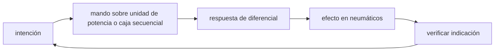

<!-- clase-meta
tipo_documento: clase
clase: 5
codigo: FORMULA1-05
curso: formula-1
titulo: "Mandos e instrumentos de la Fórmula 1"
modalidad: "taller de simulación"
duracion_minutos: 60
nivel: introductorio
prerrequisito: FORMULA1-04
competencia: "lectura_y_mando"
resultados_aprendizaje:
  - "Explicar controles, instrumentos, entradas y estados del sistema con vocabulario propio de Fórmula 1."
  - "Aplicar esos conceptos a una decisión segura o a un escenario de simulación de Fórmula 1."
evidencia: "Mapa de mandos y resolución de dos estados del tablero."
criterio_aprobacion: "Reconoce los controles críticos y responde a los estados sin introducir acciones inseguras."
fuentes: manuales/fuentes.md
ultima_revision: 2026-09-10
-->

# 🎛️ Mandos e instrumentos de la Fórmula 1

[🏠 Inicio](../../../README.md) · [🏎️ Curso: Fórmula 1](../README.md) · 🎛️ Mandos

## Vista general

El puesto de mando de un monoplaza se concentra en el volante y en los pedales.
El volante es una computadora: reune dirección, cambios, pantalla de datos y
decenas de ajustes. El piloto va tumbado dentro del monocasco, con los pies casi
al mismo nivel que las manos y la cabeza fija por el arco de protección.

## Mapa de controles

| Zona | Control | Tipo | Función | Prioridad | Comentarios |
| --- | --- | --- | --- | --- | --- |
| Volante | Dirección | Giro | Orientar ruedas delanteras | Alta | Recorrido corto y muy directo. |
| Volante detrás | Leva de subir marcha | Leva derecha | Subir de marcha | Alta | Secuencial, sin embrague en marcha. |
| Volante detrás | Leva de bajar marcha | Leva izquierda | Reducir de marcha | Alta | Ayuda a la frenada. |
| Volante detrás | Levas de embrague | Levas dobles | Embragar en salida | Alta | Solo para arrancar y en boxes. |
| Volante | Botón DRS | Botón | Abrir aleron trasero | Alta | Solo en zonas permitidas. |
| Volante | Botón de radio | Botón | Hablar con el equipo | Media | Comunicación con el muro. |
| Volante | Botón de impulso ERS | Botón | Solicitar entrega eléctrica | Alta | Gestión de energía por vuelta. |
| Volante | Ruletas de ajuste | Selectores | Reparto de frenada, mezcla, diferencial | Alta | Cambian el comportamiento en pista. |
| Volante | Limitador de boxes | Botón | Limitar velocidad en el pit lane | Alta | Obligatorio en boxes. |
| Piso | Pedal de acelerador | Pedal | Regular potencia | Alta | Muy progresivo. |
| Piso | Pedal de freno | Pedal | Frenar | Alta | Esfuerzo alto, gran precisión. |

## Instrumentos principales

| Instrumento | Mide o muestra | Unidad | Importancia | Notas |
| --- | --- | --- | --- | --- |
| Pantalla del volante | Datos de vuelta y coche | varios | Alta | Configurable por página. |
| Marcha actual | Marcha engranada | número/N | Alta | Siempre visible. |
| Luces de cambio | Momento de cambiar | luces LED | Alta | Guian el cambio óptimo. |
| Delta de tiempo | Diferencia con referencia | segundos | Alta | Sabe si gana o pierde tiempo. |
| Estado de energía ERS | Carga y despliegue | porcentaje | Alta | Clave para la gestión de batería. |
| Temperaturas | Neumáticos, frenos, motor | grados | Alta | Ventanas de funcionamiento. |
| Presiones | Neumáticos y aceite | bar | Media | Vigilancia de fiabilidad. |

## Entradas de simulación

| Acción | Teclado | Controlador | Volante de sim | Comentarios |
| --- | --- | --- | --- | --- |
| Acelerar | Flecha arriba | Gatillo derecho | Pedal acelerador | Progresivo, controla tracción. |
| Frenar | Flecha abajo | Gatillo izquierdo | Pedal de freno | Modula fuerza y evita bloqueo. |
| Subir marcha | E | Leva derecha | Leva derecha | Secuencial. |
| Bajar marcha | Q | Leva izquierda | Leva izquierda | Reducir antes de curva. |
| Girar | Flechas izq/der | Stick izquierdo | Giro del volante | Recorrido corto. |
| DRS | Tecla D | Botón asignado | Botón DRS | Solo en zona DRS. |
| Impulso ERS | Tecla Espacio | Botón asignado | Botón ERS | Gestión de energía. |

## Estados del sistema

| Estado | Descripción | Indicadores | Acciones disponibles |
| --- | --- | --- | --- |
| Detenido | En boxes o parrilla | Pantalla en modo garaje | Encender, calibrar, salir. |
| En pista | Rodando en el trazado | Delta y marcha activos | Acelerar, frenar, cambiar, DRS. |
| Vuelta rápida | Buscando mejor tiempo | Luces de cambio y delta | Gestionar energía y neumáticos. |
| Boxes | Parada técnica | Limitador activo | Limitar velocidad, cambiar gomas. |
| Bandera / alerta | Precaución en pista | Testigos y radio | Levantar, respetar bandera. |

## Observaciones ergonomicas

- La pantalla del volante debe priorizar marcha, delta y estado de energía.
- El limitador de boxes debe ser inconfundible para no exceder el límite.
- Reparto de frenada y modos de energía son ajustes frecuentes: la interfaz de
  simulación debe hacerlos accesibles sin distraer del pilotaje.
- El DRS solo debe habilitarse cuando la simulación permite la zona.

## 🧭 Guía de estudio aplicada

### Pregunta guía

¿Cómo ayuda **Vista general, Mapa de controles, Instrumentos principales y Entradas de simulación** a **interpretar mandos e indicaciones durante entrada y salida de una curva rápida durante una tanda con neumáticos degradados**?

### Explicación razonada

Un mando no se aprende memorizando su nombre, sino recorriendo el ciclo intención → acción → indicación → verificación. En Fórmula 1, el operador actúa sobre unidad de potencia o caja secuencial, observa la respuesta en diferencial y confirma el efecto en neumáticos. Una indicación inesperada exige detener la secuencia mental, identificar el modo activo y evitar una segunda orden que agrave el estado.

Esta clase se conecta con el resto del curso mediante **interacción entre carga aerodinámica, temperatura del neumático y balance del monoplaza**. El hilo de
seguridad consiste en reconocer a tiempo **sobrepasar el agarre disponible al cambiar el balance con freno, volante o acelerador** y poder justificar la decisión
**sacrificar velocidad de entrada para conservar estabilidad y tracción de salida**; en clases posteriores cambiará el ángulo de análisis, no esa relación causal.
La lectura funcional común sigue **unidad de potencia → caja secuencial → diferencial → neumáticos**, de modo que cada concepto pueda
ubicarse dentro del funcionamiento completo y no quede como un dato aislado.

**Apoyo documental:** [Formula 1 Regulations](https://www.fia.com/regulations/formula-1) aporta reglamento, arquitectura y seguridad de Fórmula 1;
[Vehicle Safety](https://www.nhtsa.gov/vehicle-safety) se usa para seguridad de vehículos terrestres. Estas fuentes
se contrastan con el alcance de la clase y no sustituyen un manual de equipo concreto.

### Caso resuelto: de la observación a la decisión

1. **Intención:** formula qué cambio se necesita durante **entrada y salida de una curva rápida durante una tanda con neumáticos degradados**.
2. **Mando:** identifica el control que actúa sobre **unidad de potencia** o **caja secuencial** y el modo que debe estar activo.
3. **Lectura:** localiza la indicación que confirma la respuesta de **diferencial** y el efecto en **neumáticos**.
4. **Verificación:** si la lectura no coincide, no acumules órdenes; estabiliza e investiga el estado.

### Comprueba tu comprensión

1. ¿Qué mando inicia la respuesta y qué instrumento confirma que el modo correcto está activo?
2. ¿Qué indicación temprana advertiría **sobrepasar el agarre disponible al cambiar el balance con freno, volante o acelerador**?
3. ¿Qué secuencia usarías si la respuesta de **neumáticos** no coincide con la orden?

Orientación para revisar tus respuestas

- La primera respuesta debe relacionar el eslabón elegido con un efecto posterior, no solo nombrarlo.
- La segunda debe proponer una señal medible u observable y explicar qué tendencia sería preocupante.
- La tercera debe cambiar al menos una variable de capacidad, mando, entorno o margen de seguridad.

## 🎓 Cierre de clase

- **Actividad:** Recorre el puesto de mando simulado de Fórmula 1: localiza los controles de controles, instrumentos, entradas y estados del sistema y asocia cada indicación con una decisión.
- **Evidencia:** Mapa de mandos y resolución de dos estados del tablero.
- **Criterio de aprobación:** Reconoce los controles críticos y responde a los estados sin introducir acciones inseguras.
- **Transferencia:** explica qué cambiaría al pasar a otra variante de esta máquina.

### Fuentes de esta clase

- [FIA-F1-2026](https://www.fia.com/regulations/formula-1): Formula 1 Regulations, FIA. Uso: reglamento, arquitectura y seguridad de Fórmula 1.
- [US-NHTSA](https://www.nhtsa.gov/vehicle-safety): Vehicle Safety, NHTSA. Uso: seguridad de vehículos terrestres.
- [NASA-FLIGHT](https://www1.grc.nasa.gov/beginners-guide-to-aeronautics/): Beginner's Guide to Aeronautics, NASA. Uso: contraste con física y vuelo reales.

> Las fuentes sostienen el marco conceptual y normativo; esta clase no reemplaza el manual
> del fabricante, la formación certificada ni la habilitación exigida para operar equipos reales.

---

[⬅️ Anterior: Sistemas mecánicos](../operacion/sistemas-mecanicos-formula-1.md) · [➡️ Siguiente: Principios y operación](../operacion/principios-formula-1.md)
