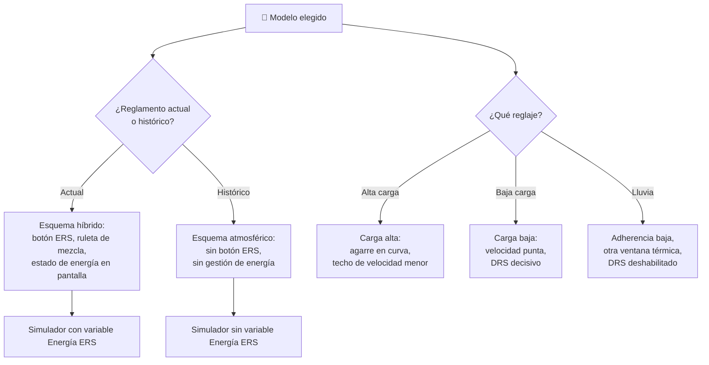

# 🧩 Modelos y variantes del Fórmula 1

[🏠 Inicio](../../../README.md) · [🏎️ Curso: Fórmula 1](../README.md) · 🧩 Modelos

El [Módulo 2](../operacion/caracteristicas-formula-1.md) ya dijo qué familias de
monoplaza existen: las que define el reglamento (actual e histórico) y las que
define el reglaje (alta carga, baja carga, lluvia). Este módulo responde a algo
distinto: **no todas se pilotan igual**, y esa diferencia no es de matiz. Cambia
qué mandos tiene la máquina y, por tanto, qué debe modelar el simulador.

> 🎯 **La idea que sostiene el módulo.** "Un Fórmula 1" no es una sola máquina
> desde el punto de vista del mando. Un monoplaza histórico no tiene botón de
> impulso ERS: no es que lo tenga más simple, es que **no existe**, porque no
> hay hibridación que gestionar. Un simulador que presente un solo esquema de
> control está representando un monoplaza concreto aunque diga representarlos
> todos.

---

## 🧭 Por qué el modelo decide el simulador

El [Módulo 5](../mandos/manual-mandos-formula-1.md) describe un puesto de mando
con un **botón de impulso ERS** en el volante, de prioridad alta, cuya función
es "solicitar entrega eléctrica" y cuya nota dice "gestión de energía por
vuelta". El [Módulo 9](../simulacion/diseno-simulador-formula-1.md) expone una
variable `Energía ERS` con rango `0-100%`, que afecta al impulso disponible y
que "se gasta y recupera por vuelta". Ambos describen un monoplaza **híbrido**:
el del campeonato vigente.

En un monoplaza histórico, que el Módulo 2 define con "motores atmosféricos, sin
hibridación", ese botón no manda nada. Y la variable `Energía ERS` sencillamente
no tiene valores que tomar. Si el simulador se construye sobre el esquema
híbrido y luego se le "añade" un histórico, el resultado es un monoplaza
atmosférico con ERS, que no existe.

Lo mismo pasa, en menor escala, con el reglaje: el reglaje de lluvia no quita
mandos, pero mueve dos variables (`Adherencia` y `Temperatura de gomas`) fuera
del rango con el que el resto del curso razona.

---

## 🗂️ Qué cambia en el manejo

| Modelo | Qué cambia al conducirlo |
| --- | --- |
| Monoplaza actual | La referencia del curso: efecto suelo, unidad híbrida V6 turbo y gestión de energía por vuelta. Todo el Módulo 6 está escrito sobre él. |
| Monoplaza histórico | Sin hibridación que administrar, la atención se libera hacia la trazada y la frenada. La carga aerodinámica es menor o inexistente según la era: la velocidad de paso por curva no crece con la velocidad como en el actual. |
| Alta carga aerodinámica | Máximo agarre en curva: se puede girar más rápido, pero la resistencia castiga la recta. El coche depende de mantener velocidad, no de recuperarla. |
| Baja carga aerodinámica | Más velocidad punta y menos agarre en apoyo: la frenada se alarga y el vértice exige más precisión. |
| Reglaje de lluvia | Neumáticos de lluvia y menos potencia aplicada. La adherencia deja de ser un valor estable de asfalto seco y el error se paga antes. |

---

## 🎛️ Qué cambia en el mando

| Modelo | Qué mando aparece o desaparece | Consecuencia |
| --- | --- | --- |
| Monoplaza actual | Ninguno: el mapa de controles del Módulo 5 aplica tal cual. | Es el caso base del curso. |
| Monoplaza histórico | **Desaparece** el botón de impulso ERS: sin hibridación no hay entrega eléctrica que solicitar. La ruleta de mezcla y el estado de energía del tablero se quedan sin contenido. | El piloto pierde una decisión estratégica por vuelta. La pantalla del volante, que el Módulo 5 pide priorizar en "marcha, delta y estado de energía", queda con dos de tres. |
| Alta carga / baja carga | Ninguno: cambian los valores de reglaje, no los controles. | El botón DRS pesa mucho más en baja carga, donde la recta es el terreno de juego. |
| Reglaje de lluvia | Ninguno **desaparece**, pero el DRS deja de estar disponible cuando la dirección de carrera no lo habilita, tal como pide el propio Módulo 5. | Un mando de prioridad alta se vuelve inerte sin que el piloto lo decida. |
| Todos | Las **ruletas de ajuste** (reparto de frenada, mezcla, diferencial) no cambian de sitio, pero cambian de peso según el modelo. | No es un mando nuevo, pero altera el resultado de todos los demás. |

---

## 🎮 Qué cambia en el simulador

Contrastado con las variables del
[Módulo 9](../simulacion/diseno-simulador-formula-1.md):

| Modelo | Variables que cambian | Esquema de control |
| --- | --- | --- |
| Monoplaza actual | Ninguna: es el caso base. | El del Módulo 5. |
| Monoplaza histórico | `Energía ERS` **se elimina**: sin hibridación no hay carga que gastar ni recuperar. `Carga aerodinámica` reduce su rango o desaparece según la era del Módulo 1. `Combustible` sigue pesando, pero deja de estar acotado por el flujo regulado del reglamento actual. | Sin entrada de impulso ERS; la gestión de energía sale del ciclo básico. |
| Alta carga aerodinámica | `Carga aerodinámica` se fija en el extremo alto; `Velocidad` recorta su techo por resistencia. | El mismo. |
| Baja carga aerodinámica | `Carga aerodinámica` se fija en el extremo bajo; `Velocidad` alcanza el techo del rango y `Adherencia` importa más en apoyo. | El mismo, con el DRS como recurso central. |
| Reglaje de lluvia | `Adherencia` deja de ser un valor de asfalto seco y baja de forma sostenida. `Temperatura de gomas` cambia de ventana: el problema pasa de sobrecalentar a no llegar a temperatura. `Desgaste de gomas` sigue otra curva. | El mismo, con el DRS deshabilitado por el escenario. |

---

## 🗺️ Del modelo al esquema de control

---

## ⚠️ Qué modelos no comparten simulador

Un solo modelo no se resuelve con un ajuste de parámetros, porque su esquema de
control es otro:

- **El monoplaza histórico** frente al resto: falta una entrada de prioridad
  alta y desaparece una variable entera del Módulo 9. La gestión de energía deja
  de ser un paso del ciclo básico, no un paso más barato. Es un modo de control
  distinto, no una dificultad distinta.

Las tres configuraciones de reglaje sí caben en un mismo simulador ajustando
rangos, porque comparten volante, pedales y variables:

- **Alta y baja carga** solo mueven `Carga aerodinámica` y el techo de
  `Velocidad`.
- **El reglaje de lluvia** mueve `Adherencia` y `Temperatura de gomas`, y apaga
  el DRS desde el escenario, no desde el modelo del coche.

Esto encaja con los [niveles de realismo](../../../docs/03-niveles-de-realismo.md)
que recoge el [Módulo 6](../operacion/principios-formula-1.md): en el nivel 1
todos los reglajes se comportan casi igual, la carga aerodinámica y la
adherencia aparecen en el nivel 2, y la gestión de energía ERS —lo único que
separa de verdad al histórico del actual— no llega hasta el nivel 3.

---

[⬅️ Anterior: Características](../operacion/caracteristicas-formula-1.md) · [➡️ Siguiente: Sistemas mecánicos](../operacion/sistemas-mecanicos-formula-1.md)
