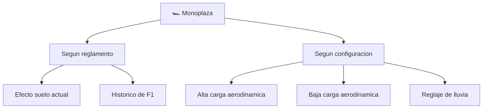

# 📋 Caracteristicas funcionales de la Formula 1

[🏠 Inicio](../../../README.md) · [🏎️ Curso: Formula 1](../README.md) · 📋 Caracteristicas

Que es un monoplaza de Formula 1, que variantes existen y para que sirve cada
una. Este modulo da el contexto antes de abrir la mecanica (Modulo 3).

---

## 🧭 Definicion

Un monoplaza de Formula 1 es un vehiculo de competicion de circuito, abierto, de
una sola plaza y con ruedas descubiertas. Esta construido solo para dar vueltas
rapidas a un trazado cerrado: prioriza agarre, aceleracion y frenada por encima
de comodidad o autonomia. No circula por via publica.

---

## 🧬 Caracteristicas clave

| Caracteristica | Descripcion |
| --- | --- |
| Carga aerodinamica | Los alerones y el fondo empujan el coche al suelo y aumentan el agarre. |
| Relacion peso/potencia | Muy alta; cerca de 800 kg de conjunto con potencia hibrida elevada. |
| Frenada extrema | Frenos de carbono capaces de desaceleraciones de varias g. |
| Neumaticos anchos | Enorme superficie de contacto en una ventana estrecha de temperatura. |
| Monocasco de carbono | Chasis ligero y muy rigido que protege al piloto. |
| Especializacion | Cada pieza se ajusta al circuito; no busca versatilidad. |

---

## 🗂️ Tipos y familias de monoplaza

| Configuracion | Uso tipico | Rasgo destacado |
| --- | --- | --- |
| Alta carga aerodinamica | Circuitos lentos y sinuosos | Maximo agarre en curva. |
| Baja carga aerodinamica | Circuitos rapidos con rectas | Menos resistencia, mas velocidad punta. |
| Reglaje de lluvia | Piso mojado | Neumaticos de lluvia y menos potencia aplicada. |
| Monoplaza historico | Exhibicion y clasicos | Motores atmosfericos, sin hibridacion. |
| Monoplaza actual | Campeonato vigente | Unidad hibrida V6 turbo y efecto suelo. |

---

## 🎯 Para que se usa

- Competir en circuitos por el mejor tiempo por vuelta.
- Desarrollar y probar tecnologia de motor, frenos y aerodinamica.
- Formar pilotos e ingenieros en el limite del rendimiento.
- Servir de vitrina tecnica y deportiva para fabricantes.

---

[⬅️ Anterior: Historia](../historia/historia-formula-1.md) · [➡️ Siguiente: Sistemas mecanicos](sistemas-mecanicos-formula-1.md)
