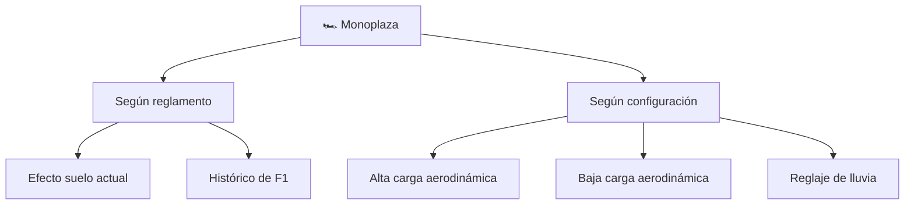

<!-- clase-meta
tipo_documento: clase
clase: 2
codigo: FORMULA1-02
curso: formula-1
titulo: "Características funcionales de la Fórmula 1"
modalidad: "teórica aplicada"
duracion_minutos: 45
nivel: introductorio
prerrequisito: FORMULA1-01
competencia: "identificacion_funcional"
resultados_aprendizaje:
  - "Explicar definición, rasgos funcionales, tipos y usos con vocabulario propio de Fórmula 1."
  - "Aplicar esos conceptos a una decisión segura o a un escenario de simulación de Fórmula 1."
evidencia: "Matriz comparativa y decisión justificada."
criterio_aprobacion: "La elección considera función, límites, mando y efecto en la simulación; no se apoya solo en preferencias."
fuentes: manuales/fuentes.md
ultima_revision: 2026-09-10
-->

# 📋 Características funcionales de la Fórmula 1

[🏠 Inicio](../../../README.md) · [🏎️ Curso: Fórmula 1](../README.md) · 📋 Características

Que es un monoplaza de Fórmula 1, que variantes existen y para que sirve cada
una. Esta clase da el contexto antes de abrir la mecánica (Clase 4).

---

## 🧭 Definición

Un monoplaza de Fórmula 1 es un vehículo de competición de circuito, abierto, de
una sola plaza y con ruedas descubiertas. Está construido solo para dar vueltas
rápidas a un trazado cerrado: prioriza agarre, aceleración y frenada por encima
de comodidad o autonomía. No circula por vía pública.

---

## 🧬 Características clave

| Característica | Descripción |
| --- | --- |
| Carga aerodinámica | Los alerones y el fondo empujan el coche al suelo y aumentan el agarre. |
| Relación peso/potencia | Muy alta; cerca de 800 kg de conjunto con potencia híbrida elevada. |
| Frenada extrema | Frenos de carbono capaces de desaceleraciones de varias g. |
| Neumáticos anchos | Enorme superficie de contacto en una ventana estrecha de temperatura. |
| Monocasco de carbono | Chasis ligero y muy rígido que protege al piloto. |
| Especialización | Cada pieza se ajusta al circuito; no busca versatilidad. |

---

## 🗂️ Tipos y familias de monoplaza

```mermaid
flowchart TD
    F1[🏎️ Monoplaza] --> Reglamento[Según reglamento]
    F1 --> Config[Según configuración]
    Reglamento --> Actual[Efecto suelo actual]
    Reglamento --> Historico[Histórico de F1]
    Config --> AltaCarga[Alta carga aerodinámica]
    Config --> BajaCarga[Baja carga aerodinámica]
    Config --> Lluvia[Reglaje de lluvia]
```

| Configuración | Uso típico | Rasgo destacado |
| --- | --- | --- |
| Alta carga aerodinámica | Circuitos lentos y sinuosos | Máximo agarre en curva. |
| Baja carga aerodinámica | Circuitos rápidos con rectas | Menos resistencia, más velocidad punta. |
| Reglaje de lluvia | Piso mojado | Neumáticos de lluvia y menos potencia aplicada. |
| Monoplaza histórico | Exhibición y clásicos | Motores atmosféricos, sin hibridación. |
| Monoplaza actual | Campeonato vigente | Unidad híbrida V6 turbo y efecto suelo. |

---

## 🎯 Para qué se usa

- Competir en circuitos por el mejor tiempo por vuelta.
- Desarrollar y probar tecnología de motor, frenos y aerodinámica.
- Formar pilotos e ingenieros en el límite del rendimiento.
- Servir de vitrina técnica y deportiva para fabricantes.

## 🧭 Guía de estudio aplicada

### Pregunta guía

¿Cómo ayuda **Definición, Características clave, Tipos y familias de monoplaza y Para qué se usa** a **elegir una configuración adecuada para entrada y salida de una curva rápida durante una tanda con neumáticos degradados**?

### Explicación razonada

Una característica solo es útil cuando permite anticipar comportamiento. En Fórmula 1, la relación entre unidad de potencia, caja secuencial, diferencial y neumáticos determina capacidad, respuesta y límites. Por eso «configuración de alta carga frente a baja carga aerodinámica» no se compara por apariencia: se compara por misión, entorno, carga de trabajo y exposición al riesgo «sobrepasar el agarre disponible al cambiar el balance con freno, volante o acelerador».

Esta clase se conecta con el resto del curso mediante **interacción entre carga aerodinámica, temperatura del neumático y balance del monoplaza**. El hilo de
seguridad consiste en reconocer a tiempo **sobrepasar el agarre disponible al cambiar el balance con freno, volante o acelerador** y poder justificar la decisión
**sacrificar velocidad de entrada para conservar estabilidad y tracción de salida**; en clases posteriores cambiará el ángulo de análisis, no esa relación causal.
La lectura funcional común sigue **unidad de potencia → caja secuencial → diferencial → neumáticos**, de modo que cada concepto pueda
ubicarse dentro del funcionamiento completo y no quede como un dato aislado.

**Apoyo documental:** [Formula 1 Regulations](https://www.fia.com/regulations/formula-1) aporta reglamento, arquitectura y seguridad de Fórmula 1;
[Vehicle Safety](https://www.nhtsa.gov/vehicle-safety) se usa para seguridad de vehículos terrestres. Estas fuentes
se contrastan con el alcance de la clase y no sustituyen un manual de equipo concreto.

### Caso resuelto: de la observación a la decisión

1. **Definir la necesidad:** convierte «entrada y salida de una curva rápida durante una tanda con neumáticos degradados» en requisitos de capacidad, entorno y respuesta.
2. **Comparar:** contrasta **configuración de alta carga frente a baja carga aerodinámica** usando esos requisitos y la cadena **unidad de potencia → caja secuencial → diferencial → neumáticos**.
3. **Descartar:** elimina la alternativa que deja menos margen frente a **sobrepasar el agarre disponible al cambiar el balance con freno, volante o acelerador**.
4. **Elegir:** declara la variante escogida, la evidencia usada y una limitación que todavía debe respetarse.

### Comprueba tu comprensión

1. ¿Qué característica de **neumáticos** condiciona primero el caso «entrada y salida de una curva rápida durante una tanda con neumáticos degradados»?
2. ¿Qué requisito descartaría una de las alternativas **configuración de alta carga frente a baja carga aerodinámica**?
3. ¿Qué límite debe declararse junto con la variante elegida?

Orientación para revisar tus respuestas

- La primera respuesta debe relacionar el eslabón elegido con un efecto posterior, no solo nombrarlo.
- La segunda debe proponer una señal medible u observable y explicar qué tendencia sería preocupante.
- La tercera debe cambiar al menos una variable de capacidad, mando, entorno o margen de seguridad.

## 🎓 Cierre de clase

- **Actividad:** Compara variantes de Fórmula 1 mediante los ejes «definición, rasgos funcionales, tipos y usos» y elige una para un caso de uso razonado.
- **Evidencia:** Matriz comparativa y decisión justificada.
- **Criterio de aprobación:** La elección considera función, límites, mando y efecto en la simulación; no se apoya solo en preferencias.
- **Transferencia:** explica qué cambiaría al pasar a otra variante de esta máquina.

### Fuentes de esta clase

- [FIA-F1-2026](https://www.fia.com/regulations/formula-1): Formula 1 Regulations, FIA. Uso: reglamento, arquitectura y seguridad de Fórmula 1.
- [US-NHTSA](https://www.nhtsa.gov/vehicle-safety): Vehicle Safety, NHTSA. Uso: seguridad de vehículos terrestres.
- [NASA-FLIGHT](https://www1.grc.nasa.gov/beginners-guide-to-aeronautics/): Beginner's Guide to Aeronautics, NASA. Uso: contraste con física y vuelo reales.

> Las fuentes sostienen el marco conceptual y normativo; esta clase no reemplaza el manual
> del fabricante, la formación certificada ni la habilitación exigida para operar equipos reales.

---

[⬅️ Anterior: Historia](../historia/historia-formula-1.md) · [➡️ Siguiente: Modelos y variantes](../modelos/modelos-formula-1.md)
