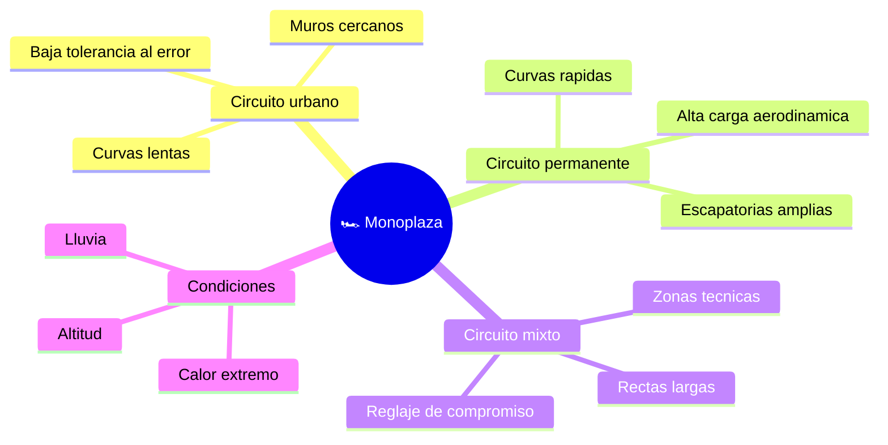

# 🌍 Entornos de trabajo de la Fórmula 1

[🏠 Inicio](../../../README.md) · [🏎️ Curso: Fórmula 1](../README.md) · 🌍 Entornos

Donde compite un monoplaza y cómo cambia el pilotaje según el circuito. Cada
trazado implica reglaje, riesgos y estrategia distintos, y en simulación se
traduce en escenarios diferentes.

---

## 🗺️ Entornos principales

| Entorno | Características | Riesgos típicos | Ajuste de pilotaje |
| --- | --- | --- | --- |
| Circuito urbano | Muros cercanos, curvas lentas. | Error mínimo termina en muro. | Precisión, alta carga, cuidar frenos. |
| Circuito permanente | Escapatorias, curvas rápidas. | Sobreexigir gomas y frenos. | Buscar trazada limpia y ritmo. |
| Circuito mixto | Rectas largas y zonas técnicas. | Reglaje de compromiso. | Equilibrar velocidad punta y agarre. |
| Lluvia | Piso mojado, baja adherencia. | Aquaplaning y trompos. | Gomas de lluvia, suavidad, más distancia. |
| Calor / altitud | Menos densidad de aire. | Sobrecalentar unidad y gomas. | Gestión térmica y de energía. |

---

## 🌦️ Factores del entorno

- **Clima**: la lluvia reduce el agarre y cambia el neumático; el calor afecta la
  temperatura de gomas y frenos.
- **Asfalto**: nuevo o gomado, liso o rugoso, cambia el agarre disponible.
- **Trazado**: número y tipo de curvas define la carga aerodinámica ideal.
- **Altitud y temperatura del aire**: afectan la potencia y la refrigeración.

---

## 🎮 Traducción a simulación

Cada circuito es un escenario con su trazado, asfalto, clima y zonas DRS. Ver
como se modela en el
[Módulo 8: Diseño de simulación](../simulacion/diseno-simulador-formula-1.md).

---

[⬅️ Anterior: Principios y operación](principios-formula-1.md) · [➡️ Siguiente: Reglamentos](../reglamentos/reglamentos-formula-1.md)
