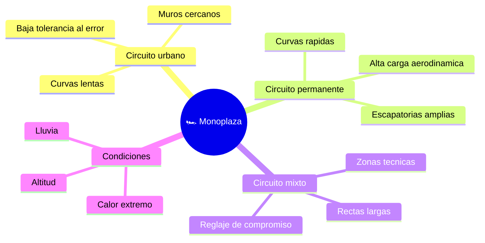

# 🌍 Entornos de trabajo de la Formula 1

[🏠 Inicio](../../../README.md) · [🏎️ Curso: Formula 1](../README.md) · 🌍 Entornos

Donde compite un monoplaza y como cambia el pilotaje segun el circuito. Cada
trazado implica reglaje, riesgos y estrategia distintos, y en simulacion se
traduce en escenarios diferentes.

---

## 🗺️ Entornos principales

| Entorno | Caracteristicas | Riesgos tipicos | Ajuste de pilotaje |
| --- | --- | --- | --- |
| Circuito urbano | Muros cercanos, curvas lentas. | Error minimo termina en muro. | Precision, alta carga, cuidar frenos. |
| Circuito permanente | Escapatorias, curvas rapidas. | Sobreexigir gomas y frenos. | Buscar trazada limpia y ritmo. |
| Circuito mixto | Rectas largas y zonas tecnicas. | Reglaje de compromiso. | Equilibrar velocidad punta y agarre. |
| Lluvia | Piso mojado, baja adherencia. | Aquaplaning y trompos. | Gomas de lluvia, suavidad, mas distancia. |
| Calor / altitud | Menos densidad de aire. | Sobrecalentar unidad y gomas. | Gestion termica y de energia. |

---

## 🌦️ Factores del entorno

- **Clima**: la lluvia reduce el agarre y cambia el neumatico; el calor afecta la
  temperatura de gomas y frenos.
- **Asfalto**: nuevo o gomado, liso o rugoso, cambia el agarre disponible.
- **Trazado**: numero y tipo de curvas define la carga aerodinamica ideal.
- **Altitud y temperatura del aire**: afectan la potencia y la refrigeracion.

---

## 🎮 Traduccion a simulacion

Cada circuito es un escenario con su trazado, asfalto, clima y zonas DRS. Ver
como se modela en el
[Modulo 8: Diseno de simulacion](../simulacion/diseno-simulador-formula-1.md).

---

[⬅️ Anterior: Principios y operacion](principios-formula-1.md) · [➡️ Siguiente: Reglamentos](../reglamentos/reglamentos-formula-1.md)
