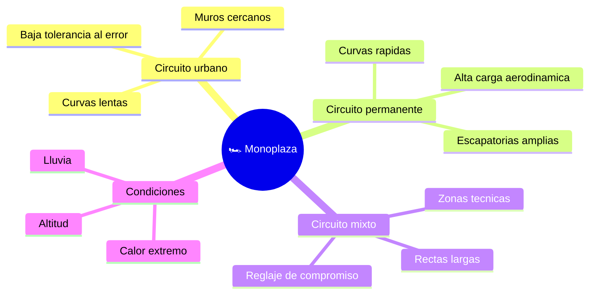

<!-- clase-meta
tipo_documento: clase
clase: 7
codigo: FORMULA1-07
curso: formula-1
titulo: "Entornos de trabajo de la Fórmula 1"
modalidad: "análisis de escenarios"
duracion_minutos: 60
nivel: introductorio
prerrequisito: FORMULA1-06
competencia: "adaptacion_al_entorno"
resultados_aprendizaje:
  - "Explicar entornos, factores ambientales, riesgos y respuesta de simulación con vocabulario propio de Fórmula 1."
  - "Aplicar esos conceptos a una decisión segura o a un escenario de simulación de Fórmula 1."
evidencia: "Matriz entorno–cambio–riesgo–respuesta."
criterio_aprobacion: "Cada respuesta se adapta al entorno y distingue riesgos que no son intercambiables entre escenarios."
fuentes: manuales/fuentes.md
ultima_revision: 2026-09-10
-->

# 🌍 Entornos de trabajo de la Fórmula 1

[🏠 Inicio](../../../README.md) · [🏎️ Curso: Fórmula 1](../README.md) · 🌍 Entornos

Donde compite un monoplaza y cómo cambia el pilotaje según el circuito. Cada
trazado implica reglaje, riesgos y estrategia distintos, y en simulación se
traduce en escenarios diferentes.

---

## 🗺️ Entornos principales

```mermaid
mindmap
  root((🏎️ Monoplaza))
    Circuito urbano
      Muros cercanos
      Curvas lentas
      Baja tolerancia al error
    Circuito permanente
      Escapatorias amplias
      Curvas rapidas
      Alta carga aerodinamica
    Circuito mixto
      Rectas largas
      Zonas tecnicas
      Reglaje de compromiso
    Condiciones
      Lluvia
      Calor extremo
      Altitud
```

| Entorno | Características | Riesgos típicos | Ajuste de pilotaje |
| --- | --- | --- | --- |
| Circuito urbano | Muros cercanos, curvas lentas. | Error mínimo termina en muro. | Precisión, alta carga, cuidar frenos. |
| Circuito permanente | Escapatorias, curvas rápidas. | Sobreexigir gomas y frenos. | Buscar trazada limpia y ritmo. |
| Circuito mixto | Rectas largas y zonas técnicas. | Reglaje de compromiso. | Equilibrar velocidad punta y agarre. |
| Lluvia | Piso mojado, baja adherencia. | Aquaplaning y trompos. | Gomas de lluvia, suavidad, más distancia. |
| Calor / altitud | Menos densidad de aire. | Sobrecalentar unidad y gomas. | Gestión térmica y de energía. |

---

## 🌦️ Factores del entorno

- **Clima**: la lluvia reduce el agarre y cambia el neumático; el calor afecta la
  temperatura de gomas y frenos.
- **Asfalto**: nuevo o gomado, liso o rugoso, cambia el agarre disponible.
- **Trazado**: número y tipo de curvas define la carga aerodinámica ideal.
- **Altitud y temperatura del aire**: afectan la potencia y la refrigeración.

---

## 🎮 Traducción a simulación

Cada circuito es un escenario con su trazado, asfalto, clima y zonas DRS. Ver
como se modela en el
[Clase 9: Diseño de simulación](../simulacion/diseno-simulador-formula-1.md).

## 🧭 Guía de estudio aplicada

### Pregunta guía

¿Cómo ayuda **Entornos principales, Factores del entorno, Traducción a simulación y Guía de estudio aplicada** a **adaptar entrada y salida de una curva rápida durante una tanda con neumáticos degradados a tres condiciones ambientales distintas**?

### Explicación razonada

El entorno no es decoración: modifica las fuerzas, la percepción y el tiempo disponible. En el caso «entrada y salida de una curva rápida durante una tanda con neumáticos degradados», cambia el comportamiento de neumáticos y aumenta la probabilidad de sobrepasar el agarre disponible al cambiar el balance con freno, volante o acelerador. La respuesta correcta empieza por reconocer qué variable cambió y después adaptar límites, ruta o misión.

Esta clase se conecta con el resto del curso mediante **interacción entre carga aerodinámica, temperatura del neumático y balance del monoplaza**. El hilo de
seguridad consiste en reconocer a tiempo **sobrepasar el agarre disponible al cambiar el balance con freno, volante o acelerador** y poder justificar la decisión
**sacrificar velocidad de entrada para conservar estabilidad y tracción de salida**; en clases posteriores cambiará el ángulo de análisis, no esa relación causal.
La lectura funcional común sigue **unidad de potencia → caja secuencial → diferencial → neumáticos**, de modo que cada concepto pueda
ubicarse dentro del funcionamiento completo y no quede como un dato aislado.

**Apoyo documental:** [Formula 1 Regulations](https://www.fia.com/regulations/formula-1) aporta reglamento, arquitectura y seguridad de Fórmula 1;
[Vehicle Safety](https://www.nhtsa.gov/vehicle-safety) se usa para seguridad de vehículos terrestres. Estas fuentes
se contrastan con el alcance de la clase y no sustituyen un manual de equipo concreto.

### Caso resuelto: de la observación a la decisión

1. **Escenario base:** conserva la misión «entrada y salida de una curva rápida durante una tanda con neumáticos degradados» para poder comparar.
2. **Cambiar una condición:** modifica sucesivamente superficie o medio, visibilidad y perturbación externa.
3. **Recalcular margen:** explica cómo cada cambio afecta **neumáticos** y acerca o aleja **sobrepasar el agarre disponible al cambiar el balance con freno, volante o acelerador**.
4. **Adaptar:** cambia límite, ruta, configuración o incluso cancela; no mantengas la misma respuesta por hábito.

### Comprueba tu comprensión

1. ¿Cómo cambiaría **neumáticos** si empeora la perturbación externa?
2. ¿Qué condición ambiental acerca más el escenario a **sobrepasar el agarre disponible al cambiar el balance con freno, volante o acelerador**?
3. ¿Cuándo adaptarías la maniobra y cuándo la cancelarías?

Orientación para revisar tus respuestas

- La primera respuesta debe relacionar el eslabón elegido con un efecto posterior, no solo nombrarlo.
- La segunda debe proponer una señal medible u observable y explicar qué tendencia sería preocupante.
- La tercera debe cambiar al menos una variable de capacidad, mando, entorno o margen de seguridad.

## 🎓 Cierre de clase

- **Actividad:** Contrasta tres entornos de Fórmula 1 a partir de entornos, factores ambientales, riesgos y respuesta de simulación y determina cómo cambian variables, percepción, riesgos y respuesta.
- **Evidencia:** Matriz entorno–cambio–riesgo–respuesta.
- **Criterio de aprobación:** Cada respuesta se adapta al entorno y distingue riesgos que no son intercambiables entre escenarios.
- **Transferencia:** explica qué cambiaría al pasar a otra variante de esta máquina.

### Fuentes de esta clase

- [FIA-F1-2026](https://www.fia.com/regulations/formula-1): Formula 1 Regulations, FIA. Uso: reglamento, arquitectura y seguridad de Fórmula 1.
- [US-NHTSA](https://www.nhtsa.gov/vehicle-safety): Vehicle Safety, NHTSA. Uso: seguridad de vehículos terrestres.
- [NASA-FLIGHT](https://www1.grc.nasa.gov/beginners-guide-to-aeronautics/): Beginner's Guide to Aeronautics, NASA. Uso: contraste con física y vuelo reales.

> Las fuentes sostienen el marco conceptual y normativo; esta clase no reemplaza el manual
> del fabricante, la formación certificada ni la habilitación exigida para operar equipos reales.

---

[⬅️ Anterior: Principios y operación](principios-formula-1.md) · [➡️ Siguiente: Reglamentos](../reglamentos/reglamentos-formula-1.md)
