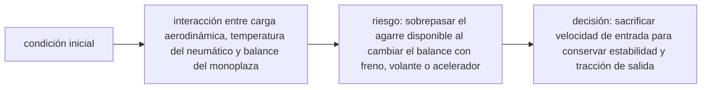

<!-- clase-meta
tipo_documento: clase
clase: 6
codigo: FORMULA1-06
curso: formula-1
titulo: "Principios y operación de la Fórmula 1"
modalidad: "resolución de problemas"
duracion_minutos: 90
nivel: introductorio
prerrequisito: FORMULA1-05
competencia: "razonamiento_operacional"
resultados_aprendizaje:
  - "Explicar principios físicos, fases de operación, decisiones y errores frecuentes con vocabulario propio de Fórmula 1."
  - "Aplicar esos conceptos a una decisión segura o a un escenario de simulación de Fórmula 1."
evidencia: "Resolución argumentada de un escenario operacional."
criterio_aprobacion: "Aplica los principios correctos, anticipa consecuencias y respeta los límites del curso."
fuentes: manuales/fuentes.md
ultima_revision: 2026-09-10
-->

# 🧪 Principios y operación de la Fórmula 1

[🏠 Inicio](../../../README.md) · [🏎️ Curso: Fórmula 1](../README.md) · 🧪 Principios

Documento general y educativo. No sustituye la formación de un piloto de
competición ni la ingeniería de un equipo real. Describe cómo se opera un
monoplaza en simulación y que principios físicos conviene representar.

## Principios de funcionamiento

- **Propulsión**: la unidad híbrida entrega par a las ruedas traseras; el
  acelerador y la gestión de energía regulan esa entrega.
- **Carga aerodinámica**: la aerodinámica y el efecto suelo aumentan el agarre
  con la velocidad, permitiendo curvas más rápidas.
- **Frenada**: los frenos de carbono y la recuperación del MGU-K desaceleran el
  coche con fuerzas de varias g.
- **Adherencia**: el neumático, dentro de su ventana de temperatura, limita
  cuanta aceleración, frenada y giro son posibles antes de deslizar.
- **Gestión de energía**: la batería se carga y descarga por vuelta; usarla bien
  marca el tiempo.

## Fases de una vuelta

| Fase | Que ocurre | Puntos clave |
| --- | --- | --- |
| Recta | Máxima velocidad | Desplegar energía, DRS si está habilitado. |
| Frenada | Reducir antes de curva | Frenar fuerte y recto, bajar marchas. |
| Entrada | Girar hacia el vértice | Soltar freno de forma progresiva. |
| Vértice | Punto más interior | Velocidad mínima justa, buscar tracción. |
| Salida | Acelerar hacia la recta | Abrir acelerador sin perder el eje trasero. |
| Gestión | Cuidar el coche | Neumáticos, frenos y energía dentro de rango. |

## Una curva rápida: idea general

1. Frenar fuerte y en línea recta antes de la curva.
2. Bajar las marchas necesarias mientras se frena.
3. Soltar el freno de forma progresiva al girar hacia el vértice.
4. Pasar por el vértice a la velocidad mínima justa.
5. Acelerar de forma progresiva a la salida cuidando el agarre trasero.

## Errores comunes que la simulación puede enseñar a evitar

- Frenar demasiado tarde y pasarse de la curva.
- Bloquear un neumático por exceso de freno o goma fría.
- Acelerar de golpe a la salida y perder el eje trasero.
- Malgastar la energía ERS y quedar sin impulso en la recta.
- Ignorar la ventana de temperatura de neumáticos y frenos.

## Relación con los niveles de realismo

- **Nivel 1 (educativo)**: acelerar, frenar, girar y seguir la trazada.
- **Nivel 2 (simplificado)**: agregar carga aerodinámica, degradación de gomas y
  límite de adherencia.
- **Nivel 3 (técnico)**: sumar gestión de energía ERS, reparto de frenada,
  ventanas de temperatura y estrategia de neumáticos.

Ver [`docs/03-niveles-de-realismo.md`](../../../docs/03-niveles-de-realismo.md) para el detalle de cada nivel.

## 🧭 Guía de estudio aplicada

### Pregunta guía

¿Cómo ayuda **Principios de funcionamiento, Fases de una vuelta, Una curva rápida: idea general y Errores comunes que la simulación puede enseñar a evitar** a **resolver entrada y salida de una curva rápida durante una tanda con neumáticos degradados sin agotar el margen operacional**?

### Explicación razonada

El principio rector puede resumirse así: interacción entre carga aerodinámica, temperatura del neumático y balance del monoplaza. Esto explica por qué una misma orden produce resultados distintos cuando cambian velocidad, carga, configuración o entorno. Operar bien consiste en leer la tendencia antes de agotar el margen y tomar esta decisión: sacrificar velocidad de entrada para conservar estabilidad y tracción de salida.

Esta clase se conecta con el resto del curso mediante **interacción entre carga aerodinámica, temperatura del neumático y balance del monoplaza**. El hilo de
seguridad consiste en reconocer a tiempo **sobrepasar el agarre disponible al cambiar el balance con freno, volante o acelerador** y poder justificar la decisión
**sacrificar velocidad de entrada para conservar estabilidad y tracción de salida**; en clases posteriores cambiará el ángulo de análisis, no esa relación causal.
La lectura funcional común sigue **unidad de potencia → caja secuencial → diferencial → neumáticos**, de modo que cada concepto pueda
ubicarse dentro del funcionamiento completo y no quede como un dato aislado.

**Apoyo documental:** [Formula 1 Regulations](https://www.fia.com/regulations/formula-1) aporta reglamento, arquitectura y seguridad de Fórmula 1;
[Vehicle Safety](https://www.nhtsa.gov/vehicle-safety) se usa para seguridad de vehículos terrestres. Estas fuentes
se contrastan con el alcance de la clase y no sustituyen un manual de equipo concreto.

### Caso resuelto: de la observación a la decisión

1. **Datos:** reconoce condiciones, configuración y margen disponibles en **entrada y salida de una curva rápida durante una tanda con neumáticos degradados**.
2. **Modelo:** aplica **interacción entre carga aerodinámica, temperatura del neumático y balance del monoplaza** para predecir una tendencia antes de actuar.
3. **Riesgo:** explica mediante qué cadena de causas podría ocurrir **sobrepasar el agarre disponible al cambiar el balance con freno, volante o acelerador**.
4. **Decisión:** ejecuta mentalmente **sacrificar velocidad de entrada para conservar estabilidad y tracción de salida** y define qué observación confirmaría que funcionó.

### Comprueba tu comprensión

1. ¿Qué variable del principio «interacción entre carga aerodinámica, temperatura del neumático y balance del monoplaza» cambia primero en el caso?
2. ¿Cómo se propaga ese cambio hasta **neumáticos**?
3. ¿Qué evidencia confirmaría que **sacrificar velocidad de entrada para conservar estabilidad y tracción de salida** conservó margen operacional?

Orientación para revisar tus respuestas

- La primera respuesta debe relacionar el eslabón elegido con un efecto posterior, no solo nombrarlo.
- La segunda debe proponer una señal medible u observable y explicar qué tendencia sería preocupante.
- La tercera debe cambiar al menos una variable de capacidad, mando, entorno o margen de seguridad.

## 🎓 Cierre de clase

- **Actividad:** Resuelve un escenario de Fórmula 1 explicando, paso a paso, cómo intervienen principios físicos, fases de operación, decisiones y errores frecuentes.
- **Evidencia:** Resolución argumentada de un escenario operacional.
- **Criterio de aprobación:** Aplica los principios correctos, anticipa consecuencias y respeta los límites del curso.
- **Transferencia:** explica qué cambiaría al pasar a otra variante de esta máquina.

### Fuentes de esta clase

- [FIA-F1-2026](https://www.fia.com/regulations/formula-1): Formula 1 Regulations, FIA. Uso: reglamento, arquitectura y seguridad de Fórmula 1.
- [US-NHTSA](https://www.nhtsa.gov/vehicle-safety): Vehicle Safety, NHTSA. Uso: seguridad de vehículos terrestres.
- [NASA-FLIGHT](https://www1.grc.nasa.gov/beginners-guide-to-aeronautics/): Beginner's Guide to Aeronautics, NASA. Uso: contraste con física y vuelo reales.

> Las fuentes sostienen el marco conceptual y normativo; esta clase no reemplaza el manual
> del fabricante, la formación certificada ni la habilitación exigida para operar equipos reales.

---

[⬅️ Anterior: Mandos](../mandos/manual-mandos-formula-1.md) · [➡️ Siguiente: Entornos de trabajo](entornos-formula-1.md)
