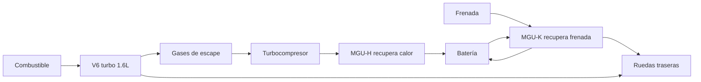
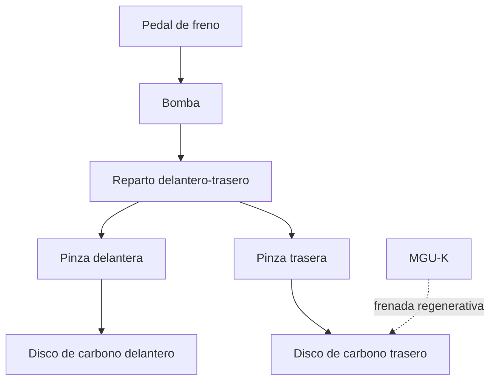

# 🔧 Sistemas mecánicos de la Fórmula 1

[🏠 Inicio](../../../README.md) · [🏎️ Curso: Fórmula 1](../README.md) · 🔧 Sistemas mecánicos

Este módulo abre el monoplaza por dentro. Explica cada sistema, como funciona y
como se conecta con los demás. Es la base técnica para entender los mandos
(Módulo 5) y la física del rendimiento (Módulo 6).

---

## 1. ⚙️ Unidad de potencia híbrida

La unidad de potencia combina un motor de combustión con dos máquinas
eléctricas. No es solo un motor: es un sistema que genera, almacena y reutiliza
energía.

| Componente | Función |
| --- | --- |
| Motor V6 turbo 1.6L | Genera la potencia base de combustión. |
| Turbocompresor | Comprime el aire de admisión con los gases de escape. |
| MGU-K | Recupera energía de la frenada y la devuelve como empuje. |
| MGU-H | Recupera calor de los gases y reduce el retardo del turbo. |
| Batería (almacén de energía) | Guarda la energía eléctrica recuperada. |
| Electrónica de control | Coordina reparto entre combustión y eléctrico. |

- **ERS (sistema de recuperación de energía)**: conjunto formado por MGU-K,
  MGU-H, batería y su electrónica. Entrega un impulso eléctrico extra por vuelta.
- **Eficiencia**: la hibridación busca más rendimiento con menos combustible.

---

## 2. 🪽 Aerodinámica y carga aerodinámica

La aerodinámica es la clave del rendimiento moderno. El coche genera carga
vertical hacia abajo para pegar los neumáticos al suelo sin sumar peso.

- **Carga aerodinámica**: fuerza vertical hacia el suelo que aumenta el agarre.
- **Resistencia**: fuerza que se opone al avance; más carga suele traer más
  resistencia.
- **Reglaje**: equilibrar carga y resistencia según el circuito.

| Elemento | Aporte principal |
| --- | --- |
| Aleron delantero | Ajusta el equilibrio y dirige el aire al resto del coche. |
| Fondo y difusor | Genera gran parte de la carga por baja presión bajo el coche. |
| Aleron trasero | Aporta carga en el eje trasero y estabilidad. |
| Bargeboards y desviadores | Ordenan el flujo hacia el fondo y los radiadores. |

### Efecto suelo

El fondo del monoplaza forma un canal que acelera el aire por debajo. Al ganar
velocidad el aire, baja la presión y se genera una succión que empuja el coche
al suelo. Es carga aerodinámica muy eficiente porque cuesta poca resistencia.

### DRS

El DRS (sistema de reducción de resistencia) abre una aleta del aleron trasero
en zonas permitidas para reducir la resistencia y facilitar el adelantamiento.
Al cerrarse, recupera la carga habitual.

---

## 3. ⭕ Neumáticos

El único contacto con el asfalto. Todo (acelerar, frenar, girar) pasa por ellos.

- **Compuestos**: de más duros y duraderos a más blandos y rápidos.
- **Ventana de temperatura**: rinden solo dentro de un rango; fríos o
  sobrecalentados pierden agarre.
- **Degradación**: pierden rendimiento con las vueltas y obligan a parar en boxes.
- **Presión**: incorrecta cambia la huella de contacto y el agarre.

---

## 4. 🛑 Frenos de carbono

Convierten la energía de movimiento en calor. En Fórmula 1 son de disco y
pastilla de carbono.

- **Disco de carbono**: soporta temperaturas muy altas y es ligero.
- **Ventana térmica**: como los neumáticos, necesita calor para frenar bien.
- **Frenada por cable en el eje trasero**: parte del frenado trasero lo gestiona
  la electrónica junto con la recuperación del MGU-K.
- **Reparto de frenada**: el piloto ajusta el balance delantero-trasero.

---

## 5. ⚙️ Caja de cambios secuencial

Transmite la potencia a las ruedas traseras y adapta fuerza y velocidad.

- **Secuencial**: se sube y baja de marcha en orden, sin saltar posiciones.
- **Cambio por levas**: el piloto usa levas detrás del volante.
- **Cambio casi instantáneo**: la electrónica corta y reengancha en milisegundos.
- **Diferencial**: reparte el par entre las dos ruedas traseras en curva.

---

## 6. 🏗️ Chasis y suspensión

- **Monocasco de carbono**: célula rígida y ligera que protege al piloto y sirve
  de estructura central.
- **Suspensión**: conecta ruedas y chasis, controla el reparto de carga y
  mantiene el neumático bien apoyado.
- **Altura al suelo**: crítica por el efecto suelo; muy sensible al reglaje.

---

## 🔁 Cómo se conecta todo

1. La **unidad de potencia** genera y recupera energía.
2. La **caja secuencial** y el **diferencial** llevan el par a las ruedas.
3. La **aerodinámica** y el **efecto suelo** pegan el coche al suelo.
4. Los **neumáticos** convierten agarre y potencia en velocidad real.
5. Los **frenos de carbono** devuelven el control en cada frenada.
6. El **monocasco** y la **suspensión** mantienen la geometría y la seguridad.

Con esto entendido, el
[Módulo 5: Mandos](../mandos/manual-mandos-formula-1.md) muestra como el piloto
opera cada uno de estos sistemas.

---

[⬅️ Anterior: Modelos y variantes](../modelos/modelos-formula-1.md) · [➡️ Siguiente: Mandos e instrumentos](../mandos/manual-mandos-formula-1.md)
