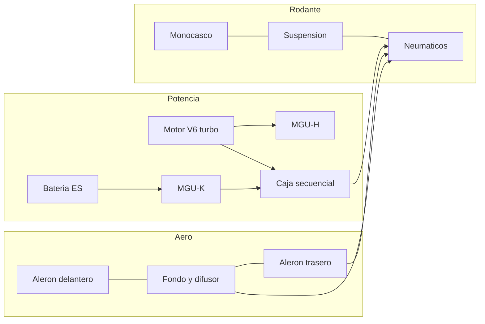
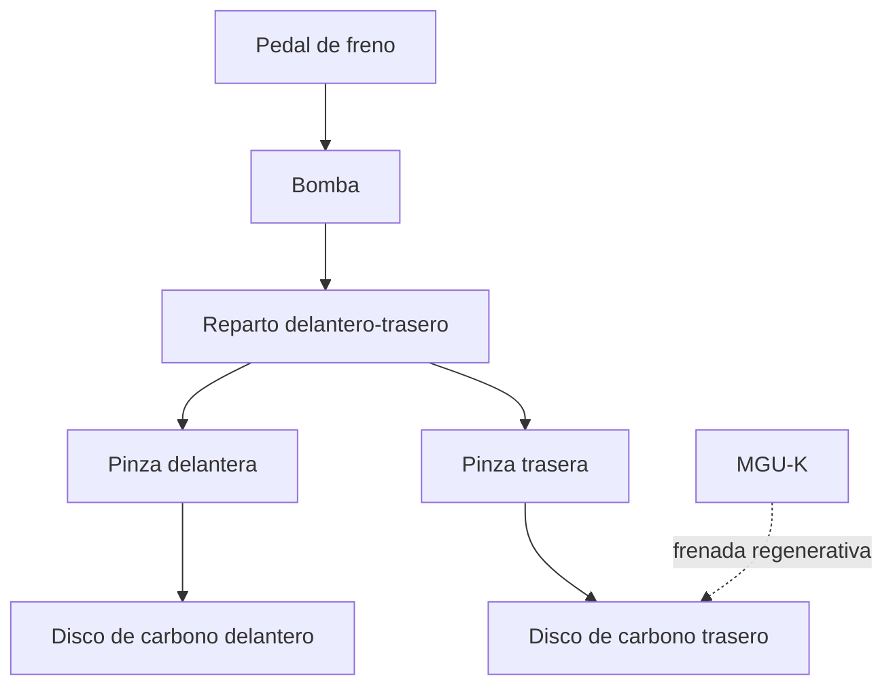

# 🔧 Sistemas mecanicos de la Formula 1

[🏠 Inicio](../../../README.md) · [🏎️ Curso: Formula 1](../README.md) · 🔧 Sistemas mecanicos

Este modulo abre el monoplaza por dentro. Explica cada sistema, como funciona y
como se conecta con los demas. Es la base tecnica para entender los mandos
(Modulo 4) y la fisica del rendimiento (Modulo 5).

---

## 1. ⚙️ Unidad de potencia hibrida

La unidad de potencia combina un motor de combustion con dos maquinas
electricas. No es solo un motor: es un sistema que genera, almacena y reutiliza
energia.

| Componente | Funcion |
| --- | --- |
| Motor V6 turbo 1.6L | Genera la potencia base de combustion. |
| Turbocompresor | Comprime el aire de admision con los gases de escape. |
| MGU-K | Recupera energia de la frenada y la devuelve como empuje. |
| MGU-H | Recupera calor de los gases y reduce el retardo del turbo. |
| Bateria (almacen de energia) | Guarda la energia electrica recuperada. |
| Electronica de control | Coordina reparto entre combustion y electrico. |

- **ERS (sistema de recuperacion de energia)**: conjunto formado por MGU-K,
  MGU-H, bateria y su electronica. Entrega un impulso electrico extra por vuelta.
- **Eficiencia**: la hibridacion busca mas rendimiento con menos combustible.

---

## 2. 🪽 Aerodinamica y carga aerodinamica

La aerodinamica es la clave del rendimiento moderno. El coche genera carga
vertical hacia abajo para pegar los neumaticos al suelo sin sumar peso.

- **Carga aerodinamica**: fuerza vertical hacia el suelo que aumenta el agarre.
- **Resistencia**: fuerza que se opone al avance; mas carga suele traer mas
  resistencia.
- **Reglaje**: equilibrar carga y resistencia segun el circuito.

| Elemento | Aporte principal |
| --- | --- |
| Aleron delantero | Ajusta el equilibrio y dirige el aire al resto del coche. |
| Fondo y difusor | Genera gran parte de la carga por baja presion bajo el coche. |
| Aleron trasero | Aporta carga en el eje trasero y estabilidad. |
| Bargeboards y desviadores | Ordenan el flujo hacia el fondo y los radiadores. |

### Efecto suelo

El fondo del monoplaza forma un canal que acelera el aire por debajo. Al ganar
velocidad el aire, baja la presion y se genera una succion que empuja el coche
al suelo. Es carga aerodinamica muy eficiente porque cuesta poca resistencia.

### DRS

El DRS (sistema de reduccion de resistencia) abre una aleta del aleron trasero
en zonas permitidas para reducir la resistencia y facilitar el adelantamiento.
Al cerrarse, recupera la carga habitual.

---

## 3. ⭕ Neumaticos

El unico contacto con el asfalto. Todo (acelerar, frenar, girar) pasa por ellos.

- **Compuestos**: de mas duros y duraderos a mas blandos y rapidos.
- **Ventana de temperatura**: rinden solo dentro de un rango; frios o
  sobrecalentados pierden agarre.
- **Degradacion**: pierden rendimiento con las vueltas y obligan a parar en boxes.
- **Presion**: incorrecta cambia la huella de contacto y el agarre.

---

## 4. 🛑 Frenos de carbono

Convierten la energia de movimiento en calor. En Formula 1 son de disco y
pastilla de carbono.

- **Disco de carbono**: soporta temperaturas muy altas y es ligero.
- **Ventana termica**: como los neumaticos, necesita calor para frenar bien.
- **Frenada por cable en el eje trasero**: parte del frenado trasero lo gestiona
  la electronica junto con la recuperacion del MGU-K.
- **Reparto de frenada**: el piloto ajusta el balance delantero-trasero.

---

## 5. ⚙️ Caja de cambios secuencial

Transmite la potencia a las ruedas traseras y adapta fuerza y velocidad.

- **Secuencial**: se sube y baja de marcha en orden, sin saltar posiciones.
- **Cambio por levas**: el piloto usa levas detras del volante.
- **Cambio casi instantaneo**: la electronica corta y reengancha en milisegundos.
- **Diferencial**: reparte el par entre las dos ruedas traseras en curva.

---

## 6. 🏗️ Chasis y suspension

- **Monocasco de carbono**: celula rigida y ligera que protege al piloto y sirve
  de estructura central.
- **Suspension**: conecta ruedas y chasis, controla el reparto de carga y
  mantiene el neumatico bien apoyado.
- **Altura al suelo**: critica por el efecto suelo; muy sensible al reglaje.

---

## 🔁 Como se conecta todo

1. La **unidad de potencia** genera y recupera energia.
2. La **caja secuencial** y el **diferencial** llevan el par a las ruedas.
3. La **aerodinamica** y el **efecto suelo** pegan el coche al suelo.
4. Los **neumaticos** convierten agarre y potencia en velocidad real.
5. Los **frenos de carbono** devuelven el control en cada frenada.
6. El **monocasco** y la **suspension** mantienen la geometria y la seguridad.

Con esto entendido, el
[Modulo 4: Mandos](../mandos/manual-mandos-formula-1.md) muestra como el piloto
opera cada uno de estos sistemas.

---

[⬅️ Anterior: Caracteristicas](caracteristicas-formula-1.md) · [➡️ Siguiente: Mandos e instrumentos](../mandos/manual-mandos-formula-1.md)
