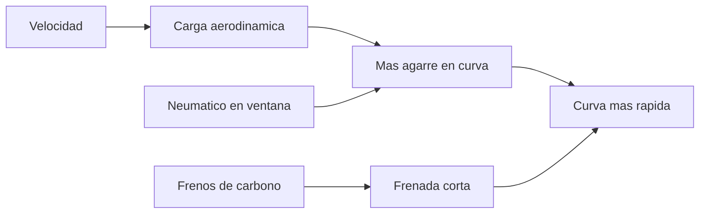

# 🧰 Recursos de la Formula 1

[🏠 Inicio](../../../README.md) · [🏎️ Curso: Formula 1](../README.md) · 🧰 Recursos

Glosario especifico, enlaces y diagramas de apoyo del curso de Formula 1. Amplia
el [glosario general](../../../docs/05-glosario-general.md).

---

## 📖 Glosario especifico

| Termino | Definicion |
| --- | --- |
| Carga aerodinamica | Fuerza vertical hacia el suelo que aumenta el agarre sin sumar peso. |
| Efecto suelo | Succion generada por el fondo del coche que lo pega al asfalto. |
| DRS | Sistema de reduccion de resistencia; abre el aleron trasero en zonas permitidas. |
| ERS | Sistema de recuperacion de energia formado por MGU-K, MGU-H y bateria. |
| MGU-K | Maquina electrica que recupera energia de la frenada y da impulso. |
| MGU-H | Maquina electrica que recupera calor de los gases de escape. |
| Undercut | Estrategia de parar antes en boxes para ganar tiempo con gomas nuevas. |
| Delta | Diferencia de tiempo respecto a una vuelta de referencia. |
| Parque cerrado | Regimen que limita los cambios al coche tras la clasificacion. |

---

## 🗺️ Diagrama de rendimiento en curva

---

## 🔗 Enlaces y fuentes

- Marco tecnico de competicion: [⚖️ docs/07-marco-legal-chile.md](../../../docs/07-marco-legal-chile.md)
- Registro de fuentes: [📚 manuales/fuentes.md](../../../manuales/fuentes.md)
- Reglamento deportivo y tecnico de la FIA: ver el registro de fuentes.

Registrar cada recurso nuevo con su origen y licencia, siguiendo
[`recursos/README.md`](../../../recursos/README.md).

---

[🎓 Portada del curso](../README.md) · [⬅️ Anterior: Diseno de simulacion](../simulacion/diseno-simulador-formula-1.md)
