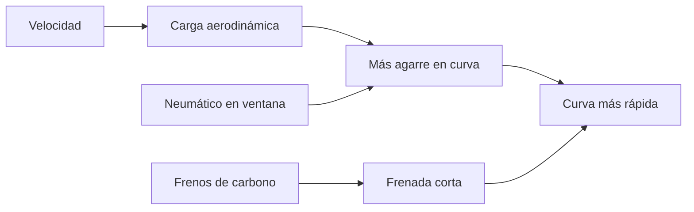

# 🧰 Recursos de la Fórmula 1

[🏠 Inicio](../../../README.md) · [🏎️ Curso: Fórmula 1](../README.md) · 🧰 Recursos

Glosario específico, enlaces y diagramas de apoyo del curso de Fórmula 1. Amplia
el [glosario general](../../../docs/05-glosario-general.md).

---

## 📖 Glosario específico

| Término | Definición |
| --- | --- |
| Carga aerodinámica | Fuerza vertical hacia el suelo que aumenta el agarre sin sumar peso. |
| Efecto suelo | Succión generada por el fondo del coche que lo pega al asfalto. |
| DRS | Sistema de reducción de resistencia; abre el aleron trasero en zonas permitidas. |
| ERS | Sistema de recuperación de energía formado por MGU-K, MGU-H y batería. |
| MGU-K | Máquina eléctrica que recupera energía de la frenada y da impulso. |
| MGU-H | Máquina eléctrica que recupera calor de los gases de escape. |
| Undercut | Estrategia de parar antes en boxes para ganar tiempo con gomas nuevas. |
| Delta | Diferencia de tiempo respecto a una vuelta de referencia. |
| Parque cerrado | Régimen que limita los cambios al coche tras la clasificación. |

---

## 🗺️ Diagrama de rendimiento en curva

```mermaid
flowchart LR
    Velocidad[Velocidad] --> Carga[Carga aerodinámica]
    Carga --> Agarre[Más agarre en curva]
    Neumatico[Neumático en ventana] --> Agarre
    Agarre --> Curva[Curva más rápida]
    Frenos[Frenos de carbono] --> Frenada[Frenada corta]
    Frenada --> Curva
```

---

## 🔗 Enlaces y fuentes

- Marco técnico de competición: [⚖️ docs/07-marco-legal-chile.md](../../../docs/07-marco-legal-chile.md)
- Registro de fuentes: [📚 manuales/fuentes.md](../../../manuales/fuentes.md)
- Reglamento deportivo y técnico de la FIA: ver el registro de fuentes.

Registrar cada recurso nuevo con su origen y licencia, siguiendo
[`recursos/README.md`](../../../recursos/README.md).

## 🎓 Cierre de clase

- **Actividad:** Selecciona términos de glosario, esquemas y trazabilidad de fuentes, explícalos en contexto de Fórmula 1 y verifica la procedencia de las fuentes utilizadas.
- **Evidencia:** Glosario aplicado y ficha breve de trazabilidad.
- **Criterio de aprobación:** Los términos permiten interpretar el curso y las fuentes se distinguen por autoridad, alcance y vigencia.
- **Transferencia:** explica qué cambiaría al pasar a otra variante de esta máquina.

### Fuentes de esta clase

- [FIA-F1-2026](https://www.fia.com/regulations/formula-1): Formula 1 Regulations, FIA. Uso: reglamento, arquitectura y seguridad de Fórmula 1.
- [US-NHTSA](https://www.nhtsa.gov/vehicle-safety): Vehicle Safety, NHTSA. Uso: seguridad de vehículos terrestres.
- [NASA-FLIGHT](https://www1.grc.nasa.gov/beginners-guide-to-aeronautics/): Beginner's Guide to Aeronautics, NASA. Uso: contraste con física y vuelo reales.

> Las fuentes sostienen el marco conceptual y normativo; esta clase no reemplaza el manual
> del fabricante, la formación certificada ni la habilitación exigida para operar equipos reales.

---

[🎓 Portada del curso](../README.md) · [⬅️ Anterior: Diseño de simulación](../simulacion/diseno-simulador-formula-1.md) · [➡️ Siguiente: Ejercicios](../ejercicios/ejercicios-formula-1.md)
